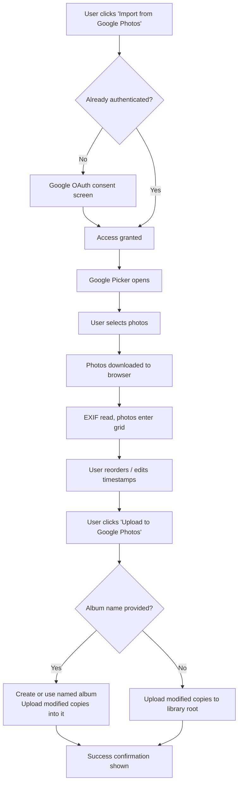

# Google Photos Integration

## Problem Frame

Users currently must download photos from Google Photos manually before using the app. This friction breaks the workflow. The goal is to let users import photos directly from Google Photos via a picker, reorder/edit them using the existing tools, then upload modified copies back to Google Photos — without leaving the app or handling files by hand.

## User Flow

## Requirements

**Authentication**
- R1. A "Connect Google Photos" / "Sign in with Google" button initiates OAuth 2.0. A minimal Next.js API route may be used for token exchange if the Google Photos Library API requires it (i.e. if pure client-side implicit/PKCE flow is insufficient).
- R2. No refresh token is stored. Tokens expire after ~1 hour. If a token expires mid-session, the app detects this and prompts the user to re-authenticate without losing their current grid state or edits.
- R3. The app requests only the scopes needed: read access to browse/select photos and write access to upload new media items. The exact scope set is determined by the Picker API choice (see Deferred to Planning).
- R4. The user can disconnect / sign out from Google within the app, which clears the token. If uploads are in progress, they are allowed to complete before sign-out takes effect.

**Authentication UI**
- R5. The current signed-in Google account is displayed in the app (e.g. account name or email and avatar). A disconnect/sign-out option is accessible from this indicator.
- R6. When the access token is within 5 minutes of expiry, the app shows a non-blocking warning (e.g. "Your Google session expires soon — click to refresh") that lets the user re-authenticate without losing their work.

**Import**
- R7. An "Import from Google Photos" entry point is available alongside the existing file upload.
- R8. When triggered, the Google Picker widget opens in the browser, allowing the user to select photos from their Google Photos library.
- R9. After selection, each chosen photo is fetched into the browser as a Blob/File object. EXIF reading and the existing grid/reorder flow apply to these photos exactly as they do to locally uploaded files.
- R10. If the Picker is closed without selection, the app state is unchanged.
- R11. If the Picker fails to open (network error, API quota, scope rejection), an error message is shown and the user can retry.
- R12. Google Photos imports are additive to the current grid — triggering import mid-session appends photos rather than replacing the existing set. No discard-edits confirmation is shown for an import action (only for a fresh load that replaces all photos).
- R13. Each photo card in the grid shows a small badge indicating its origin (Google Photos or local file), so users understand what will be affected by the upload action.

**Upload Back**
- R14. After reordering and editing, the user can trigger "Upload to Google Photos." This button is only shown (or enabled) when the user is authenticated and the grid contains at least one photo that originated from Google Photos.
- R15. "Upload to Google Photos" uploads all photos currently in the grid — both Google Photos imports and locally uploaded files — as new media items.
- R16. Before uploading, the user is offered an optional text field to name a destination album. If left empty, photos upload to the library root (no album). The field has a 500-character limit.
- R17. If an album name is provided, the app creates a new album with that name and adds the uploaded photos to it. If an album with that name already exists, the app creates a new album (duplicates allowed — Google Photos API behavior).
- R18. Each modified photo (with updated EXIF) is uploaded as a new media item. Originals in Google Photos are not modified or deleted.
- R19. Upload progress is shown (e.g. "Uploading 3 of 12…"). On completion, a success message confirms how many photos were uploaded and to which destination (album name, or "your Google Photos library" if no album).
- R20. If an upload fails for individual photos, the error is surfaced per-photo. A "Retry failed" button retries only the failed items without re-uploading successful ones.

**Coexistence with existing flow**
- R21. The existing local file upload continues to work unchanged.

## Success Criteria

- A user can go from "photos in Google Photos album" to "modified copies uploaded back" without ever manually downloading or saving a file locally.
- Modified copies appear in Google Photos (in the named album or root library) with the updated EXIF timestamps reflecting the new order.
- The existing local-upload workflow is unaffected.
- Token expiry does not cause data loss — re-authentication is possible mid-session without losing the grid state.

## Scope Boundaries

- No replacing or updating existing photos in Google Photos — only new uploads.
- No persistent OAuth sessions; no refresh tokens stored.
- Minimal backend only: a Next.js API route for OAuth token exchange is acceptable if required by the Google Photos API. No database, no server-side storage.
- No browsing albums manually via the app — the Google Picker handles all selection UI.
- No support for Google Drive files (only Google Photos content).
- No bulk album management (renaming, deleting albums) beyond creating a named destination.
- No deep link to the uploaded album in the success confirmation (unless the Photos API returns a usable album URL — determine during planning).

## Key Decisions

- **Google Picker over custom browser**: Avoids building a photo browser UI; leverages Google's own, maintained picker experience.
- **Minimal backend if needed**: The original no-backend constraint is relaxed to allow a single Next.js API route for OAuth token exchange, if the Google Photos Library API requires it. No full server infrastructure.
- **Upload as new copies, not replacements**: Google Photos API limitation — originals cannot be overwritten.
- **Optional album on upload, duplicates allowed**: Flexible — power users name albums; casual users skip it. Duplicate album names are permitted (the API creates a new one regardless).
- **All grid photos uploaded, not just Google Photos imports**: Simpler UX — one upload action covers everything in the current grid.

## Dependencies / Assumptions

- A Google Cloud project with the Google Photos Library API and Google Picker API enabled is required. Assumed to be set up by the developer before deployment.
- Client ID and API key must be available as environment variables (e.g. `NEXT_PUBLIC_GOOGLE_CLIENT_ID`, `NEXT_PUBLIC_GOOGLE_API_KEY`). `NEXT_PUBLIC_GOOGLE_API_KEY` is inlined into the client JS bundle and visible to anyone who inspects the page; it **must** be restricted to the app's production domain via HTTP referrer restrictions in Google Cloud Console before deployment to prevent quota abuse.
- The app is served over HTTPS in production (required by Google OAuth). In development, `http://localhost:<port>` must be listed as an authorized redirect URI on the OAuth client in Google Cloud Console.
- App-created Google Photos albums may appear in the "Apps" section rather than the user's main album view. The success message should set this expectation explicitly.

## Outstanding Questions

### Deferred to Planning

- [Affects R1, R3][Needs research] Confirm the correct OAuth flow for the Google Photos Library API: can an access token be obtained purely client-side (PKCE authorization code flow via Google Identity Services), or does the Library API require a backend token exchange? This determines whether a Next.js API route is needed.
- [Affects R9][Needs research] Confirm that photo Blobs fetched via Picker download URLs retain full EXIF data (not stripped by Google's CDN). If EXIF is stripped, the planner must define a fallback strategy (e.g. warn the user, show photos without timestamps, or block import).
- [Affects R8, R3][Needs research] Confirm whether to use the legacy Google Drive Picker (fully client-side JS, returns Drive file IDs) or the newer Google Photos Picker API (privacy-scoped, may require a backend session). This choice changes scopes (R3), download URL format (R9), and possible backend requirement (R1).
- [Affects R17][Needs research] Verify whether the Google Photos Library API supports creating a new album and adding items to it in a single call, or whether it requires two separate requests.
- [Affects R18][Technical] Determine how to handle non-JPEG uploads (PNG, TIFF, HEIC): `writeTimestamp` currently passes non-JPEG files through unchanged, so EXIF will not be updated on these before upload.
- [Affects R20] Define the retry UX in detail during planning (e.g. individual retry buttons vs. "Retry failed" batch action).
- [Affects R2][Technical] Define how the app detects token expiry proactively (e.g. checking `expires_in` from the token response) vs. reactively (catching 401 errors from API calls).

## Next Steps
→ `/ce:plan` for structured implementation planning
