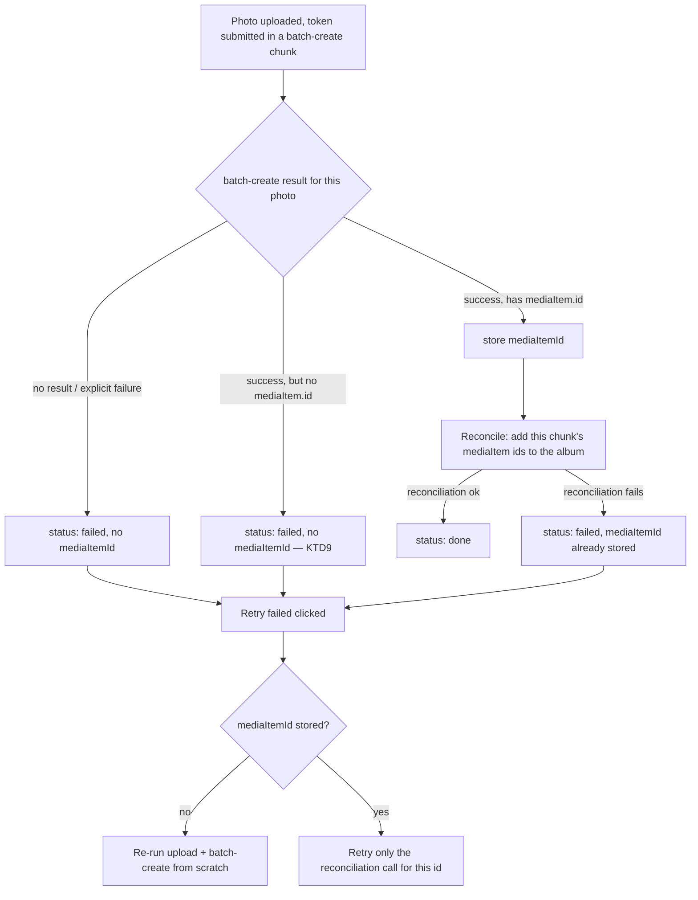

# Google Photos Album Upload Gaps - Plan

## Goal Capsule

- **Objective:** Close two bugs found during manual testing of the Google Photos album workflow: uploads that finish but leave the album short of photos, and videos leaking into an import that should be photos-only.
- **Authority:** This plan's Requirements and Key Technical Decisions are authoritative for implementation. Where a unit's Approach seems to conflict with a cited requirement or KTD, the requirement or KTD wins.
- **Execution profile:** Standard. Three implementation units, sequential (U1 then U2), with U3 independent.
- **Stop conditions:** Stop and ask if implementation reveals `albums.batchAddMediaItems` does not accept an item id that `batchCreate` just returned (would mean the whole reconciliation premise in KTD1/KTD2 is wrong), or if a live Google account test shows the album-attach gap does not reproduce (see Risks).
- **Tail ownership:** Whoever ships this plan also runs the live-account verification in Definition of Done — it cannot be fully verified in an automated test run alone.

---

## Product Contract

### Summary

Fixes two Google Photos album workflow bugs. Bug 1: an upload can report success while the resulting album ends up short of photos, because Google's batch-create call does not report album-attachment status separately from media-item-creation status. The fix adds an explicit reconciliation step and makes retry safe against creating duplicate media items. Bug 2: videos from a Google Photos import appear in the app despite it being photos-only; the fix filters them out client-side, silently, before they ever reach the app's photo list.

### Problem Frame

A user uploaded a batch of photos to a new Google Photos album through this app. The upload ran for a while and reported done, but the resulting album had fewer photos than the batch. Separately, importing from Google Photos brought in videos, which this app has no support for.

Research during planning found the most likely cause of the first bug: Google's `mediaItems:batchCreate` endpoint accepts an `albumId` and is documented to both create the media item and add it to the album in one call, but its per-item response `status` field is documented purely in terms of item-creation success or failure. Google documents no distinct status for "item created, but not added to the album." The app currently treats a `status: Success` result as `'done'`, with no way to tell from that response alone whether the item is actually in the album.

The second bug has a simpler cause: Google's Photos Picker API has no option to restrict its picker UI to photos only, so the picker will always let a user select videos; the app never filters them out afterward.

### Requirements

**Upload reliability**

- R1. Every photo whose media item Google reports as successfully created must be confirmed as a member of the target album before it is marked done; if album membership cannot be confirmed, the photo is marked failed instead.
- R2. Every outbound call to Google's Photos Library API must time out rather than hang indefinitely. A timeout marks the affected photo(s) failed with a message that names the timeout specifically, not a generic error string.
- R3. A 429 response from Google is surfaced with a message that identifies rate-limiting specifically. No automatic retry is added for this; recovery stays manual, through the existing "Retry failed" action.
- R4. Retrying a photo whose media item Google already created must never create a second media item. Retry redoes only the step that actually failed for that photo.

**Import filtering**

- R5. Videos selected in the Google Photos picker never appear anywhere in the app — not in the photo grid, not in any count — filtered out immediately after the picker reports its selection, before anything is downloaded or displayed. No message tells the user videos were excluded.

### Scope Boundaries

- **In scope:** the two bugs above, in the existing upload (`hooks/useGooglePhotosUpload.ts`) and import (`hooks/useGooglePhotosPicker.ts`) flows.
- **Deferred to Follow-Up Work:**
  - A standalone "verify album membership" action independent of a fresh upload, to catch drift from causes other than the batch-create gap this plan fixes.
  - Automatic retry-with-backoff for rate-limited photos (KTD5).
  - A user-facing notice or count for filtered videos (KTD8).
- **Outside this fix's identity:** adding video support to the app.

### Acceptance Examples

- AE1. Given a photo whose raw upload and batch-create both succeed, when the reconciliation call that adds it to the album fails, then the photo shows failed, not done, and clicking "Retry failed" retries only the album-add step for that photo, not the upload or batch-create.
- AE2. Given a 50-photo chunk where batch-create succeeds for every photo but the reconciliation call for that chunk fails outright (network error or non-2xx), when the run finishes, then all 50 photos show failed, each already has its real Google media item recorded, and retrying them re-attempts only reconciliation for those same 50 items.
- AE3. Given a picker selection containing both photos and videos, when the app fetches the selected items, then only the photos ever appear in the app, with no row, count, or message for the videos; if the whole selection is videos, the app behaves exactly as if nothing were selected.

---

## Planning Contract

### Key Technical Decisions

- KTD1. **Bug 1's root cause is Google's batch-create response reporting only media-item-creation status, not album-attachment status — not the app's missing request timeouts (KTD6/U1), which is a real, separate gap.** Google's `mediaItems.batchCreate` reference documents the per-item `status` and `mediaItem` fields purely in terms of item creation; no field distinguishes "created and in the album" from "created, album-add silently failed" (see Sources). The two candidate causes predict different, distinguishable symptoms: a hung, un-timed-out fetch leaves the affected photo stuck at `'uploading'` forever and the whole run never reaches `'done'` — it fails by visibly stalling, not by finishing short. The reported symptom is the opposite: the run reported done, no photo showed failed, and only the album's final count was low. That is exactly what today's code produces when a `status: Success` batch-create result maps straight to `'done'` with no way to tell, from that response alone, whether the item actually reached the album. The missing timeout is worth fixing on its own (a hang is its own failure mode), but it does not explain this specific clean-finish/short-album symptom.
- KTD2. **Reconciliation calls `albums.batchAddMediaItems` once per batch-create chunk, immediately after that chunk resolves, using the same chunk's successful media item ids** — not one call across the whole run. `batchAddMediaItems`'s own reference documentation confirms the same 50-item-per-call limit as `batchCreate` (see Sources); reusing the existing per-chunk grouping avoids inventing a second chunking scheme and stays under that confirmed cap. Governs R1.
- KTD3. **`PhotoUploadState` gains a `mediaItemId` field, set whenever batch-create reports item-creation success for that photo, independent of whether reconciliation then succeeds.** This is the record that lets retry (KTD4) tell "media item already exists" apart from "never got created." Governs R1, R4.
- KTD4. **`retryFailed` branches on `mediaItemId`: a photo that has one retries only the reconciliation call; a photo without one runs the existing full upload-then-batch-create pipeline unchanged.** Without this branch, retrying a reconciliation-only failure would re-upload and re-create a second media item — reopening the exact duplicate-item problem the album-based redesign exists to prevent. Governs R4.
- KTD5. **No automatic retry-with-backoff for rate-limited photos** *(session-settled: user-directed — chosen over adding automatic retry-with-backoff for 429s: Google's documented minimum 30-second backoff for a 429 risks exceeding the hosting platform's own request duration limit if attempted in-request; recovery stays manual through the existing "Retry failed" button)*. Governs R3.
- KTD6. **Timeout and rate-limit handling extend the existing `upstreamErrorBody` convention with new `status` string values (`REQUEST_TIMEOUT`, `RATE_LIMITED`) rather than introducing a new error shape or field.** `UpstreamErrorBody`'s machine-readable field is named `status` (already populated with values like `UNAUTHENTICATED`, `INVALID_REQUEST`, `UPSTREAM_UNREACHABLE` across every route in this family) — not `code`. `code` already means something else in this same integration: `GooglePhotosApiError.error.code` (a numeric HTTP-like code, read by `describeApiError` in `hooks/useGooglePhotosPicker.ts`). Using `status` avoids colliding with that existing, differently-typed field. Governs R2, R3.
- KTD7. **Video filtering whitelists (`item.type === 'PHOTO'` and `item.mediaFile.mimeType` starts with `image/`), both must agree, rather than blacklisting on `type !== 'VIDEO'`.** Fails closed against an undocumented third `type` value. Governs R5.
- KTD8. **Filtered videos are excluded completely silently — no notice, no count** *(session-settled: user-directed — chosen over showing a "N videos skipped" message: matches the literal request that videos not be shown in the app at all)*. Governs R5.
- KTD9. **A batch-create result with a success `status` but no `mediaItem.id` is its own distinct failure — no reconciliation attempted, no `mediaItemId` stored — rather than being crashed on or folded into the normal success/failure branches.** Found as an unguarded edge case in the current `isBatchCreateSuccess` check during planning. Governs R1.

### High-Level Technical Design

Per-chunk flow for a batch-create call, including the new reconciliation step and how a subsequent retry branches:

### Assumptions

- `albums.batchAddMediaItems` is idempotent — re-adding a media item already in the album is a safe no-op, not an error. This is a genuinely open assumption: Google's reference page and album-management guide are both silent on it, and no community report was found either way during planning. Do not depend on this being safe without empirical verification (see Risks) — a retry that re-adds an item without knowing whether the prior attempt already succeeded is the scenario most likely to hit this gap.
- A media item that is created but never successfully reconciled into the album (e.g. the reconciliation call fails on every retry) has no cleanup path — same accepted limitation as other orphaned-item scenarios in the prior Google Photos plan, since the Library API has no delete endpoint reachable by this app.

---

## Implementation Units

### U1. Harden outbound Google Photos API calls: timeouts and rate-limit codes

**Goal:** No outbound call to Google's Photos Library API can hang indefinitely, and a 429 is surfaced distinctly from a generic failure.

**Requirements:** R2, R3

**Dependencies:** None.

**Files:**
- `app/api/google-photos/upload/route.ts`
- `app/api/google-photos/batch-create/route.ts`
- `app/api/google-photos/albums/route.ts`
- `lib/google-photos-server.ts`
- `hooks/useGooglePhotosUpload.ts`
- `hooks/useGooglePhotosUpload.test.ts`

**Approach:**
1. Add `AbortSignal.timeout(ms)` to each route's outbound `fetch()` to `photoslibrary.googleapis.com`: ~45s for the raw-byte upload (large body), ~12s for `batch-create` and `albums` (small JSON body). On the resulting abort, return `upstreamErrorBody('Request to Google Photos timed out', 'REQUEST_TIMEOUT')` at 504, following the existing try/catch-decides-status convention (per KTD6 and the JSON-parse-failure doc in Sources) rather than letting the abort propagate as an unhandled rejection.
2. In the same three routes, when the upstream response status is 429, return `upstreamErrorBody(message, 'RATE_LIMITED')` and include a `retryAfterMs` value: from the upstream `Retry-After` header when present, else Google's documented 30-second floor (see Sources). `upload/route.ts` currently discards the upstream error body entirely on any non-2xx (`upstreamErrorBody('Upload failed', 'UPLOAD_FAILED')`, no parsing) — add the 429 branch there explicitly, before that catch-all. `batch-create/route.ts` and `albums/route.ts` already forward the parsed upstream body on non-2xx; add the 429 branch before that pass-through in both.
3. On the client (`useGooglePhotosUpload.ts`), extend the existing failure-message construction in `uploadSinglePhoto` and `markChunkFailed`'s call sites to read the parsed error body's `error.status` (not `error.code` — that field already means something else, see KTD6), and use a specific message for `RATE_LIMITED` ("Rate limited by Google — try again in a moment") and `REQUEST_TIMEOUT` ("Request to Google Photos timed out"), falling back to today's generic message for any other status value.

**Patterns to follow:** The try/catch-decides-status convention in `app/api/google-photos/sessions/route.ts` and `docs/solutions/integration-issues/google-photos-json-parse-failure-returns-200.md`; the existing `upstreamErrorBody(message, status)` helper in `lib/google-photos-server.ts`.

**Test scenarios:**
- Upload route: upstream fetch aborts on timeout — response is 504 with `error.status: 'REQUEST_TIMEOUT'`, not an unhandled rejection.
- Batch-create route: same, for its own timeout.
- Albums route: same, for its own timeout.
- Upload route: upstream returns 429 with a `Retry-After` header — response carries `error.status: 'RATE_LIMITED'` and a `retryAfterMs` derived from that header (this route must parse the upstream body for this case, unlike its current catch-all).
- Batch-create route: upstream returns 429 with no `Retry-After` header — `retryAfterMs` falls back to the 30-second floor.
- Albums route: upstream returns 429 — response carries `error.status: 'RATE_LIMITED'` and a `retryAfterMs` value, matching the upload and batch-create routes' coverage.
- Client hook: a chunk's batch-create call resolves with `error.status: 'REQUEST_TIMEOUT'` — every photo in that chunk is marked failed with the timeout-specific message, not the generic one.
- Client hook: `uploadSinglePhoto` receives a `RATE_LIMITED`-status error body — that photo's failed message names rate-limiting specifically.
- Client hook: an error body with an unrecognized or missing `error.status` still falls back to today's generic message (no regression for other failure shapes).

**Verification:** All new and existing tests in `useGooglePhotosUpload.test.ts` and any new route test files pass; a manual timeout (mocked slow response) never leaves a photo stuck `'uploading'`.

---

### U2. Reconcile batch-create success with real album membership

**Goal:** A photo is only marked done once its media item is confirmed in the target album, and retrying a reconciliation failure never creates a second media item.

**Requirements:** R1, R4

**Dependencies:** U1 (new route in this unit follows U1's timeout/rate-limit-code pattern from the start, rather than needing a follow-up touch-up).

**Files:**
- `app/api/google-photos/albums/[id]/batch-add/route.ts` (new)
- `hooks/useGooglePhotosUpload.ts`
- `hooks/useGooglePhotosUpload.test.ts`
- `lib/google-photos-types.ts`

**Approach:**
1. Add a new route wrapping `POST https://photoslibrary.googleapis.com/v1/albums/{albumId}:batchAddMediaItems` with body `{ mediaItemIds: [...] }`, built with U1's timeout and rate-limit-code handling from the start. Missing/invalid auth and malformed request bodies follow the same shape as the existing `albums` route.
2. Add `mediaItemId?: string` to `PhotoUploadState`.
3. In `batchCreate`, after computing each chunk's per-photo done/failed split from `resultsByToken`: for a result with success status and a `mediaItem.id`, store that id as the photo's `mediaItemId` immediately (KTD3) — this happens regardless of what the reconciliation step below does next. For a success status with no `mediaItem.id`, mark the photo failed with a distinct message and do not attempt reconciliation (KTD9).
4. Immediately after that chunk's done/failed split is computed, call the new reconciliation route once, scoped to just that chunk's newly-stored `mediaItemId`s (KTD2) — never across the whole run. On a 2xx reconciliation response, those photos become `'done'`. On a non-2xx or network failure, mark every photo in that reconciliation sub-batch `'failed'`, with a message stating the item was created but not confirmed in the album (its `mediaItemId` stays stored).
5. In `retryFailed`, partition the failed photos passed in by whether they already have a `mediaItemId` (KTD4). For photos without one, run the existing full pipeline (`uploadSinglePhoto` then `batchCreate`) unchanged. For photos with one, skip straight to the reconciliation route with their existing ids, chunked the same way, and update their status from that response alone.

**Patterns to follow:** `batchCreate`'s existing per-chunk matching-by-id (not by array position) and its `markChunkFailed` shape for an outright chunk failure — mirror both for the reconciliation call.

**Test scenarios:**
- A chunk where batch-create succeeds for every photo and reconciliation succeeds — every photo is `'done'` and has a `mediaItemId`.
- A chunk where batch-create succeeds but the reconciliation call fails outright (non-2xx) — every photo in the chunk is `'failed'`, each retains its `mediaItemId`.
- Same, but the reconciliation call throws (network error) instead of returning non-2xx — same outcome.
- A batch-create result with success status but no `mediaItem.id` — that photo is `'failed'` with a distinct message, no `mediaItemId` stored, no reconciliation call made for it.
- `retryFailed` called with a mix of a photo that has a `mediaItemId` (reconciliation-only failure) and a photo that doesn't (raw-upload failure): asserts the reconciliation-only photo's retry calls only the batch-add route (never `/api/google-photos/upload` or `/api/google-photos/batch-create` again for it), and the other photo's retry runs the full pipeline as today.
- Covers AE1: single photo, reconciliation fails then succeeds on retry — final state `'done'`, and the retry made exactly one call (to the batch-add route), not three.
- Covers AE2: 50-photo chunk, reconciliation fails outright for the whole chunk, then a retry of all 50 succeeds — asserts all 50 retried through the reconciliation-only path, none re-uploaded.
- Multi-chunk run (51+ photos, mirroring the existing multi-chunk batch-create test): reconciliation is called once per chunk with only that chunk's ids, never once across all chunks.

**Verification:** All scenarios above pass; the existing multi-chunk and out-of-order-response regression tests in `useGooglePhotosUpload.test.ts` still pass unmodified (reconciliation must not disturb batch-create's own per-chunk matching).

---

### U3. Filter non-photo items out of the Google Photos import

**Goal:** Videos selected in the Google Photos picker never reach the app's photo list.

**Requirements:** R5

**Dependencies:** None — independent of U1/U2.

**Files:**
- `hooks/useGooglePhotosPicker.ts`
- `hooks/useGooglePhotosPicker.test.ts`

**Approach:**
1. In `startImport`'s Step 4, immediately after `const items = mediaItemsResponse.mediaItems ?? []`, filter to only items where `item.type === 'PHOTO'` and `item.mediaFile.mimeType` starts with `image/` (KTD7), before the existing `items.length === 0` early-return check.
2. No change to the early-return, download, or `addPhotos` steps that follow — an all-video selection now reaches the existing "nothing to import" path unchanged.

**Patterns to follow:** The existing `items.length === 0` early-return already handles "nothing selected"; route an all-videos selection through it rather than adding a second empty-state path.

**Test scenarios:**
- A selection of photos and videos mixed: `addPhotos` is called with only the photo files, videos never appear in `downloadBatch`'s input.
- A selection that is entirely videos: behaves exactly like an empty selection (covers AE3) — cleans up the session, sets status to idle, never calls `addPhotos`.
- An item with `type: 'PHOTO'` but a non-image `mimeType` (or vice versa): excluded, since KTD7 requires both signals to agree.
- A selection of only photos: unaffected, matches current behavior exactly (no regression).

**Verification:** All scenarios above pass; existing `useGooglePhotosPicker.test.ts` tests pass unmodified.

---

## Verification Contract

- `npm run test` — full suite must pass, including new scenarios above.
- `npm run lint` — no new lint errors (repo has 2 pre-existing errors in `components/PhotoCard.tsx`, unrelated to this plan; do not fix as part of this work).
- `npm run build` — production build succeeds.

## Definition of Done

- U1, U2, U3 implemented; all their test scenarios exist and pass.
- No leftover code from an earlier, reworked attempt at the reconciliation or retry-branching logic.
- `npm run test`, `npm run lint`, and `npm run build` all pass.
- **Live-account verification (manual, post-merge):** confirm against a real, signed-in Google account that (a) a large-enough batch reliably lands every photo in the target album, and (b) calling `albums.batchAddMediaItems` with a media item id already in the album succeeds rather than erroring — this is unresolved after planning-time research (see Assumptions) and this plan's reconciliation/retry logic depends on the answer.

---

## Risks & Dependencies

- Google's documentation does not explicitly confirm the album-attachment gap this plan's primary fix (KTD1, KTD2) addresses — it is the best-evidenced hypothesis from Google's own docs and the reported symptom (see KTD1's rule-out of the competing timeout hypothesis), not a confirmed root cause. If a live-account test shows album membership was already correct and the real cause is something else entirely, U2's reconciliation step is still safe to ship (it can only help, per R1), but the actual bug may need further investigation.
- `albums.batchAddMediaItems`'s behavior on an already-present item is undocumented and unresolved after planning-time research (see Assumptions) — implementation should verify this empirically (e.g. a controlled test against a real album) before trusting a retry to re-add an item that may already be present.
- If Google ever changes `batchCreate` to report album-attachment status directly, U2's reconciliation step becomes redundant but remains harmless (an additional add call).

## Sources & Research

- Google Photos Library API, `mediaItems.batchCreate` reference: per-item `status`/`mediaItem` fields are documented purely in terms of item creation, with no distinct field for album-attachment outcome (grounds KTD1).
- Google Photos Library API, `albums.batchAddMediaItems` reference: explicitly documents no partial success for that endpoint ("the entire request will fail if an invalid media item or album is specified") — confirms Google is capable of documenting partial-success semantics elsewhere, reinforcing that its silence on `batchCreate`'s album-attach path is a real gap, not an oversight in reading (grounds KTD1, informs U2's all-or-nothing-per-chunk failure handling). The same reference page also states its `mediaItemIds` field's cap directly: "The maximum number of media items that can be added in one call is 50" (grounds KTD2's confirmed, not assumed, chunk size). It does not state whether adding an already-present item is a no-op or an error — this stayed an open assumption after planning-time research found no official or community answer either way.
- Google Photos Library API quotas: 10,000 requests/project/day general; 50-item cap per `batchCreate` call, no documented way to raise it; `batchCreate` must be called serially per user (already true in this codebase) (grounds KTD2, R2/R3 timeout and rate-limit values).
- Google's documented 429 guidance: minimum 30-second delay before retry, exponential backoff on top (grounds KTD5's rejection of in-request auto-retry, and U1's `retryAfterMs` fallback).
- Google Photos Picker API, `sessions.create` reference: `pickingConfig` supports only `maxItemCount`, no media-type filter — confirms client-side filtering (U3) is the only available mechanism, not a session-creation-time restriction (grounds KTD7).
- `docs/solutions/integration-issues/google-photos-json-parse-failure-returns-200.md`: established try/catch-decides-status convention and `upstreamErrorBody` shape, extended by U1/KTD6 rather than replaced.
- `docs/solutions/logic-errors/stale-shared-ref-read-after-concurrent-invocation-in-async-hooks.md`: prior fix in this exact file for a different bug class (shared ref read after `await`); repo research during planning confirmed no new instance of that pattern explains this plan's bugs — the current code's ref/state handling for `albumIdRef` and the batch-create matching logic is already correct.
- `docs/plans/2026-08-10-001-fix-google-photos-sync-duplicates-plan.md`: KTD2 there already established that the Library API has no delete endpoint reachable by this app — carried forward into this plan's Assumptions on orphaned-item cleanup.
