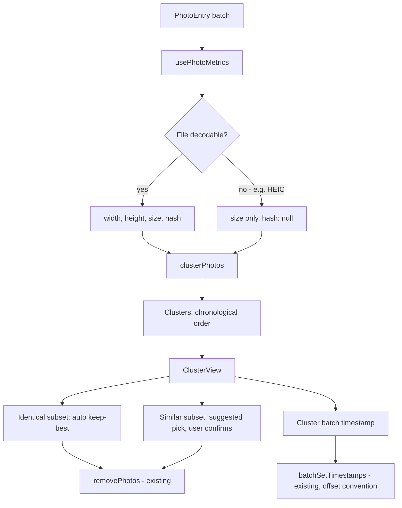

# Similar Photo Grouping & Deduplication - Plan

## Goal Capsule

- **Objective:** Let the user group near-duplicate and identical photos in an imported batch into clusters, quickly resolve exact duplicates and pick survivors from bursts, then correct the survivors' timestamps — with no AI, ML, embeddings, or external API dependency.
- **Product authority:** This plan's Requirements and Key Decisions are authoritative; a server-side or ML-based similarity approach is out of scope regardless of what planning discovered.
- **Execution profile:** Standard. Five implementation units. U1 (metrics) and U2 (clustering) are sequential; U3 (cluster view) depends on both; U4 (dedup actions) and U5 (timestamp editing) both depend on U3. U4 and U5 touch the same file (`components/ClusterView.tsx`) and U5's selection UI reuses U4's pattern, so they land sequentially — U4 first — rather than in parallel.
- **Stop conditions:** Stop and ask if implementation finds `createImageBitmap` fails to decode a large share of test photos in target browsers (would undermine the whole browser-only pixel-decoding premise), or if real-photo testing shows the starting Hamming-distance thresholds (KTD2) produce badly wrong clusters even after one round of tuning.
- **Tail ownership:** Whoever ships this plan validates the starting hash thresholds (KTD2) against a handful of real WhatsApp-sourced photos before calling the feature done — synthetic test fixtures can't substitute for real recompression artifacts.

---

## Product Contract

*Product Contract preservation: unchanged in substance, except Outstanding Questions — two of its three items are now resolved (see Planning Contract KTD1/KTD2 and KTD11); the third remains open. F1 and AE1/AE3's wording was also tightened during document review to remove a self-contradiction about whether identical-tier resolution is user-triggered or fully automatic (it is fully automatic, per the existing Key Decision) — no requirement or behavior changed, only the ambiguous phrasing.*

### Summary

Adds a toggle that groups near-duplicate and identical photos in the current batch into clusters, using purely algorithmic perceptual-hash similarity (no AI/ML). Within a cluster, identical duplicates resolve automatically to the best-quality copy; near-duplicates get a suggested pick the user can override; and any selection of survivors can get a corrected, shared timestamp in one action.

### Problem Frame

The user receives trip and event photos via WhatsApp from multiple friends and family members. These arrive out of order, frequently duplicated (several people send the same photo), and carry WhatsApp's send timestamp rather than the moment the photo was actually taken. Group-photo moments routinely produce ten near-identical burst shots where only one or two are worth keeping. A typical 200-photo album reduces to roughly 80-100 photos after removing duplicates and near-duplicates by hand — a tedious, fully manual process today with no tooling support.

### Requirements

**Detection & Display**

- R1. The app classifies photos in the currently loaded batch into clusters using a purely algorithmic method — no AI, ML, embeddings, or external API calls — distinguishing an identical relationship (same shot, differing only by resolution, format, or compression) from a similar relationship (same moment or scene, such as burst shots, but not the same shot).
- R2. A toggle switches the photo grid between the existing date-sorted view and a new grouped view; the date-sorted view stays the default and is unaffected when the toggle is off.
- R3. Clusters in the grouped view are ordered by the timestamp of their earliest member, ascending.
- R4. Each cluster visually distinguishes which member photos are identical from which are merely similar.
- R5. A photo with no similarity match to anything else in the batch still appears in the grouped view, as its own single-photo cluster.

**Deduplication**

- R6. Within a cluster, the identical-tier subset resolves in one action: the app keeps the highest-resolution, largest-file-size copy and removes the rest from the batch, with no per-photo confirmation.
- R7. Within a cluster, the similar-tier subset is pre-selected with a suggested keep (defaulting to the highest-resolution, largest-file-size member), but the user can change which member or members are kept before anything is removed — no similar-tier photo is deleted without the user's confirmation.

**Batch Timestamp Editing**

- R8. From within a cluster, the user can select any subset of that cluster's surviving photos and set a date/time for all of them in one action.
- R9. Setting a cluster's date/time offers the timestamps already present among that cluster's photos as quick-pick options, plus the ability to enter a custom date/time.
- R10. Cluster date/time assignment uses the app's existing timestamp-offset convention (each selected photo offset by one second from the chosen anchor, in display order) rather than assigning one identical timestamp to every selected photo.

### Key Decisions

- **Perceptual hashing, not histogram comparison or embeddings, defines similarity.** A two-tier threshold on hash distance (tight for identical, loose for similar) directly targets WhatsApp's recompression and resizing behavior — the standard technique other tools use for this exact problem, with no new heavy dependency required *(session-settled: user-directed — chosen over histogram-only comparison and over a hash-plus-corroborating-signals hybrid: simplest technique that fits the actual failure mode; the hybrid stays available if hash-only grouping quality disappoints in practice)*. Governs R1.
- **Detection and deduplication run entirely client-side.** Comparing already-loaded local files has no reason to leave the browser, consistent with how this app's existing photo editing (EXIF read/write) already operates. Governs R1.
- **"Keep best quality" is fully automatic only for the identical tier; the similar tier gets a suggested pick, never an automatic delete.** Resolution and file-size comparison is only a meaningful "best" signal when photos are genuinely the same shot; for similar-tier (burst or angle) photos there is no algorithmic "best," so the app suggests but always waits for confirmation *(session-settled: user-directed — the initial ask described "keep best quality" as one general action; the user confirmed the identical/similar split and asked for the similar tier to also carry a suggested default)*. Governs R6, R7.
- **Cluster timestamp edits reuse the existing one-second-offset convention rather than assigning one shared timestamp.** Keeps the app's ordering behavior consistent everywhere instead of introducing a second timestamp-assignment rule scoped only to clusters *(session-settled: user-directed — chosen over giving every survivor the exact same timestamp)*. Governs R10.
- **Clusters are ordered chronologically, not by cluster size.** Mirrors the default view's flow, so switching to grouped view doesn't reorder the album unpredictably *(session-settled: user-directed — chosen over largest-cluster-first and singletons-first ordering)*. Governs R3.
- **Detection runs on the whole loaded batch, not a user-picked date range.** Matches the actual workflow of reviewing one imported album at a time *(session-settled: user-directed — chosen over adding a date-range filter step before detection)*. Governs R1.

### Key Flows

- F1. **Switch to grouped view and clean up a cluster**
  - **Trigger:** User has an album loaded and toggles "Group similar photos."
  - **Steps:** App classifies the batch into clusters; grouped view replaces the flat grid, ordered chronologically, with every cluster's members visible immediately (clusters render fully expanded by default — no expand/collapse step). Identical-tier members are already auto-resolved to the best copy the moment the cluster is computed, with no user action; similar-tier members show a pre-selected suggested keep. User confirms or changes the similar-tier selection, then removes the rest.
  - **Outcome:** The cluster reduces to the photos the user wants to keep.
  - **Covers:** R1, R2, R3, R4, R6, R7.

- F2. **Correct a cluster's timestamp after cleanup**
  - **Trigger:** User has finished picking survivors within a cluster whose timestamp reflects when WhatsApp photos were sent, not when they were taken.
  - **Steps:** User selects the surviving photos in the cluster, opens the batch timestamp action, picks one of the cluster's existing timestamps or enters a custom one. The app applies it using the existing offset convention.
  - **Outcome:** The cluster's photos carry a corrected, consistent timestamp and sort correctly in the default date view.
  - **Covers:** R8, R9, R10.

### Acceptance Examples

- AE1. Given a cluster with 3 photos of the same shot at different resolutions (identical tier, no similar-tier members), when the cluster is computed, then the highest-resolution/largest-size photo remains and the other two are removed automatically with no confirmation prompt and no user-initiated trigger. **Covers R6.**
- AE2. Given a cluster with 8 burst-mode photos (similar tier, no identical-tier members), when the user opens the cluster, then one photo (the highest-resolution/largest-size) is pre-selected as the suggested keep, and the user can select a different photo or multiple photos before removing the rest — nothing is removed until the user confirms. **Covers R7.**
- AE3. Given a cluster containing both an identical-tier pair and a separate similar-tier trio, when the cluster is computed, then only the identical-tier pair auto-resolves immediately; the similar-tier trio still shows a suggested pick awaiting confirmation. **Covers R6, R7.**
- AE4. Given a photo with no match anywhere else in the batch, when the user switches to grouped view, then that photo still appears, shown as its own single-photo cluster. **Covers R5.**
- AE5. Given a cluster whose surviving photos carry three different existing timestamps (three different senders' send-times), when the user opens the batch timestamp action for that cluster, then all three existing timestamps are offered as quick-pick options alongside a custom-date option. **Covers R9.**

### Scope Boundaries

- No AI, ML, embeddings, or external API calls for similarity detection — a hard constraint on this feature's identity, not just today's implementation choice.
- Detection only covers photos in the currently loaded batch; it does not check against photos from a previous import or export session, or any photo library outside the current batch.
- Video and non-image files are outside this feature — this app handles photos.
- A batch-wide "resolve all identical clusters at once" action is deferred (see KTD11) — v1 operates one cluster at a time.

### Dependencies / Assumptions

- Requires new per-photo data the app does not currently track: pixel dimensions and file size (`hooks/usePhotos.ts`'s `PhotoEntry` type has no such field today).
- Assumes WhatsApp-forwarded and resent photos are re-encoded enough that a byte-level or cryptographic hash would miss matches a perceptual hash catches — the load-bearing assumption behind choosing perceptual hashing over exact-hash comparison for the identical tier.
- Assumes per-album photo counts stay in the low hundreds (the user's stated ~200-photo albums); pairwise perceptual-hash comparison at this scale is computationally trivial in-browser. Revisit this assumption if the app is ever used on much larger batches.

### Outstanding Questions

**Deferred to Implementation:**
- Exact visual treatment for distinguishing identical from similar members within a cluster (badge, border, sub-grouping, etc.) — R4 states the requirement, not the visual design.

---

## Planning Contract

### Key Technical Decisions

- KTD1. **Hand-rolled difference-hash (dHash), not a library or a DCT-based perceptual hash.** dHash needs only a grayscale downscale and adjacent-pixel comparison — cheap, and specifically robust to the resize, recompression, and format changes WhatsApp applies. The one candidate library, `blockhash-core`, was last published in 2019 and inactive since 2022; implementing dHash directly (roughly 30-50 lines) avoids depending on an unmaintained package and keeps the feature's zero-ongoing-cost identity intact. Governs R1.
- KTD2. **Starting Hamming-distance thresholds, out of a 64-bit hash: 0-3 bits difference is the identical tier, 4-12 bits is the similar tier, above that is unrelated.** These are tunable constants, not fixed assumptions — validate against real WhatsApp-sourced photos before considering the feature done (see Definition of Done). *(Resolves the Product Contract's first Outstanding Question.)* Governs R1.
- KTD3. **A photo whose file the browser cannot decode — most commonly HEIC, which only Safari decodes via `createImageBitmap` among major browsers — gets no hash and becomes its own singleton cluster, never an error and never a blocked batch.** This keeps the zero-new-heavy-dependency constraint intact rather than adding a HEIC decode library. Governs R1, R5.
- KTD4. **Clusters merge transitively — connected components over the pairwise-similar graph — not by strict mutual pairwise similarity.** A ten-shot burst can have a first and last frame more different from each other than either is from its neighbor; transitive merging keeps the whole burst in one cluster, matching the stated use case. This is a planning judgment call, not user-examined, so it carries no session-settled label. Governs R1.
- KTD5. **Pairwise Hamming-distance comparison across the whole batch, with no indexing structure.** At the stated scale (roughly 200 photos, under 20,000 pairs), this is computationally trivial; an indexing structure (LSH, bucketing) would be premature optimization. Governs R1.
- KTD6. **Hashing and dimension/size metrics run synchronously on the main thread for v1.** Each computation is a small, isolated, pure function (a `File` in, metrics out), so moving it to a Web Worker later needs no redesign if real-world profiling on real devices shows jank — not built now, since it is unlikely to be needed at this scale. Governs R1.
- KTD7. **A new `usePhotoMetrics` hook, mirroring the existing `useObjectUrls` per-`File` cache pattern, owns width, height, file size, and hash, kept separate from `usePhotos`'s state.** An async metric arriving later must not re-trigger `usePhotos`'s sort/renumber logic, which only cares about `capturedAt`/`uploadIndex`. Governs R1, R6, R7.
- KTD8. **The metrics-computation loop uses a generation-token guard, mirroring the fix already documented for this codebase's Google Photos hooks.** Without it, a photo removed or replaced mid-computation (for example via `reset()` or a new upload) could let a stale result land under a now-wrong id. Governs R1.
- KTD9. **"Best quality" compares pixel count (width times height) first, file size as a tie-breaker.** Resolution is the primary signal named in the Product Contract; file size only matters when two candidates share the same pixel count. Governs R6, R7.
- KTD10. **Cluster-scoped dedup and timestamp actions call `usePhotos`'s existing `removePhotos` and `batchSetTimestamps` unchanged, passing cluster-member id subsets.** No new exports are needed from `usePhotos.ts` for these actions; clustering and hashing are additive alongside it. Governs R6, R7, R8, R10.
- KTD11. **Cluster-resolution actions operate one cluster at a time; a batch-wide "resolve all identical clusters" action is deferred, not built now.** *(Resolves the Product Contract's third Outstanding Question.)* Keeps the first version's surface small; the per-cluster flow already delivers the stated value. Governs R6, R7.
- KTD12. **Photo metrics (width, height, size, hash) compute eagerly whenever photos are added to the batch, not lazily on first opening cluster view.** This mirrors an existing pattern in the same hook: `usePhotos.ts`'s `processFiles` already reads each photo's EXIF date eagerly on add (`await getPhotoDate(file)` per photo, `hooks/usePhotos.ts:77-90`) with no loading indicator at all. At the established computation cost — well under a couple of seconds for roughly 200 photos — the cost of computing metrics the user never looks at is negligible, and eager computation lets cluster view render instantly once opened. This also avoids introducing a net-new loading-state UI pattern: the only existing loading indicator anywhere in this app is a plain "Downloading photos…" text label in the unrelated Google Photos picker flow (`components/PhotoUploadPage.tsx:220-222`), not a pattern this feature should extend for a different flow. Governs R1.

### High-Level Technical Design

### Assumptions

- `createImageBitmap`'s `imageOrientation: 'from-image'` option normalizes EXIF-rotated photos before hashing, so two visually identical photos differing only by an orientation tag still hash close together. Assumed correct per the current Web platform behavior; verify empirically during implementation.
- HEIC photos are rare enough in the WhatsApp-received scenario (WhatsApp typically re-encodes to JPEG on send) that excluding them from hash comparison (KTD3) does not meaningfully undercut the feature's value. Revisit if real usage shows HEIC photos are common in this app's batches.
- Carried from the Product Contract: WhatsApp-forwarded photos are re-encoded enough that a perceptual hash catches matches a byte-level hash would miss; per-album photo counts stay in the low hundreds.

---

## Implementation Units

### U1. Photo metrics: dimensions, size, and perceptual hash

**Goal:** Compute and cache width, height, file size, and a perceptual hash for every photo in the batch, without blocking the UI or leaving stale results if the batch changes mid-computation.

**Requirements:** R1

**Dependencies:** None.

**Files:**
- `lib/perceptual-hash.ts` (new)
- `lib/perceptual-hash.test.ts` (new)
- `hooks/usePhotoMetrics.ts` (new)
- `hooks/usePhotoMetrics.test.ts` (new)

**Approach:**
1. `lib/perceptual-hash.ts` exports a pure function, `computePhotoMetrics(file: File): Promise<{ width: number; height: number; size: number; hash: string | null }>`. `size` comes directly from `file.size`. For `width`/`height`/`hash`: decode via `createImageBitmap(file, { imageOrientation: 'from-image' })` at natural size to read `width`/`height`, then draw that bitmap onto a canvas downscaled to a small fixed grid (for example 9x8) to compute the dHash (grayscale conversion, adjacent-pixel comparison, 64-bit result). Catch a decode failure (for example HEIC in an unsupported browser) and return `hash: null` rather than throwing. Close the bitmap after use.
2. `hooks/usePhotoMetrics.ts` mirrors `hooks/useObjectUrls.ts`'s `Map<File, T>`-in-a-ref cache shape for the cache itself, computing metrics per unique `File` and caching by `File` identity across re-renders — but unlike `useObjectUrls` (whose synchronous reads need no re-render trigger), pair the ref cache with `useState` (for example a version counter bumped each time a result lands) so a metric arriving asynchronously triggers a re-render in consumers such as `ClusterView`.
3. Compute metrics for the batch in bounded concurrency, mirroring `chunkArray`/`UPLOAD_CONCURRENCY` in `hooks/useGooglePhotosUpload.ts:30-59` (a `METRICS_CONCURRENCY` constant of similar size).
4. Guard the computation loop with a generation token, mirroring the fix in `docs/solutions/logic-errors/stale-shared-ref-read-after-concurrent-invocation-in-async-hooks.md`: capture a generation number when the loop starts; before writing each photo's result into the cache, confirm the generation is still current.
5. Trigger metrics computation eagerly whenever the photo batch changes (new photos added), not deferred until the user opens cluster view (KTD12) — mirror `usePhotos.ts`'s `processFiles`, which already reads each photo's EXIF date eagerly on add the same way.

**Patterns to follow:** `hooks/useObjectUrls.ts` for the per-`File` cache shape; `hooks/useGooglePhotosUpload.ts:30-59` for concurrency chunking; the generation-token pattern already used in `hooks/useGooglePhotosPicker.ts`; `hooks/usePhotos.ts`'s `processFiles` for the eager-on-add trigger point (KTD12).

**Test scenarios:**
- `computePhotoMetrics` returns the correct `size` for a given `File` (synchronous, no decode needed).
- Two `File`s built from mocked identical decoded-pixel data at different resolutions produce hashes within the identical-tier threshold (mock the `createImageBitmap`/canvas boundary, since jsdom cannot decode real images, following the `vi.mock('@/lib/exif', ...)` pattern in `hooks/usePhotos.test.ts:10-15`).
- Two `File`s with unrelated mocked pixel data produce hashes far outside any threshold.
- A `File` that fails `createImageBitmap` (simulated decode rejection) resolves with `hash: null`, not a thrown error.
- `usePhotoMetrics` computes metrics only once per unique `File` across re-renders (cache hit on the second call).
- The metrics loop respects `METRICS_CONCURRENCY` (assert the mocked decode function is never called with more in flight than the concurrency limit).
- A batch change mid-computation (change the input file list before the async decode resolves) drops the stale result, mirroring the existing generation-token test style in `hooks/useGooglePhotosPicker.test.ts`.

**Verification:** All new tests pass; `hooks/usePhotos.test.ts` and other existing suites are unaffected.

---

### U2. Clustering algorithm

**Goal:** Group photos into clusters using computed hashes, tagging identical vs similar relationships, with singletons for unmatched or undecodable photos.

**Requirements:** R1, R5

**Dependencies:** U1.

**Files:**
- `lib/photo-clustering.ts` (new)
- `lib/photo-clustering.test.ts` (new)

**Approach:**
1. Export `clusterPhotos(photos: { id: string; hash: string | null }[], thresholds: { identical: number; similar: number }): Cluster[]`, where a `Cluster` groups member photo ids and tracks, per member pair, whether the relationship is `identical` or `similar` (exact shape is the implementer's call; this is directional, not a type specification).
2. Compute pairwise Hamming distance for every pair with a non-null hash (KTD5: no indexing). Build a graph with an edge for any pair at or under the `similar` threshold, tagged `identical` or `similar` per KTD2's sub-thresholds.
3. Merge transitively via connected components (KTD4): every photo reachable through a chain of edges joins one cluster.
4. A photo with a null hash, or no edges to any other photo, becomes its own singleton cluster (KTD3, R5).
5. Track identical vs similar per member pair, not per cluster — a cluster can contain both relationships across different subsets of its members (AE3).

**Patterns to follow:** None existing in-repo for this algorithm shape; keep this module pure and dependency-free from React and hooks so it stays trivially unit-testable.

**Test scenarios:**
- Two photos within the identical threshold cluster together, tagged `identical`. Covers AE1.
- A group of photos each within the similar threshold of at least one neighbor in the group (a simulated 8-photo burst) all end up in one cluster, tagged `similar`. Covers AE2.
- A cluster containing one identical-tier pair and a separate similar-tier trio (five photos total, two relationship types) — both subsets appear in the same cluster with correct per-pair tags. Covers AE3.
- A photo with no hash within the similar threshold of anything else becomes its own one-member cluster. Covers AE4.
- A photo with `hash: null` becomes its own one-member cluster regardless of other photos' hashes.
- Transitive chaining: photo A is similar to B, B is similar to C, but A and C are not within the similar threshold of each other directly — all three still end up in one cluster (verifies KTD4's connected-components behavior).

**Verification:** All test scenarios pass; running `clusterPhotos` against a synthetic 200-entry batch completes with no noticeable delay (no formal performance assertion needed at this scale, per KTD5).

---

### U3. Cluster view: toggle, grouped display, identical/similar distinction

**Goal:** Let the user switch to a clustered view of the batch, ordered chronologically, with each cluster showing its members and which are identical vs similar.

**Requirements:** R1, R2, R3, R4, R5

**Dependencies:** U1, U2.

**Files:**
- `components/ClusterView.tsx` (new)
- `components/ClusterView.test.tsx` (new)
- `components/PhotoUploadPage.tsx` (modify)
- `components/PhotoUploadPage.test.tsx` (modify)

**Approach:**
1. Add a view-mode toggle to `components/PhotoUploadPage.tsx` (for example `'timeline' | 'clusters'` state, alongside the existing `selectedIds`/`albumName` state) that conditionally renders the existing `PhotoGrid` (wrapped in `DndContext`, unchanged) or the new `ClusterView` (not wrapped in `DndContext` — drag-reorder across clusters is out of scope). `PhotoUploadPage` itself calls `usePhotoMetrics` (U1) on the current `photos` list unconditionally, alongside its other top-level hooks, so metrics computation starts on photo-add regardless of which view mode is active (KTD12); it passes the resulting metrics down as a prop to `ClusterView`.
2. `ClusterView` receives the metrics from its parent and calls `clusterPhotos` (U2) on the current `photos` list plus those metrics, renders one section per cluster ordered by earliest member `capturedAt` (R3), reusing the existing `PhotoCard` component for each member. Clusters render fully expanded by default — every member visible immediately, with no collapsed/expand-to-view state.
3. While `viewMode` is `'clusters'`, hide the page-level selection controls (select-all/clear) and `BatchEditPanel` — cluster-scoped selection (U4, U5) replaces them for that mode. Toggling back to `'timeline'` clears any in-progress cluster-scoped selection rather than resurrecting a prior page-level `selectedIds`.
4. Visually distinguish identical from similar members within a cluster (for example a border color or badge keyed off the per-pair relationship data) — exact visual treatment deferred to implementation per the Product Contract's Outstanding Questions, but the distinction must carry an accessible-name equivalent (e.g. an `aria-label` or visually-hidden text stating "Identical" / "Similar"), not rely on color/border alone. Cluster-scoped selection controls in U4/U5 must be keyboard-operable, consistent with the checkbox-style `PhotoCard` props they reuse.
5. Because metrics compute eagerly on add (KTD12) from `PhotoUploadPage`, no new loading-state UI is needed for the common case of toggling to an already-settled batch. For a photo whose metrics are still in flight (for example the user toggles immediately after a large import), treat it as a temporary singleton cluster and let it join its real cluster once its hash resolves — no blocking spinner.

**Patterns to follow:** `components/PhotoGrid.tsx`'s presentation-only, `photos`-plus-callback-props shape; `components/PhotoCard.tsx`'s existing `checked`/`onSelect` selection props, reused as-is inside cluster member rendering.

**Test scenarios:**
- Toggling to cluster view renders clusters instead of the flat grid; toggling back restores the flat grid unchanged. Covers R2.
- With the toggle untouched, the default date-sorted view's rendering and behavior are unaffected (regression check).
- Clusters render in ascending order by earliest member's `capturedAt`. Covers R3.
- A singleton photo (no cluster match) still renders, as its own one-member cluster. Covers AE4.
- Clusters render fully expanded by default — all members visible without requiring an expand interaction.
- Identical and similar members within a cluster carry a distinguishable visual attribute and an accessible-name equivalent (assert both a distinguishing class/attribute and an `aria-label` or visually-hidden text are present, not exact styling). Covers R4.
- `ClusterView` is not wrapped in a drag-and-drop context (assert no drag-related props or behavior are wired for cluster-view rendering).
- The page-level selection controls and `BatchEditPanel` are hidden while `viewMode` is `'clusters'`, and reappear (with cleared cluster-scoped selection) on toggling back to `'timeline'`.
- `usePhotoMetrics` is invoked from `PhotoUploadPage`, not from `ClusterView` — metrics computation is observably underway before the user ever toggles to cluster view. Covers KTD12.
- A photo whose metrics are still in flight when cluster view renders shows as a temporary singleton, then joins its real cluster once its hash resolves, with no blocking loading state. Covers KTD12.

**Verification:** All test scenarios pass; existing `components/PhotoUploadPage.test.tsx` tests for the timeline/default view pass unmodified.

---

### U4. Deduplication actions

**Goal:** Auto-resolve identical-tier duplicates in one action per cluster; offer a suggested, overridable pick for similar-tier members.

**Requirements:** R6, R7

**Dependencies:** U1, U2, U3.

**Files:**
- `components/ClusterView.tsx` (modify, or a new `components/ClusterCard.tsx` sub-component)
- `components/ClusterView.test.tsx` (modify)

**Approach:**
1. For a cluster's identical-tier subset: compare members by pixel count (width times height), then file size as a tie-breaker (KTD9), and call the existing `removePhotos` (`hooks/usePhotos.ts`) with the non-best member ids. No confirmation step.
2. For a cluster's similar-tier subset: pre-select the same best-by-metric member as a suggested keep, using the existing `selectedIds`-style selection pattern scoped to that cluster. Let the user change the selection. A separate, explicit action removes the non-selected members via `removePhotos` — nothing is removed until this fires. If the user deselects every suggested keeper (zero members selected), disable the remove action until at least one member is selected, so a similar-tier subset can never be fully wiped out via this control. If the user selects every member as a keeper, the remove action becomes a no-op (nothing to remove) rather than an error.
3. A cluster with both subsets (AE3) runs each independently: the identical subset resolves without waiting on the similar subset's confirmation.

**Patterns to follow:** `components/PhotoUploadPage.tsx`'s `selectedIds`/`toggleSelect` pattern for the similar-tier selection UI; `hooks/usePhotos.ts`'s `removePhotos(ids: string[])`, called unchanged (KTD10).

**Test scenarios:**
- Identical-tier cluster (3 members): the highest pixel-count member remains, the other two are removed, no confirmation UI appears. Covers AE1.
- Similar-tier cluster (8 members): the highest pixel-count member is pre-selected; selecting a different member changes the selection; nothing is removed until an explicit confirm action fires. Covers AE2.
- Mixed cluster (identical pair plus similar trio): the identical pair resolves independently of the similar trio's pending confirmation. Covers AE3.
- Tie in pixel count within a cluster: file size breaks the tie (assert the larger-file-size member is kept). Covers KTD9.
- Deselecting every similar-tier member disables the remove action; selecting every member as a keeper makes the remove action a no-op. Covers the zero-/all-selected boundary.

**Verification:** All test scenarios pass; `hooks/usePhotos.test.ts`'s existing `removePhotos` tests are unaffected.

---

### U5. Cluster-scoped batch timestamp editing

**Goal:** Let the user set a shared, corrected date/time for a cluster's surviving photos, offered from the cluster's own existing timestamps or a custom entry.

**Requirements:** R8, R9, R10

**Dependencies:** U1, U2, U3.

**Files:**
- `components/BatchEditPanel.tsx` (modify — add an optional quick-pick timestamp list, or introduce a cluster-scoped variant; implementer's call. Note: the component today only receives `selectedCount: number` plus callback props, not `selectedIds` or `PhotoEntry` data — a cluster-scoped variant needs the selected members' actual `capturedAt` values passed in as a new prop to build the quick-pick list.)
- `components/BatchEditPanel.test.tsx` (modify)
- `components/ClusterView.tsx` (modify — wire cluster-scoped selection to the batch-edit action)

**Approach:**
1. Within a cluster, the user selects a subset of surviving members, reusing the same selection pattern as U4's similar-tier picker.
2. The batch-timestamp action offers the selected members' distinct existing `capturedAt` values as quick-pick options (deduping identical timestamps across members), plus the existing custom-datetime input already in `BatchEditPanel`.
3. Applying a choice calls the existing `batchSetTimestamps(selectedIds, chosenDate)` (`hooks/usePhotos.ts:128-140`) unchanged (KTD10, R10) — it already applies the one-second-offset convention per selected photo in display order.

**Patterns to follow:** `components/BatchEditPanel.tsx`'s existing datetime-local input and `parseDatetimeLocalAsUTC` helper (also duplicated in `components/PhotoCard.tsx` — match the existing duplication style rather than extracting a shared module).

**Test scenarios:**
- A cluster whose surviving members carry three distinct existing timestamps: all three appear as quick-pick options alongside the custom-date input. Covers AE5.
- Choosing a quick-pick timestamp calls `batchSetTimestamps` with the cluster's selected ids and the chosen date.
- Entering a custom date calls `batchSetTimestamps` with the cluster's selected ids and the custom date.
- Two members sharing the same existing timestamp produce one deduplicated quick-pick option, not two.

**Verification:** All test scenarios pass; existing `components/BatchEditPanel.test.tsx` tests for the non-cluster batch-edit flow pass unmodified.

---

## Verification Contract

- `npm run test` — full suite passes, including every test scenario listed above.
- `npm run lint` — no new lint errors (repo has 2 pre-existing errors in `components/PhotoCard.tsx`, unrelated to this feature; do not fix as part of this work).
- `npm run build` — production build succeeds.
- Manual, post-merge: validate the starting Hamming-distance thresholds (KTD2) against a handful of real WhatsApp-sourced photos — synthetic test fixtures can't substitute for real recompression artifacts.

## Definition of Done

- U1-U5 implemented; every listed test scenario exists and passes.
- No leftover code from an earlier, reworked attempt at the hashing pipeline or clustering algorithm.
- `npm run test`, `npm run lint`, and `npm run build` all pass.
- The default date-sorted view's behavior is unchanged when the cluster-view toggle is off (regression-checked, not just assumed).
- Hamming-distance thresholds (KTD2) validated against real photos before considering the feature done, per the Verification Contract's manual step.

## Sources & Research

- `hooks/usePhotos.ts:7-14` — current `PhotoEntry` shape (no width, height, or file-size field).
- `hooks/usePhotos.ts:128-140` — `batchSetTimestamps`, reused unchanged by U5 (KTD10).
- `hooks/usePhotos.ts:142` — `removePhotos`, reused unchanged by U4 (KTD10).
- `hooks/useObjectUrls.ts` — the per-`File` cache-in-a-ref pattern U1's `usePhotoMetrics` mirrors.
- `hooks/usePhotos.ts:77-90` — `processFiles`'s existing eager, no-loading-indicator EXIF-date read per photo on add — grounds KTD12's eager-trigger decision for metrics/hashing.
- `components/PhotoUploadPage.tsx:220-222` — the only existing loading-state UI anywhere in this app (a plain "Downloading photos…" text label in the unrelated Google Photos picker flow) — confirms this codebase has no spinner/loading-chrome convention to extend, reinforcing KTD12's eager-and-invisible approach over a new lazy-plus-spinner pattern.
- `hooks/useGooglePhotosUpload.ts:30-59` — `chunkArray`/`UPLOAD_CONCURRENCY` concurrency pattern U1 mirrors.
- `docs/solutions/logic-errors/stale-shared-ref-read-after-concurrent-invocation-in-async-hooks.md` — the generation-token pattern U1's metrics loop reuses to avoid stale writes.
- `components/BatchEditPanel.tsx`, `components/PhotoUploadPage.tsx`, `components/PhotoGrid.tsx`, `components/PhotoCard.tsx` — existing selection, batch-edit, and grid-rendering patterns U3-U5 extend.
- `package.json` — confirms no existing hashing/canvas dependency; U1 is new infrastructure.
- No repo-wide use of `createImageBitmap`, `<canvas>`, or `new Image()` exists today (confirmed by search) — U1's pixel-decoding pipeline has no in-repo precedent and is the highest-novelty unit in this plan.
- External: dHash (difference hash) is the standard technique for resize/recompression-robust near-duplicate detection (Hacker Factor's "Kind of Like That" and its dHash follow-up); chosen over `blockhash-core` (unmaintained since 2019) and over pHash/aHash (more expensive, or too fragile for this use case, respectively) — grounds KTD1.
- External: `createImageBitmap`'s `imageOrientation: 'from-image'` option and its interaction with EXIF orientation tags — grounds U1's Approach step 1.
- External: HEIC decoding via `createImageBitmap` is Safari-only among major browsers — grounds KTD3.
- External: commonly cited Hamming-distance threshold ranges for 64-bit perceptual hashes (0-5 near-certain match, 6-12 gray zone, above that unrelated) — grounds KTD2's starting values.
