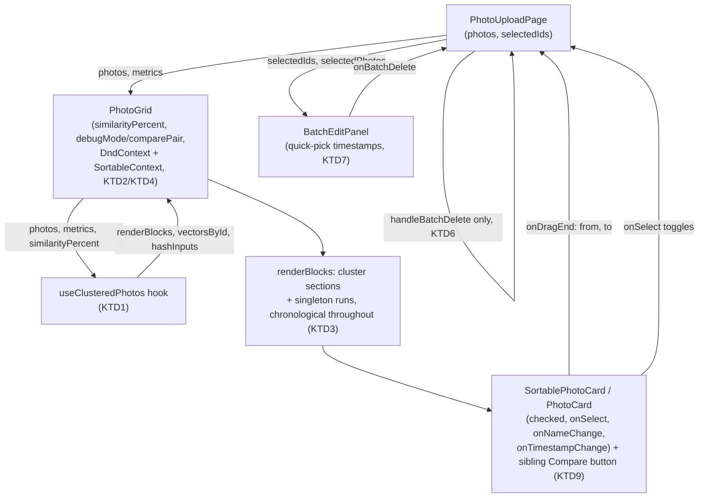

# Unify Timeline and Cluster Views - Plan

## Goal Capsule

- **Objective:** Merge the timeline grid and the cluster/dedup view into one always-visible grid. By default, with the similarity slider at its resting 0%, the grid's photo contents look like today's timeline — chronological order, all existing features — but a new similarity slider control now sits permanently above it. Raising the slider grows clusters live. Every timeline feature (drag-to-reorder, name/timestamp editing, delete, batch timestamp editing) works the same on a clustered photo as on a standalone one.
- **Authority hierarchy:** Requirements own product behavior; Key Technical Decisions own implementation mechanism within their cited requirements; Implementation Units carry unit-local sequencing only.
- **Stop conditions:** Stop and ask if `SortableContext`'s cross-block drag animation (KTD2) proves visually broken rather than merely rough — that would mean the flat-sortable-list assumption behind the whole design is wrong, not just imperfect.
- **Execution profile:** Standard. Seven implementation units, mostly sequential — U1 (extract clustering) has no dependents until U2 (rendering) needs it; U3 (drag) and U4 (selection) each depend on U2's rendering shape; U5 (batch timestamp) and U6 (delete unification) each depend on U4's unified selection; U7 (toggle removal and final cleanup) depends on all of them.
- **Tail ownership:** Whoever ships this plan runs a manual pass dragging a photo across a cluster boundary and confirms the shift animation is acceptable, not just functionally correct (see Stop condition).

---

## Product Contract

### Summary

Replace the timeline/cluster view toggle with one grid. By default the grid's contents match today's timeline; a similarity slider is always visible above it, defaulting to 0% (only exact duplicates grouped, but still visually distinguished as a group). Raising it groups more photos live. A cluster's grid position stays anchored to its earliest member's timestamp, and members within a cluster render in the same chronological order as everything else. Every timeline feature — drag-to-reorder, inline editing, delete, batch timestamp editing — works identically on a clustered photo and a standalone one, driven by one selection mechanism instead of two.

### Problem Frame

The app has two separate views today: a timeline grid (`components/PhotoGrid.tsx`, drag-to-reorder via `dnd-kit`, page-level selection, batch edit) and a cluster/dedup view (`components/ClusterView.tsx`, similarity-threshold grouping, its own separate per-cluster selection state, debug mode). A toggle switches between them. Cluster view has no drag-and-drop and its own delete/timestamp-selection UI, duplicating what the timeline's `BatchEditPanel` already does. This forces a choice — dedup or reorder, never both at once — and the duplicated selection state is itself a maintenance hazard (see KTD5). Sharing selection state alone would fix the duplication hazard, but would not fix the forced choice: dragging still would not work on a clustered photo. R5 requires drag-to-reorder to work identically on a clustered photo, which is why this plan merges rendering and drag wiring, not only selection state (see Sources & Research).

### Requirements

**Unified grid behavior**

- R1. One grid renders at all times. There is no separate timeline/cluster view or toggle between them.
- R2. At the similarity slider's default (0%), the grid's photo contents look like today's timeline, except exact-duplicate photos render visually grouped so the user can spot and remove them. The slider control itself is new, permanent UI, present regardless of threshold.
- R3. Raising the similarity slider groups progressively more photos into clusters, recomputed live.
- R4. A cluster's position in the grid is chronological, anchored to the earliest `capturedAt` among its members — the same rule a standalone photo already follows. Members within a cluster are also ordered chronologically, matching the app's one ordering rule everywhere (see KTD3).

**Feature parity inside clusters**

- R5. Dragging a photo to a new grid position reassigns its timestamp and reorders it, the same whether the photo starts in a cluster, ends in a cluster, or neither.
- R6. Inline name and timestamp editing work on any photo card, clustered or standalone.
- R7. One selection mechanism drives delete and batch timestamp editing across the whole grid, regardless of cluster membership.
- R8. Batch timestamp editing offers quick-pick buttons for the current selection's distinct existing timestamps, alongside the existing custom date/time input.
- R9. Debug mode (pairwise cosine-distance display, two-photo hash/distance compare) is preserved, scoped per cluster.

**Removed**

- R10. The view-mode toggle, the "Back to timeline view" link, and cluster-only selection/delete state are removed entirely — no dead code left behind.

### Scope Boundaries

- No changes to the clustering algorithm itself (`lib/photo-clustering.ts`'s dendrogram build/cut, cosine distance, debounce) — it carries over unchanged.
- No changes to Google Photos import/upload flows.
- Does not reintroduce the identical-vs-similar tier distinction from the original dedup plan — the shipped implementation already uses one continuous threshold with no tier badges. This also covers not adding new copy or badges to distinguish an auto-surfaced exact-duplicate group (0% default) from a similarity cluster the user raised the slider to create — both render with the same generic cluster chrome, as they already do today at any threshold.
- No new automatic/suggested deletion behavior — deletion stays fully manual, as it is today in both views.

### Acceptance Examples

- AE1. Given the slider at its default 0%, when the batch has no exact duplicates, then the grid's photo contents render identically to today's timeline — no bordered cluster sections anywhere (the slider control itself is still present). **Covers R2.**
- AE2. Given a cluster of 3 photos and the slider raised so they group, when the user drags one member to a new chronological position outside the cluster's current span, then only that photo's timestamp changes (existing offset convention), and the cluster recomputes on next render to reflect its new, possibly different membership. **Covers R3, R5.**
- AE3. Given a selection spanning two different clusters (some members from each), when the user opens batch timestamp editing, then the quick-pick buttons show the distinct existing timestamps across the whole selection, not scoped to either cluster alone. **Covers R7, R8.**
- AE4. Given debug mode is on, when the user clicks a photo's "Compare" affordance inside a cluster whose cards are also drag sources, then the compare click does not start a drag and the drag does not trigger a compare — because the affordance renders as a sibling outside the card's drag-listener region (KTD8), the two interactions structurally cannot compete for the same pointer event. **Covers R9.**

---

## Planning Contract

### Key Technical Decisions

- KTD1. **Clustering computation moves into a standalone hook, `hooks/useClusteredPhotos.ts`, separate from rendering.** Mirrors this codebase's existing separation of pure computation (`lib/photo-clustering.ts`) from a computing hook (`hooks/usePhotoMetrics.ts`) from rendering components. The hook owns clustering math only (hashes, dendrogram, blocks); debug-mode UI state and rendering stay in the rendering component (see U2). Governs R3, R4.
- KTD2. **One `DndContext`/`SortableContext` wraps the whole chronologically-ordered sequence of render blocks (cluster sections and singleton runs); the sortable `items` array stays the full flat photo-id list in display order.** `PhotoUploadPage`'s existing `handleDragEnd` already resolves `from`/`to` via `photos.findIndex`, which only depends on array order, not DOM nesting — so `reorderPhotos`/`slotTimestamp` need no changes. This correctness claim depends on KTD3: the sortable items array, the rendered visual order, and the chronologically-sorted `photos` array must all agree at every position, including inside a cluster — if a cluster's members were ordered any other way, the id a user visually drops onto would not be the id `slotTimestamp` treats as chronologically adjacent, silently misfiling the timestamp. KTD3 makes that agreement hold everywhere, which is what makes this decision correct, not merely animated smoothly. Governs R1, R5.
- KTD3. **Cluster boundaries are a pure rendering concern — a bordered `<section>` wrapper around a chronologically-contiguous run of cards — and so is member order within a cluster: members render chronologically, not by mutual similarity.** The current `ClusterView.tsx` orders a cluster's members by `hierarchicalOrder` (a cosine-distance similarity ordering, unrelated to time). That ordering is dropped here: once cards become drag sources (U3), a similarity-ordered visual sequence would diverge from the chronologically-sorted `photos` array `slotTimestamp` uses to compute a dropped photo's new timestamp, corrupting KTD2's correctness assumption. Chronological member order keeps visual order, `SortableContext` order, and array order identical everywhere, which is what actually keeps `reorderPhotos` correct inside a cluster, not merely simpler. `hierarchicalOrder` (`lib/photo-clustering.ts`) becomes unused once this lands — see U7's cleanup step. Governs R1, R4, R5.
- KTD4. **`PhotoGrid` owns the similarity-slider state and calls `useClusteredPhotos` itself; `PhotoUploadPage` passes it `photos` and `metrics` (already computed via `usePhotoMetrics`, today wired only to the soon-deleted `ClusterView`) as props.** Keeps slider state colocated with the rendering it drives, matching how `PhotoGrid` already owns its own rendering concerns today. Governs R1, R2, R3.
- KTD5. **Selection collapses to the single existing page-level `selectedIds`.** `ClusterView`'s own `deleteSelections`/`timestampSelections` Maps and `clusterKey`-based selection keying are deleted, not kept alongside *(session-settled: user-approved — chosen over keeping cluster-scoped selection as an additional layer alongside the page-level one: the request explicitly asked to remove duplicate selection/state management from having two views)*. Governs R7, R10.
- KTD6. **`handleClusterDelete` is deleted; every delete flows through the existing `handleBatchDelete`.** With one selection state, there is only one set of object URLs to release and one selection to prune, so the second wrapper's reason to exist goes away (see `docs/solutions/logic-errors/cluster-view-delete-missing-object-url-release-and-selection-cleanup.md` — that doc's bug class was two delete surfaces drifting out of sync; this removes the second surface rather than keeping both in sync). Governs R7, R10.
- KTD7. **`BatchEditPanel` gains the quick-pick-timestamp affordance `ClusterTimestampEditor` had, generalized to any selection** (single cluster, cross-cluster, or plain timeline) instead of being cluster-scoped, capped to a bounded number of buttons so a large cross-grid selection cannot flood the panel (see U5) *(session-settled: user-approved — chosen over dropping the quick-pick convenience now that selection is unified: batch timestamp editing was explicitly named as functionality that must be preserved)*. This is how R8's quick-pick behavior survives the collapse to one selection mechanism (KTD5). Governs R8.
- KTD8. **Dragging a photo never special-cases cluster membership.** `reorderPhotos` only touches the moved photo's own timestamp; clustering recomputes statelessly from current hashes and timestamps on every render, so a photo joins or leaves a cluster's visual grouping naturally on the next render. No explicit membership-transfer logic is added *(session-settled: user-approved — chosen over adding a guard against cluster reshuffling on drag: confirmed during scoping that a drag should "just work" like any other drag)*. Governs R3, R5.
- KTD9. **Debug mode's toggle, `comparePair` state, `PairwiseDistances` panel, and each card's "Compare" button move into `PhotoGrid`, rendered as siblings around `SortablePhotoCard` — never nested inside its drag-listener-covered wrapper.** This is exactly how `ClusterView` already renders the Compare button today (a sibling below `PhotoCard`, not inside its drag region), so no interface change is needed on `PhotoCard` or `SortablePhotoCard` and no new `stopPropagation` guard is needed for it: a sibling element outside the wrapper `dnd-kit`'s pointer listeners cover never receives those listeners in the first place. `PhotoCard`'s own existing interactive elements (inline name/timestamp edit inputs, its selection click target) already follow the established dnd-kit selection-target pattern (`docs/solutions/best-practices/image-as-selection-target-dnd-kit-pattern-2026-04-05.md`) as verified, pre-existing behavior — this unit only needs to confirm that still holds, not add new guards. Governs R5, R9.

### High-Level Technical Design

`useClusteredPhotos` and `PhotoGrid` are the two new/rewritten pieces. Everything else in the diagram already exists and needs only rewiring (arrows into/out of `PhotoUploadPage`), not new logic.

### Assumptions

- The `rectSortingStrategy` shift/ghost animation may look rougher across separate per-block CSS grid containers than within one flat grid (each block lays out its own grid, so dnd-kit's rect-based collision detection sees a less uniform layout). Accepted for v1 per the Goal Capsule's stop condition — functional correctness (right `from`/`to` index, right resulting timestamp) does not depend on this once KTD3's chronological member ordering holds; only animation smoothness does.
- No repo precedent exists for a sortable list split across multiple visual sub-groups (confirmed via repo research); KTD2 is a from-scratch design, not an extension of an existing pattern. This is why U3 adds an explicit test scenario for reordering a photo within its own cluster, not only across block boundaries — the within-cluster case is exactly where a stale similarity-based ordering would have silently produced a wrong timestamp before KTD3's fix.
- `hierarchicalOrder` (`lib/photo-clustering.ts`) has no remaining caller once KTD3 lands — a candidate for removal in U7, the same "no leftover code from an earlier, reworked attempt" pattern this codebase has hit before (`centroid()`, removed in an earlier pass over the same clustering module).
- `hooks/useClusteredPhotos.ts` has exactly one consumer (`PhotoGrid`) at plan-write time. The extraction is still justified by testability (mirrors `usePhotoMetrics`'s existing computation-hook pattern, independently unit-testable without rendering), not by generality — worth re-examining only if it never gains a second caller and testability turns out not to matter in practice.

---

## Implementation Units

### U1. Extract clustering computation into a standalone hook

**Goal:** Move `ClusterView.tsx`'s clustering pipeline (hash inputs, vectors, debounced dendrogram build, cheap cut, chronological block/member grouping) into a reusable hook, decoupled from rendering and from debug-mode UI state.

**Requirements:** R3, R4

**Dependencies:** None.

**Files:**
- `hooks/useClusteredPhotos.ts` (new)
- `hooks/useClusteredPhotos.test.ts` (new)

**Approach:**
1. Move `hashInputs`, `vectorsById`, the debounced dendrogram build (`useDebouncedValue`, `DENDROGRAM_REBUILD_DEBOUNCE_MS`), `rawClusters`, and `renderBlocks` (singleton-bundling) out of `components/ClusterView.tsx` into this hook.
2. Change `displayClusters`' member ordering from `hierarchicalOrder` (similarity-based) to chronological (sort each cluster's `members` by `capturedAt`, same convention as `earliestCapturedAtMs`'s null-last fallback) — this is a behavior change from the current `ClusterView.tsx`, not a straight port (see KTD3).
3. Hook signature takes `photos`, `metrics`, and `similarityPercent`; returns `renderBlocks` (or an equivalent typed shape) plus `vectorsById` (needed by debug mode's pairwise-distance display) and `hashInputs` (needed by debug mode's hash display). Debug-mode UI state (`debugMode`, `comparePair`) and its rendering stay out of this hook — they belong to `PhotoGrid` (U2, KTD9).
4. Keep `clusterKey` as an exported helper alongside the hook (or in `lib/photo-clustering.ts`) — it is still the stable identity used wherever a cluster needs a React key or a lookup key.

**Patterns to follow:** `hooks/usePhotoMetrics.ts` for the shape of a computation-only hook separate from its consumer component.

**Test scenarios:**
- Given a batch with one exact-duplicate pair and the rest orthogonal, at 0% similarity, the pair clusters and everything else is a singleton block.
- Raising `similarityPercent` on a fixed batch produces more/larger clusters without recomputing the dendrogram build itself (same test technique as `ClusterView.test.tsx`'s existing debounce test — assert `buildDendrogram` call count, not just output).
- A cluster's members render in chronological order (by `capturedAt`), not similarity order — replaces the old `ClusterView.test.tsx` test that asserted similarity-based member ordering.
- A cluster with an all-null-`capturedAt` fallback sorts last (closes the deferred gap noted in `docs/residual-review-findings/2026-08-16-001-photo-similarity-dedup.md`).
- Photos whose metrics are still in flight (absent/undefined map entry) render as temporary singletons.

**Verification:** All scenarios pass; existing `lib/photo-clustering.test.ts` is unaffected (the hook consumes that module, doesn't change it).

---

### U2. Merge cluster and timeline rendering into one grid component

**Goal:** `components/PhotoGrid.tsx` renders the full chronological sequence as interleaved cluster sections and singleton blocks (KTD3), with the similarity slider always visible above it and debug mode fully relocated in (KTD9) — replacing the old flat-only `PhotoGrid` and absorbing `ClusterView`'s rendering, without yet wiring drag or selection (U3, U4).

**Requirements:** R1, R2, R3, R4, R9

**Dependencies:** U1.

**Files:**
- `components/PhotoGrid.tsx` (rewritten)
- `components/PhotoGrid.test.tsx` (rewritten)
- `components/PhotoUploadPage.tsx` (modified — pass its existing `metrics` value, currently wired only to `ClusterView`, to `PhotoGrid` instead; see KTD4)

**Approach:**
1. `PhotoGrid` owns `similarityPercent` state (default 0%, replacing the old 40% default) and calls `useClusteredPhotos` (U1) with `photos`, the new `metrics` prop, and `similarityPercent`. It renders the returned `renderBlocks`: a bordered `<section>` per multi-member cluster, a plain grid `
` per run of singleton blocks — same visual shapes `ClusterView` already has today.
2. The similarity slider (label, range input, percent readout) renders inside `PhotoGrid`, always visible above the blocks.
3. Debug mode moves in whole: the toggle checkbox, `comparePair` state, `handleCompareClick`, and the `PairwiseDistances` panel all become part of `PhotoGrid`, using `vectorsById`/`hashInputs` from `useClusteredPhotos`. Each card's "Compare" button renders as a sibling next to `SortablePhotoCard`/`PhotoCard` in the same per-card wrapper `
` `ClusterView` already uses (KTD9) — not as a new prop on either card component.
4. Drag wiring and selection wiring are explicitly deferred to U3 and U4 — this unit only gets the always-visible, always-clustering, debug-mode-complete rendering shape correct against the existing (unchanged) selection props, so it stays reviewable as one step. `components/ClusterView.tsx` is not deleted yet — U3, U4, and U5 still port pieces from it; its final deletion is U7's job, once nothing references it.

**Patterns to follow:** `components/ClusterView.tsx`'s current `renderBlocks.map(...)` rendering (block key derivation, cluster header text, debug-mode toggle and `PairwiseDistances` rendering, per-card Compare button placement) as the direct source to port.

**Test scenarios:**
- At 0% default, with no exact duplicates in the batch, the grid's photo contents match today's flat timeline (no bordered sections). Covers AE1.
- A batch with one 3-member cluster at the current threshold renders one bordered section with a "3 related photos" header, positioned chronologically among any singleton blocks per the cluster's earliest timestamp.
- Moving the slider live re-renders blocks without a full remount (existing photo cards keep their identity/keys across a threshold change).
- Debug mode off by default: no toggle-checked state, no `PairwiseDistances` panel, no Compare buttons rendered as active affordances.
- Toggling debug mode on renders the `PairwiseDistances` panel for each multi-member cluster and a Compare button on every card, matching today's `ClusterView` behavior.
- Test expectation: none for the slider's visual styling — covered by existing snapshot-free assertions on structure, not pixels.

**Verification:** All scenarios pass; `components/ClusterView.test.tsx`'s structural and debug-mode tests are ported here and pass unchanged in substance (member-ordering assertions updated per U1).

---

### U3. Wire drag-and-drop across the unified sequence

**Goal:** Every card in `PhotoGrid` — clustered or standalone — is a drag source and drop target inside one `DndContext`/`SortableContext` spanning the whole grid (KTD2), correct both across cluster boundaries and within a single cluster.

**Requirements:** R1, R5, R9

**Dependencies:** U2.

**Files:**
- `components/PhotoGrid.tsx` (modified)
- `components/PhotoUploadPage.tsx` (modified — `DndContext` now always wraps `PhotoGrid`, not conditionally per `viewMode`)
- `components/PhotoGrid.test.tsx` (modified)

**Approach:**
1. `PhotoUploadPage` always renders `<DndContext><PhotoGrid .../></DndContext>` — the existing conditional between `DndContext`-wrapped `PhotoGrid` and standalone `ClusterView` goes away (this is the mechanical half of R10, completed here since it's inseparable from the drag wiring).
2. Inside `PhotoGrid`, every card (cluster member or singleton) renders via `SortablePhotoCard` with the full flat photo-id list as the `SortableContext` `items` array, in the same chronological order `renderBlocks` already produces — now identical to visual order everywhere per KTD3, so `handleDragEnd`'s existing `photos.findIndex`-based index resolution needs no changes (KTD2).
3. Verify the debug-mode "Compare" button still renders as a sibling outside `SortablePhotoCard`'s drag-listener wrapper (per KTD9, ported in U2) — confirm no `stopPropagation` addition is needed for it, and that `PhotoCard`'s own existing interactive elements still correctly guard against the drag sensor as they already do in today's timeline view.

**Execution note:** Prove the within-cluster and cross-block index resolution with a test before relying on it visually — this is the plan's one from-scratch design (no repo precedent), and a wrong `from`/`to` computation would silently misfile a photo's timestamp rather than error loudly.

**Patterns to follow:** `docs/solutions/best-practices/image-as-selection-target-dnd-kit-pattern-2026-04-05.md` for confirming the existing `stopPropagation` treatment holds; `components/PhotoUploadPage.tsx`'s existing `handleDragEnd` for index resolution, unchanged.

**Test scenarios:**
- Dragging a standalone photo to a position inside a cluster's visual span resolves the same `from`/`to` indices `handleDragEnd` would compute today, and only that photo's timestamp changes (existing offset convention). Covers AE2.
- Dragging a cluster member to a position outside any cluster resolves correctly and the cluster's remaining members keep their own positions.
- Dragging one cluster member to swap position with another member of the *same* cluster resolves the same `from`/`to` a purely chronological array-index computation would produce — proving KTD3's chronological member ordering keeps this case correct, not just the cross-block case.
- Clicking debug mode's "Compare" button on a cluster member does not start a drag (`PointerSensor`'s `activationConstraint` is not triggered), because the button sits outside the card's drag-listener region. Covers AE4.
- Starting a drag from a card does not toggle its debug-mode compare state.
- The existing `DragOverlay` (floating card preview while dragging) renders correctly for a card that started inside a cluster section.

**Verification:** All scenarios pass; existing `hooks/usePhotos.test.ts` reorder/`slotTimestamp` tests are unaffected (no changes to that file).

---

### U4. Unify selection

**Goal:** One `selectedIds` (already in `PhotoUploadPage`) drives `checked`/`onSelect` for every card; inline name/timestamp editing (`onNameChange`/`onTimestampChange`) is wired into cluster-member cards for the first time.

**Requirements:** R6, R7, R10

**Dependencies:** U2.

**Files:**
- `components/PhotoGrid.tsx` (modified)
- `components/PhotoUploadPage.tsx` (modified — remove `deleteSelections`/`timestampSelections`-adjacent plumbing that no longer exists once selection is unified)
- `components/PhotoGrid.test.tsx` (modified)

**Approach:**
1. Every card in `PhotoGrid` receives `checked={selectedIds.has(id)}` and `onSelect={(checked) => toggleSelect(id, checked)}` — the same props `PhotoGrid` already passes today, now also reaching cluster-member cards.
2. Every card also receives `onNameChange`/`onTimestampChange` (already supported by `PhotoCard`, per repo research, just not previously wired for cluster members) so inline editing works everywhere.
3. `ClusterView`'s `deleteSelections`, `timestampSelections`, and `clusterKey`-based selection-Map logic (still physically present in `components/ClusterView.tsx` until U7 deletes the file) are no longer called or referenced by anything after this unit — nothing in the merged component reads or writes them (KTD5).

**Patterns to follow:** `components/PhotoCard.tsx`'s existing `checked`/`onSelect`/`onNameChange`/`onTimestampChange` props, confirmed selection-agnostic and reusable unchanged.

**Test scenarios:**
- Selecting a cluster member updates the same `selectedIds` a standalone-photo selection would, visible in `BatchEditPanel`'s count.
- Selecting photos both inside and outside a cluster in the same session produces one combined selection, not two separate ones.
- Editing a cluster member's name or timestamp inline updates it the same way a standalone photo's inline edit does.
- No code path in `components/PhotoGrid.tsx`, `components/PhotoUploadPage.tsx`, or their tests references `deleteSelections`, `timestampSelections`, or `clusterKey`-based selection after this unit (grep-verified, not just test-verified) — those symbols only remain reachable from the still-undeleted `ClusterView.tsx`, itself unreferenced by anything.

**Verification:** All scenarios pass; `components/PhotoCard.test.tsx` is unaffected (no changes to that component).

---

### U5. Generalize batch timestamp editing with quick-pick

**Goal:** `BatchEditPanel` offers quick-pick buttons for the current selection's distinct existing timestamps, working the same whether the selection is one cluster, spans clusters, or is plain timeline photos (KTD7), with a bounded button count so a large selection can't flood the panel.

**Requirements:** R8

**Dependencies:** U4.

**Files:**
- `components/BatchEditPanel.tsx` (modified)
- `components/BatchEditPanel.test.tsx` (modified)
- `components/PhotoUploadPage.tsx` (modified — pass selected photos' timestamps, not just the count, into `BatchEditPanel`)

**Approach:**
1. `PhotoUploadPage` derives the selection's distinct existing `capturedAt` values (deduped by ms value, sorted ascending — same rule `ClusterTimestampEditor` already used) and passes them into `BatchEditPanel` as a new prop, alongside the existing `selectedCount`.
2. `BatchEditPanel` renders one quick-pick button per distinct timestamp, capped at 8 buttons (matching this app's other small fixed UI limits, e.g. tag counts elsewhere in the stack) — when more than 8 distinct timestamps exist, show the 8 most recent and a plain count of how many more were omitted, alongside the existing custom datetime-local input. Both the quick-pick and custom paths call the existing `onBatchSetTimestamp`.
3. `ClusterTimestampEditor`'s JSX (currently inside `ClusterView.tsx`) is no longer called from anywhere once this unit lands — its behavior is now folded into `BatchEditPanel`. The now-dead component definition itself is removed when `ClusterView.tsx` is deleted in U7, not here.

**Patterns to follow:** `ClusterView.tsx`'s current `ClusterTimestampEditor` for the quick-pick button rendering and timestamp-dedup logic, generalized to take an arbitrary id list instead of one cluster's members.

**Test scenarios:**
- A selection with three distinct existing timestamps shows three quick-pick buttons plus the custom input.
- Two selected photos sharing the same existing timestamp produce one deduplicated quick-pick button, not two. Covers AE3.
- A selection spanning two different clusters shows the union of both clusters' distinct timestamps, not either cluster's alone. Covers AE3.
- A selection with more than 8 distinct timestamps shows exactly 8 quick-pick buttons plus a count of the remainder, not an unbounded list.
- Choosing a quick-pick timestamp applies the existing one-second-offset convention to the whole current selection, identically to the custom-input path.
- A selection with zero photos carrying a timestamp (all null `capturedAt`) shows only the custom input, no quick-pick buttons.

**Verification:** All scenarios pass; the existing custom-datetime-input test coverage in `components/BatchEditPanel.test.tsx` continues to pass unmodified.

---

### U6. Retire the cluster-specific delete path

**Goal:** Every delete — cluster-originated or not — flows through the single existing `handleBatchDelete` (KTD6); `handleClusterDelete` and its dedicated tests are removed.

**Requirements:** R7, R10

**Dependencies:** U4.

**Files:**
- `components/PhotoUploadPage.tsx` (modified — delete `handleClusterDelete`)
- `components/PhotoUploadPage.test.tsx` (modified — remove the `PhotoUploadPage — cluster-view delete cleanup` describe block; add coverage for cluster-originated deletes going through `handleBatchDelete`)

**Approach:**
1. Delete `handleClusterDelete` entirely — with selection unified (U4), `handleBatchDelete` already releases object URLs and prunes `selectedIds` for whatever is currently selected, cluster-originated or not.
2. Remove the now-obsolete `PhotoUploadPage — cluster-view delete cleanup` test block (it tested `handleClusterDelete` directly via a mock-captured prop that no longer exists).

**Patterns to follow:** `components/PhotoUploadPage.tsx`'s existing `handleBatchDelete` — unchanged, now the only delete path.

**Test scenarios:**
- Deleting a selection that includes a cluster member releases that photo's object URL, the same as deleting a standalone photo.
- Deleting a mixed selection (some cluster members, some standalone) prunes `selectedIds` correctly for all of them in one call.

**Verification:** All scenarios pass; `docs/solutions/logic-errors/cluster-view-delete-missing-object-url-release-and-selection-cleanup.md`'s bug class (two delete surfaces, only one correctly wrapped) cannot recur — there is only one surface left.

---

### U7. Remove the view toggle and clean up

**Goal:** Delete the `viewMode` state, the "Group similar photos"/"Back to timeline view" controls, `components/ClusterView.tsx` itself (now that U2-U5 have absorbed everything it did), the now-unused `hierarchicalOrder` export, and every other now-dead export or test left over from the two-view design.

**Requirements:** R1, R10

**Dependencies:** U2, U3, U4, U5, U6.

**Files:**
- `components/PhotoUploadPage.tsx` (modified — remove `viewMode` state and the toggle button; the "Select all"/"Clear selection" controls, currently gated on `viewMode === 'timeline'`, render unconditionally)
- `components/ClusterView.tsx` (deleted — U2 through U5 have ported or made unreachable everything it contained)
- `components/ClusterView.test.tsx` (deleted — coverage already ported to `components/PhotoGrid.test.tsx` and `hooks/useClusteredPhotos.test.ts` in U1/U2)
- `lib/photo-clustering.ts` (modified — remove the now-unused `hierarchicalOrder` export per KTD3)
- `lib/photo-clustering.test.ts` (modified — remove `hierarchicalOrder`'s test coverage)
- `CONCEPTS.md` (modified — update the Photo Deduplication section's Cluster entry to reflect the always-visible grid instead of a toggled view, if the current wording implies a separate mode)

**Approach:**
1. Remove `viewMode` state and the button that toggled it; `PhotoGrid` (with its always-visible slider and debug mode from U2) is the only thing `PhotoUploadPage` renders once photos exist. Unconditionally render "Select all"/"Clear selection" instead of gating them on the now-removed `viewMode`.
2. Delete `components/ClusterView.tsx` and `components/ClusterView.test.tsx` now that nothing calls into either.
3. Remove `hierarchicalOrder` from `lib/photo-clustering.ts` and its dedicated test block, per KTD3's note that it has no remaining caller.
4. Grep the repo for any remaining reference to `ClusterView`, `deleteSelections`, `timestampSelections`, `clusterKey` usage outside `hooks/useClusteredPhotos.ts`/`lib/photo-clustering.ts`, `handleClusterDelete`, and `hierarchicalOrder` — confirm zero hits.
5. Update `CONCEPTS.md`'s Cluster entry only if its current wording assumes a separate toggled view; otherwise leave it (it already describes the slider and debug mode generically).

**Test scenarios:**
- The "Group similar photos" / "Back to timeline view" button does not exist anywhere in the rendered output.
- "Select all" and "Clear selection" render regardless of whether any clusters are currently showing.
- Test expectation: none for the `CONCEPTS.md` edit — documentation change, not behavior.

**Verification:** All scenarios pass; full suite (`npm run test`), `npm run lint`, and `npm run build` all pass; the grep audit in step 4 returns zero hits.

---

## Verification Contract

| Gate | Command | Applies to |
|---|---|---|
| Unit/component tests | `npm run test` | All units |
| Lint | `npm run lint` | All units |
| Production build | `npm run build` | All units |
| Manual: cross-block and within-cluster drag | Drag a photo across a cluster's visual boundary, and drag one cluster member past another within the same cluster, in a running dev session | U3 |
| Manual: mixed-selection batch edit | Select photos both inside and outside a cluster, apply a quick-pick timestamp | U5 |

## Definition of Done

- All seven units implemented; every listed test scenario exists and passes.
- `components/ClusterView.tsx`, `ClusterTimestampEditor`, `handleClusterDelete`, `deleteSelections`, `timestampSelections`, and `hierarchicalOrder` no longer exist anywhere in the codebase (grep-verified, per U7 step 4).
- The view toggle and "Back to timeline view" link are gone; one grid renders whenever photos are loaded.
- `npm run test`, `npm run lint`, and `npm run build` all pass.
- Manual verification (Verification Contract) completed, including the Goal Capsule's stop-condition check on cross-block drag animation quality.

---

## Sources & Research

- `hooks/usePhotos.ts:33-53,96-98` — `reorderPhotos`/`slotTimestamp`: confirmed index-only, computing a moved photo's new timestamp from its chronologically-adjacent array neighbors — the fact that grounds KTD3's requirement that visual, sortable, and array order all agree (grounds KTD2, KTD3, KTD8).
- `components/PhotoGrid.tsx:26-66`, `components/SortablePhotoCard.tsx:16-47` — current flat `SortableContext` wiring, the direct source for U3's port. Confirmed `SortablePhotoCard`'s Props type has no children/extra-content slot, which is why KTD9 keeps the debug Compare button a sibling rather than adding one.
- `components/ClusterView.tsx` (current, full file) — source for U1's extracted hook and U2's rendering port: `clusterKey` (:112-114), `earliestCapturedAtMs` (:127-135), `deleteSelections`/`timestampSelections` (:402, :423), `renderBlocks` (:384-396), `useDebouncedValue`/`DENDROGRAM_REBUILD_DEBOUNCE_MS` (:39, :50-67), `ClusterTimestampEditor` (:183-249), `PairwiseDistances` (:256-293), debug toggle/`comparePair` state and the per-card Compare-button-as-sibling rendering (:429-450, :472-505, :520-528, :571-579).
- `lib/photo-clustering.ts` — `hierarchicalOrder` (similarity-based ordering, used today only for within-cluster member order) vs. `earliestCapturedAtMs`-style chronological ordering used everywhere else; grounds KTD3's decision to drop the former once cards become draggable.
- `components/PhotoCard.tsx:40-47,120-148` — confirmed `checked`/`onSelect`/`onNameChange`/`onTimestampChange` are already selection-agnostic and reusable unchanged (grounds U4); confirmed its own interactive elements already carry the dnd-kit `stopPropagation` pattern independent of this plan.
- `components/BatchEditPanel.tsx:6-20` — confirmed selection-agnostic, grounds U5's extension.
- `docs/solutions/logic-errors/cluster-view-delete-missing-object-url-release-and-selection-cleanup.md` — grounds KTD6; this plan removes the second delete surface that doc's bug required, rather than keeping two surfaces in sync.
- `docs/solutions/best-practices/image-as-selection-target-dnd-kit-pattern-2026-04-05.md` — grounds KTD9; confirms which existing guards already hold and clarifies the sibling-placement pattern that means the debug Compare button needs no new guard.
- `docs/solutions/best-practices/exif-timestamp-rewriting-for-drag-reorder-persistence-2026-04-05.md` — confirms the timestamp-offset convention `reorderPhotos`/`batchSetTimestamps` already use, unaffected by this merge.
- `docs/residual-review-findings/2026-08-16-001-photo-similarity-dedup.md` — source of the deferred `earliestCapturedAtMs` all-null-cluster test gap, closed in U1.
- `docs/plans/2026-08-15-001-feat-similar-photo-grouping-dedup-plan.md` — prior art: the original dedup feature plan this work restructures. Not updated in place (already shipped and implementation-ready; this is a follow-on plan, not an amendment).
- A narrower alternative — share `selectedIds`/`handleBatchDelete` between the still-separate `ClusterView` and `PhotoGrid` without merging rendering or drag — would resolve KTD6's bug class alone, but not R5 (drag-to-reorder must work identically on a clustered photo), which was explicit in the request this plan was scoped against, not an inferred nice-to-have. That is why this plan takes on KTD2's from-scratch rendering/drag merge rather than stopping at selection unification.
