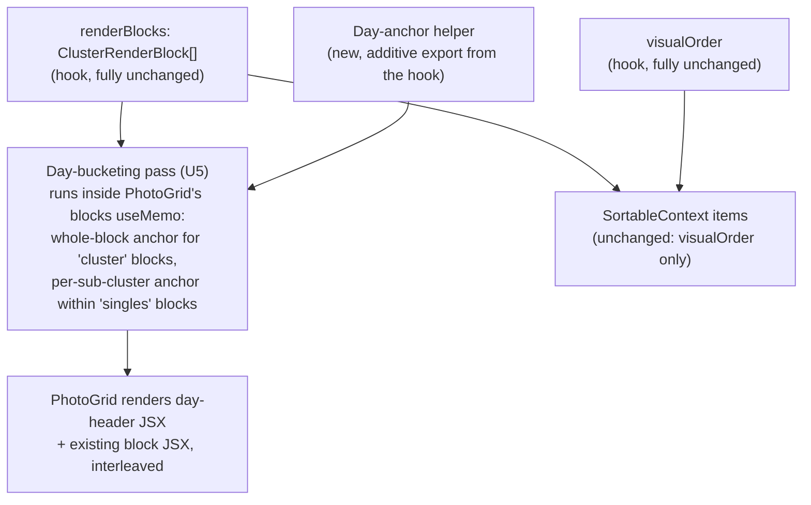

# Photo Card Delete/Zoom Overlays and Day Grouping - Plan

## Goal Capsule

- **Objective:** Add three independent UI additions to the photo grid: a delete (X) icon on every card that reuses the existing batch-delete cleanup path, a zoom (magnifying glass) icon that opens a new view-only lightbox, and chronological day-separator headers grouping photos and clusters by calendar day.
- **Authority hierarchy:** Requirements own product behavior; Key Technical Decisions own implementation mechanism within their cited requirements; Implementation Units carry unit-local sequencing only.
- **Stop conditions:** Stop and ask if day-bucketing (KTD6) turns out to need touching `hooks/useClusteredPhotos.ts`'s `ClusterRenderBlock` union or `visualOrder` computation beyond the one additive day-anchor export — the whole point of KTD6 is that day headers never enter the hook's return shape, so drag-and-drop's `visualOrder` can never be affected by them.
- **Execution profile:** Standard. Five implementation units in two independent tracks: U1 (delete generalization) has no dependents until U2 (delete icon); U3 (lightbox component) is standalone; U4 (zoom icon) depends on U2 and U3 for file-overlap sequencing; U5 (day headers, entirely render-level) is standalone.
- **Tail ownership:** Whoever ships this plan runs a manual pass: delete a photo from within a multi-photo selection via the X icon and confirm the rest of the selection survives; open and close the lightbox, including a keyboard-only pass (Tab, Escape); and change the similarity slider while day headers are showing to confirm headers don't jump or duplicate.

---

## Product Contract

### Summary

Add a delete icon and a zoom icon to every photo card, and add day-separator headers above the grid. All three apply uniformly across singleton photos and clusters, and regardless of the similarity slider's position.

### Problem Frame

The grid currently supports deletion and inspection only through page-level affordances: select one or more photos, then use `BatchEditPanel`'s delete button; there is no full-size preview at all. Both add friction to the common "scan through recent photos, remove the bad ones, look closer at the borderline ones" workflow — the user must select-then-act instead of acting directly on the photo they're looking at. Photos are already rendered in chronological order, but with no day boundaries, a long batch reads as one undifferentiated scroll with no landmarks.

### Requirements

**Card-level actions**

- R1. Every photo card shows a delete (X) icon. Clicking it removes that one photo from the batch through the same cleanup the existing batch delete performs (object-URL release, `selectedIds` pruning) — no second, differently-behaved delete path.
- R2. Deleting a photo that is not part of the current multi-selection does not affect the rest of that selection.
- R3. Every photo card shows a zoom (magnifying glass) icon. Clicking it opens a lightbox showing that one photo at full size. View-only: no next/prev navigation between photos, no delete action inside the lightbox.
- R4. The lightbox closes on an explicit close control, a click outside the photo, and the Escape key, and manages keyboard focus while open.
- R5. Clicking the delete or zoom icon never toggles the card's selection state and never starts a drag.
- R6. Delete has no confirmation step, matching the existing batch-delete's zero-friction behavior.

**Day grouping**

- R7. Photos render under chronological day-separator headers (e.g. "September 23, 2023"), applying to both singleton photos and clusters.
- R8. A cluster's header placement is its earliest member's day; a cluster whose members span multiple days is filed entirely under the earliest day, never split.
- R9. Photos with no timestamp are grouped under one trailing header, after every dated day (or as the sole header when no dated photos exist at all), consistent with the app's existing null-timestamp-sorts-last convention.
- R10. Day-header grouping never becomes a second, independently-computed ordering signal — it is derived from the same rendered sequence that drag-and-drop and clustering already treat as authoritative, so it can never disagree with what a drag interaction resolves against.

### Scope Boundaries

- No change to the clustering algorithm, the similarity slider, or drag-and-drop mechanics — day headers are a pure rendering addition on top of the existing pipeline.
- No lightbox navigation (next/prev, keyboard arrows between photos) — a fixed non-goal for this plan, not a deferred one; revisit only on explicit future request.
- No delete confirmation or undo affordance (R6) — explicit non-goal, matching current behavior.
- **Deferred to Follow-Up Work:** consolidating all three delete-capable call sites (batch delete, the retired cluster-delete path, and this plan's new per-card delete) into a single `useDeletePhotos()` hook, as floated in `docs/solutions/logic-errors/cluster-view-delete-missing-object-url-release-and-selection-cleanup.md`'s prevention notes. Reviewed and reconfirmed during planning: the retired `ClusterView`/`handleClusterDelete` path no longer exists in this codebase, so this plan leaves exactly two live call sites (batch delete, per-card delete), both already routed through the same `handleBatchDelete` wrapper (KTD1) — extracting a hook now would have one internal consumer and no cross-component reuse benefit. Worth revisiting only if a distinct third call site appears later.

### Acceptance Examples

- AE1. Given a photo is part of a 3-photo selection, when the user clicks that photo's X icon (not the batch-delete button), then only that photo is removed and the other 2 remain selected. **Covers R1, R2.**
- AE2. Given the similarity slider groups three photos into one cluster whose earliest member was captured on 2026-08-20 and latest member on 2026-08-22, when the grid renders, then the whole cluster appears once, under the 2026-08-20 header, not split across two headers. **Covers R8.**
- AE3. Given a batch with some dated and some undated photos, when the grid renders, then every dated day appears in chronological order first, followed by exactly one "Undated" header holding all undated photos. **Covers R9.**
- AE4. Given the user clicks a card's zoom icon, when the lightbox is open, then (a) the initiating click did not toggle that card's selection state and did not start a drag, and (b) pressing Escape, clicking the backdrop, or clicking the close control all close the lightbox and return keyboard focus to the zoom icon that opened it. **Covers R3, R4, R5.**
- AE5. Given a run of chronologically-adjacent singleton (unclustered) photos spans two different UTC calendar days with no 2+-member cluster between them, when the grid renders, then the singleton photos split into two day groups, each under its own correct day header, not one group under a single day. **Covers R7.**

---

## Planning Contract

### Key Technical Decisions

- KTD1. **The delete icon reuses `handleBatchDelete` (`components/PhotoUploadPage.tsx:218-224`), generalized to accept an explicit `ids: string[]` parameter defaulting to `Array.from(selectedIds)`.** Calling it with a single id is the delete icon's whole implementation — no new wrapper, no raw `removePhotos` call. This directly avoids the "second delete surface bypassing cleanup" bug class documented in `docs/solutions/logic-errors/cluster-view-delete-missing-object-url-release-and-selection-cleanup.md`, whose own prevention notes name a parameterized/shared delete function as the fix. Governs R1.
- KTD2. **Selection pruning inside the generalized delete removes exactly the deleted ids from `selectedIds`, not the whole set.** Today's `handleBatchDelete` unconditionally calls `clearSelection()` (safe today, because it only ever deletes exactly what's selected). Once the function can be called with an id that is not the current selection, blind clearing would silently drop the rest of an unrelated multi-selection. The fix: prune `selectedIds` of only the ids passed in. For the existing batch-delete call site this is behaviorally identical (the passed ids already equal the full selection); for the new per-card call site it is the difference between correct and buggy. Governs R2.
- KTD3. **Delete and zoom icons call `e.stopPropagation()` on both `onPointerDown` and `onClick`.** Established pattern from `docs/solutions/best-practices/image-as-selection-target-dnd-kit-pattern-2026-04-05.md`: `onClick` alone stops the click from also toggling the card's selection (`components/PhotoCard.tsx:125`'s existing selection handler), but `SortablePhotoCard` puts dnd-kit's drag `{...listeners}` on the outer wrapper (`components/SortablePhotoCard.tsx:36`), so only stopping `onPointerDown` too prevents `PointerSensor` (8px activation distance) from starting a drag on the same gesture. Governs R5.
- KTD4. **Icon placement, sizing, and visual treatment:** zoom at bottom-left, delete at bottom-right of the card's image container, leaving the existing top-left (Google Photos badge, `PhotoCard.tsx:135-139`) and top-right (selection checkmark, `PhotoCard.tsx:141-147`) corners untouched. Both new icons are absolutely-positioned siblings inside the same `relative` image wrapper (`PhotoCard.tsx:123`), always-visible not hover-only *(session-settled: user-approved — chosen over a hover-only reveal: proposed with the always-visible/hover-only tradeoff surfaced during planning, user confirmed always-visible)*. Each icon's tappable hit area is a minimum ~44x44px region (via padding around a visually smaller glyph, matching the checkmark's compact visual size) — R6/KTD11 settle that delete has zero confirmation, so an undersized tap target on a no-undo destructive action carries real mis-tap risk on touch devices. The delete icon additionally gets a distinct warning tone (e.g. a red/rose stroke color) so it reads as visually different from the neutral zoom icon at a glance, given both are always-visible, similarly sized, and in symmetric corners. Governs R1, R3, R5, R6.
- KTD5. **The lightbox is a new, from-scratch component with explicit focus management.** Confirmed via repo search: no modal, dialog, or portal pattern exists anywhere in the codebase, and no dialog/UI library is a dependency (`@dnd-kit/*`, `exifr`, `piexif-ts`, `next`, `react` only). Build a plain `fixed inset-0` overlay div — no portal, no new dependency, consistent with the app's zero-extra-UI-dependency posture. Because there is no existing modal precedent to inherit focus conventions from, the component owns its own: on open, focus moves to the close control; Tab/Shift+Tab is trapped within the lightbox's focusable elements while open; on any close path, focus returns to the zoom icon that opened it. Governs R3, R4.
- KTD6. **Day-bucketing is computed entirely inside `components/PhotoGrid.tsx`'s existing `blocks` render pass, operating on the hook's unchanged `renderBlocks` output — never as a new variant in `hooks/useClusteredPhotos.ts`'s `ClusterRenderBlock` union, and never touching `visualOrder`.** `hooks/useClusteredPhotos.ts` gains exactly one small additive export — a day-anchor helper (an exported form of the existing internal `earliestCapturedAtMs` logic) — so the single source of truth for "what day does this cluster's earliest member fall on" stays in the hook rather than being duplicated in `PhotoGrid`. Everything else about the hook (`ClusterRenderBlock`'s two-variant union, `renderBlocks`'s shape, `visualOrder`'s computation at `hooks/useClusteredPhotos.ts:271-281`) is untouched. This is a deliberately narrower application of the Prevention guidance in `docs/solutions/logic-errors/cluster-drag-timestamp-visual-order-divergence.md` (a P0 bug from this same pipeline, fixed this session) than an earlier draft of this plan took: rather than adding a third block type to the hook's union and then having to update every `block.type` consumer (production code and tests alike) to skip it, day headers never enter the hook's type system at all, so there is no unguarded branch anywhere to protect and no risk of the exact P0 bug's shape recurring. Governs R7, R10.
- KTD7. **Within a `'singles'` render block, day-bucketing groups its individual `clusters` array (each a 1-member cluster) by day before flattening to JSX — not the whole block at once.** A `'singles'` block bundles any run of chronologically-adjacent 1-member clusters until a 2+-member cluster interrupts it (`hooks/useClusteredPhotos.ts:248-260`), with no day-boundary awareness — so a single `'singles'` block can legitimately span multiple different UTC calendar days when no cluster happens to fall between them. Bucketing at the whole-block level would silently misfile a multi-day run of singleton photos under one day's header. A `'cluster'` block (2+ members) is never split this way — by R8 it always gets exactly one day bucket, at its earliest member's day, even when it spans multiple days. Governs R7, R8.
- KTD8. **Day buckets use UTC calendar-day components** (`getUTCFullYear`/`getUTCMonth`/`getUTCDate`), not local-timezone day boundaries. EXIF timestamps are UTC-encoded clock values (`exifr` builds `Date` objects via `Date.UTC`) that the rest of the app already reads and displays as UTC (`PhotoCard.tsx`'s `formatDate`/`toDatetimeLocal`, `PhotoCard.tsx:5-15, 22-29`), so bucketing by local time would silently misfile a photo relative to the date already shown on its own card. Governs R7.
- KTD9. **Day headers use a dedicated full-month UTC date formatter** (e.g. `month: 'long'`), distinct from `PhotoCard.tsx`'s existing card-level `dateFormatter` (which uses `month: 'short'` for the compact per-card timestamp label). A day header is a page-level landmark, not a per-card label, and the plan's own worked example ("September 23, 2023") is the full-month form — reusing the card formatter unchanged would silently produce "Sep 23, 2023" instead, contradicting that example. Governs R7.
- KTD10. **All-null-`capturedAt` clusters/singles are grouped into one trailing "Undated" bucket, after every dated day (or as the sole bucket when no dated photos exist at all).** Matches `hooks/usePhotos.ts`'s `compareByCapturedAt` null-last convention (`usePhotos.ts:23-31`) and the day-anchor helper's `Infinity` fallback for all-null clusters (mirroring `earliestCapturedAtMs`, `hooks/useClusteredPhotos.ts:91-99`) — the day-bucketing pass reuses that same existing per-cluster anchor value rather than recomputing it. Governs R9.
- KTD11. **Day headers render as plain, non-sticky headings in normal document flow** — no `position: sticky` scroll-anchoring. Chosen as the simpler default for this plan's scope; revisit only if manual verification shows headers scrolling out of view undermines their landmark purpose in a long batch. Governs R7.
- KTD12. **The lightbox ships with no next/prev navigation between photos** *(session-settled: user-approved — chosen over adding keyboard/click navigation to browse the batch from inside the lightbox: proposed as minimal/view-only during planning, user confirmed no navigation)*. Governs R3.
- KTD13. **Delete has no confirmation or undo step** *(session-settled: user-approved — chosen over adding a lightweight confirm/undo affordance despite the X icon making accidental single-click deletion easier than the existing selection-then-batch-delete flow: proposed as matching today's zero-friction batch delete during planning, user confirmed no confirmation)*. Governs R6.

### High-Level Technical Design

`renderBlocks` and `visualOrder` are untouched hook outputs, consumed exactly as before by `SortableContext`. Day headers exist only inside `PhotoGrid`'s own render output — they never pass through the hook's type system, so there is nothing for `visualOrder` to skip or be perturbed by.

### Assumptions

- The lightbox needs no photo metadata beyond the image itself (filename as alt text is enough); it does not duplicate the card's inline name/timestamp editing.
- The lightbox's broken-image case (the object URL somehow fails to load) is handled with a minimal fallback state — unlikely in practice since the same object URL already renders the card thumbnail successfully before the lightbox can open, but still a real interaction state for a from-scratch component with no existing pattern to inherit from.

---

## Implementation Units

### U1. Generalize delete to a parameterized function with correct selection pruning

**Goal:** Change `handleBatchDelete` to accept an explicit `ids: string[]` parameter (defaulting to the current selection) and prune `selectedIds` of only those ids, per KTD1/KTD2.

**Requirements:** R1, R2

**Dependencies:** None.

**Files:**
- `components/PhotoUploadPage.tsx` (modified)
- `components/PhotoUploadPage.test.tsx` (modified)

**Approach:**
1. Rename/generalize `handleBatchDelete()` to accept `ids: string[] = Array.from(selectedIds)`.
2. Replace the unconditional `clearSelection()` call with pruning: build a new `Set` from `selectedIds` with exactly the passed `ids` removed.
3. Keep the object-URL-release loop and `removePhotos` call unchanged in shape — only the id source and the pruning target change.
4. Update the existing `onBatchDelete={handleBatchDelete}` wiring on `BatchEditPanel` — calling it with no arguments must still delete the current selection, so the existing batch-delete behavior is unchanged.

**Patterns to follow:** The existing prune-not-clear pattern already used elsewhere for selection state (e.g. `toggleSelect`'s `Set`-copy-and-mutate shape).

**Test scenarios:**
- Calling the delete function with no arguments (existing batch-delete call site) still deletes every currently-selected photo and clears the whole selection, unchanged from today.
- Calling it with a single id that is part of a 3-photo selection removes only that photo and its id from `selectedIds`, leaving the other 2 selected. Covers AE1.
- Calling it with an id that is not currently selected at all removes that photo and leaves `selectedIds` completely unchanged.
- Object-URL release still fires for exactly the deleted id(s) in every case above.

**Verification:** All scenarios pass; existing `handleBatchDelete`-related tests in `components/PhotoUploadPage.test.tsx` continue to pass with call sites updated to the new signature where needed.

---

### U2. Add the delete icon to photo cards

**Goal:** Render an always-visible X icon overlay on every card; clicking it calls U1's generalized delete function with that card's id, with correct pointer-event handling, sizing, and visual treatment.

**Requirements:** R1, R5, R6

**Dependencies:** U1.

**Files:**
- `components/PhotoCard.tsx` (modified)
- `components/SortablePhotoCard.tsx` (modified)
- `components/PhotoGrid.tsx` (modified)
- `components/PhotoUploadPage.tsx` (modified — pass the new delete callback down)
- `components/PhotoCard.test.tsx` (modified)
- `components/PhotoGrid.test.tsx` (modified)

**Approach:**
1. Add an `onDelete?: (id: string) => void`-shaped prop to `PhotoCard` (the component itself doesn't know its own id today — check whether to pass a pre-bound `() => void` callback, matching how `onSelect`/`onNameChange` are already pre-bound per-card in `PhotoGrid.renderCard`, `components/PhotoGrid.tsx:165-217`).
2. Render the X icon as an absolutely-positioned inline SVG sibling inside the existing image wrapper (`PhotoCard.tsx:123`), at bottom-right, sized per KTD4 (small visible glyph, ~44x44px tappable padding, distinct warning-tone stroke color) — the visible glyph matches the existing checkmark overlay's stroke-based SVG style (`PhotoCard.tsx:143-145`); the hit-area and color are new, not copied from it.
3. Wire `onPointerDown` and `onClick` on the icon's own element to `e.stopPropagation()` then invoke the delete callback (KTD3).
4. Thread the prop through `SortablePhotoCard` exactly like `onSelect` already is (`SortablePhotoCard.tsx:10-13, 40-43`).
5. In `PhotoGrid.renderCard`, bind the callback to `handleDelete(id)` and pass it into both the `SortablePhotoCard` and `PhotoCard` branches, exactly parallel to how `onSelect` is bound today (`PhotoGrid.tsx:177, 186`).
6. In `PhotoUploadPage.tsx`, pass U1's generalized delete function down to `PhotoGrid` as the new prop.

**Patterns to follow:** `PhotoCard.tsx:141-147`'s selection-checkmark overlay for SVG/positioning style (glyph only, not hit-area/color); `image-as-selection-target-dnd-kit-pattern-2026-04-05.md` for the stopPropagation pairing.

**Test scenarios:**
- Clicking a card's delete icon calls the delete callback with that card's id, exactly once.
- Clicking the delete icon does not toggle the card's `checked`/selection state.
- Clicking the delete icon on a `SortablePhotoCard` does not start a drag (no drag-start event fires).
- The delete icon renders on every card regardless of `debugMode` or cluster membership — no card is missing it.
- The delete icon's rendered tappable region meets the ~44x44px minimum (assert on the clickable element's box, not just the visible glyph).

**Verification:** All scenarios pass; existing selection and drag test coverage in `PhotoCard.test.tsx`/`PhotoGrid.test.tsx` is unaffected.

---

### U3. Build the lightbox component

**Goal:** A new, standalone, view-only lightbox component that shows one photo at full size, manages keyboard focus while open, and closes via close-control click, backdrop click, or Escape.

**Requirements:** R3, R4

**Dependencies:** None.

**Files:**
- `components/PhotoLightbox.tsx` (new)
- `components/PhotoLightbox.test.tsx` (new)

**Approach:**
1. Accept props for the photo to show (filename for alt text, object URL) and an `onClose` callback. No id/navigation props — this component knows nothing about the rest of the batch (R3's view-only scope).
2. Render a `fixed inset-0` backdrop with the image centered above it (KTD5) — plain CSS, no portal, no new dependency.
3. On mount, move keyboard focus to the close control; trap Tab/Shift+Tab within the lightbox's focusable elements while open; on unmount (any close path), return focus to the element that had it before the lightbox opened (the triggering zoom icon).
4. Close on: a visible close-control click, a click on the backdrop itself (not the image), and an Escape keydown while open.
5. Stop propagation on a click on the image itself so it doesn't bubble to the backdrop's close handler.
6. Handle the image's `onError` (broken/failed-to-load object URL) with a minimal fallback message in place of the image; the close control remains available.

**Patterns to follow:** No existing modal precedent in this codebase (confirmed via repo research) — this is new UI surface; keep the implementation minimal and self-contained rather than importing an external pattern.

**Test scenarios:**
- Rendering with a photo shows that photo's image and filename-derived alt text, nothing else from the batch.
- On mount, focus moves to the close control.
- Tab from the last focusable element inside the lightbox cycles back to the first (focus trap), not out to the page behind it.
- Clicking the close control calls `onClose`.
- Clicking the backdrop (outside the image) calls `onClose`.
- Clicking the image itself does not call `onClose`.
- Pressing Escape while rendered calls `onClose`.
- After `onClose` fires (component unmounts), focus returns to the element that triggered the open.
- Simulating an image load error renders the fallback state, not a broken image, with the close control still present and functional.
- No next/prev control renders anywhere in the component.

**Verification:** All scenarios pass. This unit is fully testable in isolation with a fixture photo and does not require the rest of the grid.

---

### U4. Add the zoom icon and wire it to the lightbox

**Goal:** Render an always-visible magnifying-glass icon overlay on every card; clicking it opens U3's lightbox for that card's photo.

**Requirements:** R3, R4, R5

**Dependencies:** U2 (shares files touched — sequencing after U2 avoids rework on the same overlay wiring), U3.

**Files:**
- `components/PhotoCard.tsx` (modified)
- `components/SortablePhotoCard.tsx` (modified)
- `components/PhotoGrid.tsx` (modified)
- `components/PhotoUploadPage.tsx` (modified — owns the "which photo is zoomed" state and renders `PhotoLightbox`)
- `components/PhotoCard.test.tsx` (modified)
- `components/PhotoUploadPage.test.tsx` (modified)

**Approach:**
1. Add an `onZoom?: () => void`-shaped prop to `PhotoCard`, threaded through `SortablePhotoCard` and bound per-card in `PhotoGrid.renderCard`, exactly parallel to U2's `onDelete` wiring.
2. Render the magnifying-glass icon as an absolutely-positioned inline SVG sibling at bottom-left, sized per KTD4 (same ~44x44px tappable padding as the delete icon, neutral color — not the delete icon's warning tone), with the same `onPointerDown`/`onClick` stopPropagation pairing as the delete icon (KTD3).
3. `PhotoUploadPage.tsx` owns a single `zoomedPhotoId: string | null` state; the zoom callback sets it, remembering the triggering element for focus return (KTD5); `PhotoLightbox` (U3) renders conditionally when non-null, receiving that photo's object URL/filename and an `onClose` that sets the state back to `null`.

**Patterns to follow:** U2's exact prop-threading and pointer-event shape, reused for the second icon; the delete icon's hit-area sizing without its warning color.

**Test scenarios:**
- Clicking a card's zoom icon opens the lightbox showing that exact photo.
- Clicking the zoom icon does not toggle the card's selection state and does not start a drag. Covers AE4(a).
- Closing the lightbox (any of U3's three close paths) returns to the grid with no photo zoomed, and returns focus to the zoom icon that opened it. Covers AE4(b).
- Both the delete and zoom icons on the same card work independently — clicking one never triggers the other.

**Verification:** All scenarios pass; confirms U2 and U4's icons coexist on the same card without interference.

---

### U5. Compute and render day-boundary headers in the grid

**Goal:** Add one small additive day-anchor export to the clustering hook, and compute/render day-separator headers entirely inside `PhotoGrid`'s existing block-rendering pipeline — bucketing at the individual-cluster granularity within `'singles'` blocks, at the whole-block granularity for `'cluster'` blocks, with all-null-timestamp entries trailing in one "Undated" bucket — without touching `ClusterRenderBlock`, `renderBlocks`'s shape, or `visualOrder` at all.

**Requirements:** R7, R8, R9, R10

**Dependencies:** None.

**Files:**
- `hooks/useClusteredPhotos.ts` (modified — one additive named export only)
- `hooks/useClusteredPhotos.test.ts` (modified — test coverage for the new export only)
- `components/PhotoGrid.tsx` (modified)
- `components/PhotoGrid.test.tsx` (modified)

**Approach:**
1. Export the hook's internal day-anchor logic (an exported form of `earliestCapturedAtMs`, or an equivalent helper with the same null-last/`Infinity`-fallback contract, `hooks/useClusteredPhotos.ts:91-99`) alongside the existing `clusterKey` export. Do not add a new `ClusterRenderBlock` variant, do not change `renderBlocks`'s return shape, do not change `visualOrder`'s computation (KTD6).
2. In `PhotoGrid.tsx`'s `blocks` useMemo (`PhotoGrid.tsx:224-254`), before mapping `renderBlocks` to JSX, run a day-bucketing pass: for a `'cluster'` block, compute one day anchor for the whole block (KTD7's cluster case, R8); for a `'singles'` block, compute a day anchor per individual entry in `block.clusters` and group those entries by day (KTD7's singles case, closes the multi-day-singleton-run gap — Covers AE5).
3. Use UTC calendar-day components for bucketing (KTD8), and the dedicated full-month header formatter (KTD9), not `PhotoCard.tsx`'s short-month card formatter.
4. Route every all-null-anchor entry (block or individual singleton) into one trailing "Undated" bucket positioned after every dated day, or as the sole bucket when no dated photos exist (KTD10).
5. Render each day bucket's boundary as a non-sticky heading (KTD11) immediately before that bucket's content, as new sibling elements in the existing flat `blocksContent` list (`PhotoGrid.tsx:256`) — distinct from and more prominent than the existing per-cluster `<h2>` ("N related photos", `PhotoGrid.tsx:243-245`), which is unchanged.

**Patterns to follow:** `earliestCapturedAtMs` (`hooks/useClusteredPhotos.ts:91-99`) for the existing null-last/anchor-value convention being exported; `displayClusters`'s existing sort-then-group shape (`hooks/useClusteredPhotos.ts:237-260`) as the reference for how the hook already reasons about chronological grouping, even though this unit's own bucketing logic lives in `PhotoGrid.tsx`, not the hook.

**Test scenarios:**
- A batch spanning 3 distinct UTC calendar days produces exactly 3 visible day-header elements, each showing the correct full-month calendar date, each immediately before that day's first content in DOM order.
- A cluster whose earliest member is on day 1 and latest member on day 3 produces exactly one occurrence of the cluster, under day 1's header — not split, not duplicated. Covers AE2.
- A run of chronologically-adjacent singleton photos spanning two UTC days with no intervening cluster splits into two day groups under two separate headers, not one. Covers AE5.
- A batch mixing dated and undated photos produces every dated header first (chronological), then exactly one trailing "Undated" header holding every null-timestamp entry. Covers AE3.
- A batch with zero dated photos (all null `capturedAt`) renders exactly one "Undated" header and no dated headers.
- A single-day, fully-dated batch renders exactly one day header, above all photos.
- Moving the similarity slider (changing cluster membership) re-renders day headers without duplicating or dropping any — the same batch always produces the same day-header count and order regardless of clustering state.
- `hooks/useClusteredPhotos.ts`'s existing tests (`renderBlocks`, `visualOrder`, and any block-shape-asserting helper such as a test-local `memberIdsOf`) continue to pass completely unmodified, since this unit adds only a new named export and touches nothing else in the hook — this is the negative-assertion proof that day headers are structurally invisible to the hook's existing contract, not merely presumed so.

**Verification:** All scenarios pass; full grid renders correctly with all three features (delete/zoom icons, day headers) present simultaneously on the same cards.

---

## Verification Contract

| Gate | Command | Applies to |
|---|---|---|
| Unit/component tests | `npm run test` | All units |
| Lint | `npm run lint` | All units |
| Production build | `npm run build` | All units |
| Manual: mixed-selection delete | Select 3 photos, click a different (unselected) photo's X icon, confirm the original 3 stay selected | U1, U2 |
| Manual: lightbox open/close, keyboard-only | Click zoom on a card, confirm full-size view and focus on the close control, Tab within the lightbox to confirm the trap, close via all three paths, confirm focus returns to the zoom icon each time | U3, U4 |
| Manual: day headers across slider changes | With headers showing, move the similarity slider through several values, confirm headers stay stable and correct | U5 |

## Definition of Done

- All five units implemented; every listed test scenario exists and passes.
- `npm run test`, `npm run lint`, and `npm run build` all pass.
- Every photo card shows both a delete and a zoom icon, regardless of cluster membership or debug mode, each with a distinct visual treatment and an adequate tappable hit area.
- Day headers render for any batch with more than one distinct UTC calendar day (or an undated photo alongside a dated one), exactly one header for a single-day fully-dated batch, and exactly one "Undated" header for an all-undated batch.
- A run of unclustered singleton photos spanning multiple days without an intervening cluster is correctly split across the right day headers, not filed under one.
- `hooks/useClusteredPhotos.ts`'s `ClusterRenderBlock` union, `renderBlocks` shape, and `visualOrder` computation are grep-verified unchanged by this plan — only one new named export was added.
- No dead code left behind: the old unconditional `clearSelection()` call in the delete path is fully replaced, not left alongside the new pruning logic.
- Manual verification (Verification Contract) completed.

---

## Sources & Research

- `components/PhotoCard.tsx:120-148` — current image wrapper, selection click handler, existing overlay positions (Google badge top-left, checkmark top-right), and the card-level `dateFormatter` (`month: 'short'`) — grounds KTD3, KTD4, KTD9.
- `components/SortablePhotoCard.tsx:34-46` — confirms dnd-kit's drag `{...listeners}` sit on the outer wrapper, not inside `PhotoCard`, which is why `onPointerDown` stopPropagation is required on the new icons, not just `onClick` — grounds KTD3.
- `hooks/useClusteredPhotos.ts:135-159, 248-284` — current `ClusterRenderBlock` union, `renderBlocks` construction (including how a `'singles'` block bundles any run of adjacent 1-member clusters with no day-boundary awareness), `earliestCapturedAtMs`'s null-last/`Infinity` convention, and `visualOrder`'s block-flattening loop — grounds KTD6, KTD7, KTD8, KTD10, U5. An earlier draft of this plan proposed adding a third `ClusterRenderBlock` variant and updating `visualOrder`'s loop to skip it; doc review found this required updating every `block.type` consumer including test helpers, and that a render-only implementation (KTD6) satisfies the same P0-prevention goal with less surface area — this plan adopts the simpler design.
- `components/PhotoGrid.tsx:165-256` — `renderCard`'s existing per-card prop-binding pattern (`onSelect` as the template for `onDelete`/`onZoom`) and the `blocks` useMemo's block-to-JSX mapping (the exact location U5's day-bucketing pass runs inside) — grounds U2, U4, U5.
- `components/PhotoUploadPage.tsx:218-224` — current `handleBatchDelete`, read-only from closed-over `photos`/`selectedIds`, unconditional `clearSelection()` — grounds KTD1, KTD2, U1.
- `docs/solutions/best-practices/image-as-selection-target-dnd-kit-pattern-2026-04-05.md` — establishes the stopPropagation-on-both-events pattern this plan reuses verbatim for the two new overlay icons.
- `docs/solutions/logic-errors/cluster-drag-timestamp-visual-order-divergence.md` — the P0 bug (this same session) whose Prevention section motivates KTD6's render-only day-bucketing design: keep every positional/grouping signal derived from the one sequence drag-and-drop already trusts, and prefer not introducing a new signal into that pipeline's type system at all when a render-level decoration achieves the same guarantee with less surface area.
- `docs/solutions/logic-errors/cluster-view-delete-missing-object-url-release-and-selection-cleanup.md` — the prior "second delete surface" bug in this exact area; its own prevention notes name a parameterized/shared delete function as the fix, which is exactly KTD1's approach. Its floated `useDeletePhotos()` hook consolidation was reconsidered during planning and reconfirmed as deferred (see Scope Boundaries) — the retired `ClusterView` call site no longer exists, leaving only two call sites through the same wrapper already.
- Repo search confirmed no existing modal/dialog/portal component or UI library dependency anywhere in the codebase — grounds KTD5's from-scratch approach.
