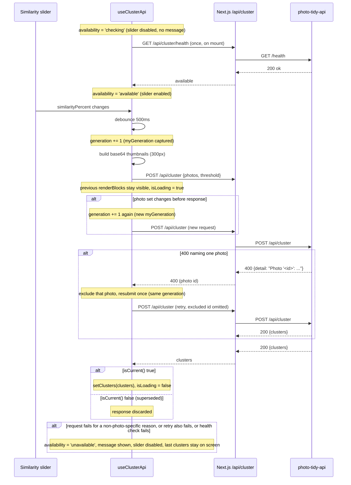

# Integrate Cluster API - Plan

## Goal Capsule

- **Objective:** replace photo-tidy-web's client-side perceptual-hash clustering with calls to the existing photo-tidy-api CLIP clustering service (`POST /api/cluster`, `GET /health`), preserving every other current behavior.
- **Authority:** Product Contract requirements (`R<N>`) govern behavior; Planning Contract KTDs govern implementation mechanism within those constraints; the repo's `CLAUDE.md` (root and `photo-tidy-web/`) governs scope — no changes to `photo-tidy-api/`, no new dependencies, no unrequested restructuring.
- **Stop conditions:** if photo-tidy-api's actual request/response shape differs from what's documented here, or the work would require modifying `photo-tidy-api/` or adding a new npm dependency, stop and ask instead of improvising.
- **Execution profile:** code, Standard depth, six dependency-ordered units. No mandated PR-splitting strategy beyond unit order — one PR is fine for a project this size.
- **Tail ownership:** the implementer runs `npm run lint`, `npm run build`, `npm run test` and updates `CONCEPTS.md` per Definition of Done. No deploy or CI work is in scope.

---

## Product Contract

### Summary

Replace the client-side perceptual-hash clustering in photo-tidy-web with calls to the existing photo-tidy-api `/api/cluster` endpoint: generate 300px thumbnails client-side, debounce slider changes 500ms, show a loading state during clustering, and gate the slider behind a `/health` check with a fallback disabled state. This removes `lib/perceptual-hash.ts`, `lib/photo-clustering.ts`, and the hash-distance debug panel. Only photo-tidy-web files change — photo-tidy-api and the existing grid/day-separator/cluster-container layout, drag-and-drop reorder, timestamp editing, delete, and Google Photos import/upload stay untouched.

Three plan-time decisions carried forward from user confirmation: keep the last cluster result visible while a new request is in flight instead of blanking to a spinner; re-cluster automatically when the photo set changes, not only on slider moves; and route a mid-session cluster-call failure into the same "unavailable" state the initial health check uses.

### Problem Frame

photo-tidy-web currently computes similarity clusters entirely in the browser: `lib/perceptual-hash.ts` builds a dHash per photo and `lib/photo-clustering.ts` runs complete-linkage clustering over cosine distance between hashes. photo-tidy-api now offers materially better grouping via CLIP embeddings, but it's a separate service reached only over HTTP. The app needs to swap the clustering *source* — network call instead of local computation — while keeping the exact rendering and interaction contract (chronological day-bucketed grid, cluster containers, drag-and-drop reorder resolving against visual order) that the local algorithm currently feeds unchanged.

### Requirements

**Clustering via the API**
- R1. Replace client-side perceptual-hash clustering with calls to photo-tidy-api's `POST /api/cluster`.
- R2. Remove `lib/perceptual-hash.ts` and `lib/photo-clustering.ts` entirely, along with code that exists solely to support them.
- R3. Generate a thumbnail no larger than ~300px on its longest side, client-side, for each photo before sending it to the cluster API.
- R4. Map the similarity slider's 0-100% value linearly onto the API's 0.0-0.5 threshold parameter.
- R5. Call the cluster API only when the slider is above 0% and photos are loaded; at 0% render photos ungrouped, as today.
- R6. Render the API's returned clusters using the existing cluster UI (grid, day separators, cluster containers) unchanged.

**Responsiveness and correctness**
- R7. Debounce slider changes 500ms before calling the API.
- R8. Re-run clustering automatically when the photo set changes (import or delete), not only on slider changes.
- R9. Keep the previously rendered cluster result visible with a non-blocking loading indicator while a new API call is in flight, rather than blanking to a spinner.
- R10. Re-call the API on every threshold change; there is no client-side cache that skips a call because the threshold was seen before, since embeddings are recomputed server-side each time.

**API availability and configuration**
- R11. Read the cluster API's base URL from an environment variable, defaulting to `http://localhost:8000`.
- R12. Check `GET /health` once on app load; if unavailable, disable the similarity slider and show "Clustering service unavailable". While the check is still in flight, disable the slider too, without the message.
- R13. Treat a mid-session `/api/cluster` call failure the same as an unavailable API — disable the slider and show the same message — except a single-photo rejection, which R15 excludes and retries instead. Keep the previously rendered clusters on screen when the slider disables this way, rather than clearing them.

**Cleanup**
- R14. Remove the debug panel that shows hash distances — the debug-mode toggle, pairwise-distance display, and photo-compare UI — entirely.

**Failure isolation**
- R15. When photo-tidy-api rejects one specific photo in a request (a `400` naming that photo — oversized, extreme aspect ratio, or undecodable), exclude that photo's id and resubmit the request once before treating the call as a failure (R13).
- R16. When a photo's client-side thumbnail generation fails, exclude that photo from the cluster request; it renders as its own ungrouped singleton, the same as an unhashable photo does today.

### Scope Boundaries

Unchanged: visual layout (grid, day separators, cluster containers), drag-and-drop reordering and timestamp editing, delete functionality, Google Photos import/upload flow, and everything in `photo-tidy-api/`. Only files under `photo-tidy-web/` are touched.

#### Deferred to Follow-Up Work
- Chunking or paginating the batch sent to `/api/cluster` if request payload size becomes a problem at larger photo counts.
- Re-checking `/health` after the initial app-load check (e.g. periodic polling, or recovery without a page reload) — out of scope per R12's "once on app load."

### Sources

- `docs/plans/2026-08-15-001-feat-similar-photo-grouping-dedup-plan.md` — established the client-side clustering architecture being replaced (`usePhotoMetrics`, `lib/perceptual-hash.ts`, `lib/photo-clustering.ts`).
- `docs/plans/2026-08-17-001-refactor-unify-timeline-cluster-views-plan.md` — established the current grid: `hooks/useClusteredPhotos.ts` as the computation hook, `components/PhotoGrid.tsx` owning slider state and debug mode, chronological member ordering as load-bearing for drag correctness (KTD3 there).
- `docs/residual-review-findings/2026-08-16-001-photo-similarity-dedup.md` — prior review of the feature being replaced; confirms `usePhotoMetrics.ts`'s generation-token pattern is correct and flags that fire-and-forget async triggers need explicit `.catch()` handling.
- `docs/solutions/logic-errors/stale-shared-ref-read-after-concurrent-invocation-in-async-hooks.md` — generation-token (not boolean) pattern for gating async state writes against a concurrent newer call; directly informs KTD4 below.
- `docs/solutions/logic-errors/cluster-drag-timestamp-visual-order-divergence.md` — chronological member/cluster ordering is load-bearing for drag-and-drop timestamp resolution regardless of what produces cluster membership; informs KTD6.
- `docs/solutions/logic-errors/cluster-view-delete-missing-object-url-release-and-selection-cleanup.md` — a second consumer of a shared mutator can silently skip cleanup side effects; informs keeping the re-cluster trigger downstream of `photos` state rather than a parallel path to the delete mutator.
- `docs/solutions/integration-issues/google-photos-json-parse-failure-returns-200.md` — `.catch(() => fallback)` on body parsing can launder a failure into a false-success value; informs explicit try/catch in the proxy routes and API hook.
- `hooks/useGooglePhotosPicker.ts` and `lib/google-photos-server.ts` — in-repo precedent for generation-token + `AbortController` cancellation and for a same-origin proxy route with centralized timeout/error handling (`fetchUpstreamWithTimeout`).
- Confirmed via `grep -rn "CORS" photo-tidy-api` (no matches): photo-tidy-api has no CORS middleware configured today, and is out of scope to modify — this rules out calling it directly from the browser.

---

## Planning Contract

### Key Technical Decisions

- KTD1. **Proxy the cluster and health calls through same-origin Next.js API routes** (`app/api/cluster/route.ts`, `app/api/cluster/health/route.ts`) rather than calling `http://localhost:8000` directly from the browser. Every existing external call in this repo (Google Photos) is proxied the same way, and photo-tidy-api has no CORS middleware today (confirmed by grep) — a direct browser call would fail cross-origin, and adding CORS support is out of scope since it lives in `photo-tidy-api/`.
- KTD2. **Server-only env var `CLUSTER_API_URL`**, default `http://localhost:8000`, read only inside the two proxy route handlers. No `NEXT_PUBLIC_` prefix — unlike `NEXT_PUBLIC_GOOGLE_CLIENT_ID`, the browser never needs this value directly since the browser talks to the same-origin proxy, not photo-tidy-api.
- KTD3. **Reuse the existing debounce shape.** `hooks/useClusteredPhotos.ts` already has a generic `useDebouncedValue<T>(value, delayMs)` (first value commits immediately, later changes debounce via `setTimeout`) used today for a 200ms dendrogram-rebuild debounce that this work removes. Adapt the same function for the 500ms slider debounce (R7) instead of adding a new debounce utility.
- KTD4. **Generation-token + `AbortController` for stale-response safety**, mirroring `hooks/useGooglePhotosPicker.ts`'s `importGenerationRef`/`isCurrent()` pattern. Increment a generation ref on every debounced-threshold commit and on every `photos` array identity change; capture the token in a local `const` before the `fetch`; gate every state write behind `isCurrent()`. A plain boolean "in flight" ref is explicitly wrong here per `docs/solutions/logic-errors/stale-shared-ref-read-after-concurrent-invocation-in-async-hooks.md` — a fresh trigger must be able to invalidate an older one without a reset legitimately un-cancelling it.
- KTD5. **Thumbnail generation via `canvas.toDataURL()`**, not object URLs. Adapt `lib/perceptual-hash.ts`'s `createImageBitmap`-then-canvas resize technique (before that file is deleted in U6) to produce a base64 JPEG capped at 300px on the longest side, guarded by the same `withTimeout` pattern against a hung decode. Producing a base64 string directly (rather than a `Blob`/object URL) means there is no object-URL lifecycle to manage for thumbnails, sidestepping the leak class flagged in `docs/solutions/logic-errors/cluster-view-delete-missing-object-url-release-and-selection-cleanup.md`.
- KTD6. **Re-sort each API cluster's members chronologically after the response arrives**, discarding the API's internal similarity ordering for members (but not its cluster ordering, which is superseded anyway by day-bucketing on `earliestCapturedAtMs`). This preserves the load-bearing invariant from `docs/plans/2026-08-17-001-refactor-unify-timeline-cluster-views-plan.md` (KTD3 there): drag-and-drop timestamp resolution depends on cluster member order matching chronological order, not similarity order.
- KTD7. **Drop `vectorsById` and `hashInputs` from `useClusteredPhotos`'s return type.** They exist today only to feed the debug panel's pairwise-distance display (R14 removes it); `renderBlocks`, `photosById`, and `visualOrder` are the only fields any other consumer (`PhotoGrid.tsx`'s grid/day-bucket rendering, `PhotoUploadPage.tsx`'s drag-end handler) actually reads.
- KTD8. **Keep the previous cluster result displayed during a new fetch instead of blanking to a spinner.** *(session-settled: user-approved — chosen over blanking to a spinner on every re-cluster: smoother UX during a 500ms-debounced slider drag or a photo-set change, at the cost of the grid briefly showing clusters computed at a different threshold than the one currently selected.)*
- KTD9. **Trigger a re-cluster on photo-set change, not only on slider input.** The hook effect depends on `photos` array identity — the same lifecycle `hooks/usePhotoMetrics.ts` already uses — so it fires after `removePhotos`/`addPhotos`/`processFiles` update state, never by a second path that could bypass existing delete cleanup. *(session-settled: user-approved — chosen over clustering only on slider interaction: otherwise newly imported photos would render ungrouped until the user nudges the slider.)*
- KTD10. **Route a mid-session `/api/cluster` failure into the same "Clustering service unavailable" disabled-slider state the initial health check uses**, rather than a separate transient toast. One status value, one user-facing message, one code path. A single-photo rejection is not a failure of the service for this purpose — see KTD11. *(session-settled: user-approved — chosen over a transient error toast: keeps error handling to one code path.)*
- KTD11. **Distinguish a per-photo rejection from a service failure.** photo-tidy-api returns `400` naming one specific photo (oversized, extreme aspect ratio, undecodable) while remaining fully healthy; folding that into KTD10's disabled-slider state would let one ordinary photo — an aspect ratio that survives 300px thumbnailing unchanged, e.g. a panorama — permanently disable clustering for the session. On a `400` naming a photo, exclude that photo's id and resubmit the request once within the same generation (KTD4); only a further failure (network error, timeout, malformed body, a non-2xx not naming a single photo, or a second `400` on the retry) reaches KTD10's unavailable state. *(session-settled: user-directed — chosen over folding every failure into the unavailable state: an ordinary photo could permanently disable clustering for the whole session.)*
- KTD12. **Exclude a photo from the cluster request when its client-side thumbnail generation fails**, rather than blocking the whole request or sending a placeholder. Mirrors `lib/perceptual-hash.ts`'s existing convention of letting one undecodable photo degrade gracefully (`hash: null`) instead of the whole batch; the excluded photo renders as its own ungrouped singleton via the same render path a never-clustered photo already uses (see U4). *(session-settled: user-directed — chosen over blocking the whole request: one bad photo shouldn't freeze clustering for the whole batch.)*
- KTD13. **Disable the similarity slider while availability is `'checking'`** (the brief window between app load and the health check resolving), the same as when it's `'unavailable'`, but without the "Clustering service unavailable" message — an enabled-but-inert slider during this window would silently swallow user input with no feedback. *(session-settled: user-approved — chosen over leaving the slider interactive during health-check resolution: an enabled-but-inert slider gives no feedback.)*
- KTD14. **Keep the last successful clusters on screen when a mid-session failure disables the slider**, rather than clearing the grid — mirrors KTD8's stale-while-loading rationale for the case where the last request failed outright instead of merely being superseded. *(session-settled: user-approved — chosen over clearing the grid on failure: keeps failure handling consistent with KTD8's in-flight behavior.)*
- KTD15. **Name explicit timeout constants for the two new proxy routes** (`CLUSTER_TIMEOUT_MS` in `app/api/cluster/route.ts`, `HEALTH_TIMEOUT_MS` in `app/api/cluster/health/route.ts`), rather than reusing the shortest existing timeout in this codebase, which risks misreporting a cold-starting backend as unavailable. `CLUSTER_TIMEOUT_MS` is set above this app's existing longest proxy timeout (45s for uploads) to absorb photo-tidy-api's documented slow first request while its CLIP model loads. `HEALTH_TIMEOUT_MS` is short (a few seconds) instead: `/health` never touches the model (photo-tidy-api's handler is a bare `{"status": "ok"}`), so a hung connection surfaces as "unavailable" quickly rather than leaving the slider silently disabled for up to a minute. Mirrors the per-route `*_TIMEOUT_MS` constant every existing proxy route in this codebase already names. *(session-settled: user-approved — chosen over reusing the shortest existing timeout.)*
- KTD16. **Cache each photo's generated thumbnail keyed by `File` identity inside the cluster-fetch hook** (U3), mirroring `hooks/usePhotoMetrics.ts`'s cache-ref pattern, and only regenerate for `File`s not already cached. Only the threshold changes on most triggers, not the photo bytes, so regenerating every photo's thumbnail on every debounced tick is redundant work R10 never required. *(session-settled: user-approved — chosen over regenerating thumbnails on every tick: redundant work since only the threshold changes, not the photo bytes.)*

### Sequencing

U1 and U2 have no interdependency and can be built in either order. U3 depends on both (it calls the proxy routes and the thumbnail utility). U4 depends on U3. U5 depends on U4. U6 depends on U5.

### High-Level Technical Design

The debounced slider-to-cluster-result flow, showing the health gate, the debounce, the generation-token race guard, and the stale-while-loading behavior:

---

## Implementation Units

### U1. Cluster API proxy routes

**Goal:** give the browser a same-origin, CORS-free path to photo-tidy-api's `/api/cluster` and `/health` endpoints, with centralized timeout and malformed-response handling.

**Requirements:** R1, R11, R12 (see KTD1, KTD2)

**Dependencies:** none

**Files:**
- `lib/cluster-api-server.ts` — new. Shared fetch-plus-timeout-plus-parse helper for both routes.
- `app/api/cluster/route.ts` — new. `POST` handler forwarding `{photos, threshold}` to `${CLUSTER_API_URL}/api/cluster`.
- `app/api/cluster/health/route.ts` — new. `GET` handler forwarding to `${CLUSTER_API_URL}/health`.
- `.env.local.example` — add `CLUSTER_API_URL=http://localhost:8000` alongside the existing Google credentials block.
- `app/api/cluster/route.test.ts`, `app/api/cluster/health/route.test.ts` — new.

**Approach:**
- Mirror `lib/google-photos-server.ts`'s `fetchUpstreamWithTimeout` shape: a shared function that does the `fetch`, translates an unreachable host or timeout into a `502`/`504` `NextResponse`, and returns the raw upstream `Response` otherwise so each route owns its own request-building and response-shaping.
- Both routes parse the upstream JSON body with an explicit try/catch (not `.catch(() => fallback)`), returning an explicit error status on parse failure rather than letting a malformed body pass through as if it were valid — this is what makes the health gate (R12) trustworthy.
- `CLUSTER_API_URL` is read with `process.env.CLUSTER_API_URL ?? 'http://localhost:8000'` at the point of use inside each route handler, matching the existing inline-env-var-read convention (no new `lib/config.ts`).
- Name `CLUSTER_TIMEOUT_MS` in `app/api/cluster/route.ts` (set above this app's existing longest proxy timeout, to absorb the backend's documented slow first request) and `HEALTH_TIMEOUT_MS` in `app/api/cluster/health/route.ts` (a short, few-second value, since `/health` never touches the CLIP model) (KTD15).
- Pass a non-2xx upstream response's status and body (including a `400`'s `detail` naming a rejected photo) straight through unmodified — U3 is the layer that interprets a photo-specific `400` differently from any other failure (KTD11); this route stays a dumb pass-through.

**Patterns to follow:** `lib/google-photos-server.ts` (`fetchUpstreamWithTimeout`, `isTimeoutError`, `upstreamErrorBody`, and its per-route `*_TIMEOUT_MS` constants such as `UPLOAD_TIMEOUT_MS = 45_000`); `app/api/google-photos/sessions/route.ts` for route-handler structure.

**Test scenarios:**
- `POST /api/cluster` with a valid photos/threshold body forwards to photo-tidy-api and returns its `clusters` response body unchanged.
- `GET /api/cluster/health` forwards to photo-tidy-api's `/health` and returns its body.
- photo-tidy-api unreachable (connection refused) → route returns a `502` with a structured error body, not a thrown exception.
- photo-tidy-api takes longer than `CLUSTER_TIMEOUT_MS` (or `HEALTH_TIMEOUT_MS`) to respond → route returns a `504` only after that longer window, not a shorter generic timeout.
- photo-tidy-api responds with a non-JSON body on a `200` status → route returns an explicit error, not a false-success pass-through.
- photo-tidy-api responds with a `400` naming one rejected photo → route passes the status and body (including the named photo id) through unchanged, so U3 can exclude that photo and retry rather than treating the whole call as failed.
- photo-tidy-api responds with any other non-2xx status → route passes that status/body through unchanged.

**Verification:** `npm run test -- app/api/cluster` passes; `npm run lint` clean for the new files.

---

### U2. Client-side thumbnail generation

**Goal:** produce a ~300px-max-dimension base64 JPEG thumbnail for a photo `File`, client-side, before it's sent to the cluster API.

**Requirements:** R3

**Dependencies:** none

**Files:**
- `lib/generate-thumbnail.ts` — new.
- `lib/generate-thumbnail.test.ts` — new.

**Approach:**
- Adapt `lib/perceptual-hash.ts`'s decode-and-resize technique: `createImageBitmap(file, { imageOrientation: 'from-image' })`, then a second `createImageBitmap` (or a canvas draw) sized so the longest side is capped at 300px, preserving aspect ratio. Draw to an off-screen `<canvas>` and call `canvas.toDataURL('image/jpeg', ...)` to get a base64 string — no `getImageData` pixel math needed (that was specific to hashing).
- Guard the decode with the same `withTimeout` pattern `lib/perceptual-hash.ts` uses, since a hung `createImageBitmap` is a documented risk in that file's own comments.
- Return the base64 payload without the `data:image/jpeg;base64,` prefix (or strip it at the call site) to match the API's `"base64-encoded thumbnail"` field.
- On an undecodable file, resolve to a clear failure signal (e.g. `null`) rather than throwing — U3 excludes that photo from the request rather than blocking the whole batch (R16, KTD12).

**Patterns to follow:** `lib/perceptual-hash.ts`'s `computePhotoMetrics`/resize step (read before deleting it in U6).

**Test scenarios:**
- A normal JPEG/PNG `File` produces a base64 string decodable back into an image no larger than 300px on its longest side.
- A very small image (e.g. 50x50) is not upscaled — it passes through at its own size or is handled without distortion.
- An undecodable file (corrupt data) rejects or resolves to a clear failure signal rather than hanging, mirroring `computePhotoMetrics`'s never-throws-but-signals-failure convention.
- A decode that hangs past the timeout guard resolves/rejects via the timeout path, not indefinitely.

**Verification:** `npm run test -- lib/generate-thumbnail` passes.

---

### U3. Cluster API hook

**Goal:** own the health gate, the debounced fetch, race-safety, and the stale-while-loading contract in one hook that `useClusteredPhotos` (U4) consumes.

**Requirements:** R4, R5, R7, R8, R9, R10, R12, R13, R15, R16 (see KTD3, KTD4, KTD8, KTD9, KTD10, KTD11, KTD12, KTD13, KTD14, KTD16)

**Dependencies:** U1, U2

**Files:**
- `hooks/useClusterApi.ts` — new.
- `hooks/useClusterApi.test.ts` — new.

**Approach:**
1. On mount, call `GET /api/cluster/health` once; set `availability` to `'checking'` → `'available'`/`'unavailable'`. The slider stays disabled for both `'checking'` and `'unavailable'`, but only `'unavailable'` carries the "Clustering service unavailable" message (KTD13; U5 owns rendering this).
2. Debounce `similarityPercent` 500ms via the adapted `useDebouncedValue` (KTD3); map the debounced percent to the API's `0.0-0.5` threshold (R4) only when computing the request, not when deciding whether to call at all — the call gate (R5) uses the live (undebounced) percent so the UI reacts to "slider is at 0%" instantly rather than after a 500ms delay.
3. Maintain a thumbnail cache keyed by `File` identity (a `Map<File, string>` ref, mirroring `hooks/usePhotoMetrics.ts`'s cache-ref pattern): generate a thumbnail via `lib/generate-thumbnail.ts` only for a `File` not already in the cache, and drop entries for `File`s no longer present in `photos` (KTD16). A `File` whose thumbnail generation fails is recorded in the cache as excluded rather than retried every tick.
4. On every debounced-threshold change, and on every `photos` array identity change, when `availability === 'available'` and the live percent is `> 0` and `photos.length > 0`: bump the generation ref, build the request from every photo with a cached thumbnail (photos whose thumbnail generation failed are left out — R16), `POST` to `/api/cluster`, and gate the response with `isCurrent()` (KTD4).
5. If the response is a `400` naming one specific rejected photo, exclude that photo's id from the request and resubmit once within the same generation (KTD11) — do not bump the generation for this retry, so a concurrent newer trigger can still supersede it via `isCurrent()`. Photos excluded this way (by thumbnail failure or by a per-photo rejection) are reported back to the caller as an `excludedPhotoIds` set so U4 can still render them as singletons.
6. Keep the last successful `clusters` value in state and do not clear it when a new request starts — only replace it when a newer, still-current response succeeds (KTD8). Track `isLoading` separately from the displayed data.
7. On a failure that is not a single-photo rejection (network error, timeout, unparseable body, a non-2xx not naming one photo, or a second `400` on the retry) for either the health check or a cluster request, set `availability = 'unavailable'` (KTD10, KTD11) and keep the last successful `clusters` on screen rather than clearing them (KTD14).

**Patterns to follow:** `hooks/useGooglePhotosPicker.ts` (generation token + `AbortController`, `PickerStatus`-style string union, `console.warn`-not-`console.error` for recoverable errors); `hooks/usePhotoMetrics.ts` (effect keyed on `photos` identity, `Map`-keyed cache ref, and its `hash: null` convention for a permanently-excluded photo).

**Test scenarios:**
- Health check succeeds on mount → `availability` becomes `'available'`.
- Health check fails on mount → `availability` becomes `'unavailable'`, no cluster call is attempted.
- Between mount and the health check resolving, `availability` is `'checking'` and no cluster call is attempted even if the slider is above 0% — Covers R12's checking-window carve-out.
- Slider moves rapidly (multiple ticks within 500ms) → only one `/api/cluster` call fires, 500ms after the last tick.
- Slider at 0% → no `/api/cluster` call is made, regardless of debounce state.
- A cluster request is in flight when the photo set changes (import or delete) → the in-flight request's response is discarded when it arrives (superseded generation), a new request fires for the new photo set, and its result is the one applied.
- A cluster request is in flight when the threshold changes again → same supersession behavior, verified with fake timers per the existing `usePhotoMetrics.test.ts`/`useGooglePhotosPicker.test.ts` convention.
- While a new request is in flight, the previously returned `clusters` value remains available in the hook's return value (`isLoading: true`, `clusters` unchanged) — Covers R9.
- The proxy returns a `400` naming one photo → that photo's id is excluded and the request is resubmitted once within the same generation; the retry's result is applied without `availability` ever becoming `'unavailable'` — Covers R15.
- The retried request also fails (a second `400`, or any other failure) → `availability` becomes `'unavailable'`, the last successful `clusters` stay in the hook's return value — Covers R13, KTD14.
- A photo's cached thumbnail entry is marked failed (from U2/step 3) → that photo's id is omitted from the request body and appears in the returned `excludedPhotoIds` — Covers R16.
- A cluster request fails after a prior successful call for a non-photo-specific reason → `availability` becomes `'unavailable'`; the previously displayed `clusters` remain in the hook's return value — Covers R13, KTD14.
- Photos array changes (add or delete) while `availability === 'available'` and percent `> 0` → a new cluster request fires without any slider interaction — Covers R8.
- Same threshold submitted twice in a row (e.g. slider released back at the same value) → a new API call is still made each time, but thumbnails for unchanged `File`s are read from cache rather than regenerated — Covers R10, KTD16.
- A `File` already present in the thumbnail cache from a prior trigger is not passed to `lib/generate-thumbnail.ts` again on a threshold-only change — Covers KTD16.

**Verification:** `npm run test -- hooks/useClusterApi` passes, including fake-timer supersession scenarios and the retry-then-fail scenario above.

---

### U4. Rewrite `useClusteredPhotos` to consume the API-based clusters

**Goal:** replace the local dendrogram computation with `useClusterApi`'s output while preserving the hook's existing render-block/visual-order contract exactly.

**Requirements:** R1, R6, R9, R15, R16 (see KTD6, KTD7, KTD12)

**Dependencies:** U3

**Files:**
- `hooks/useClusteredPhotos.ts` — rewrite.
- `hooks/useClusteredPhotos.test.ts` — update.

**Approach:**
1. Drop the `metrics: Map<string, PhotoMetrics | undefined>` parameter (no longer needed — hashing is gone) and the `buildDendrogram`/`cutDendrogram`/`useDebouncedValue`-for-dendrogram machinery entirely; call `useClusterApi(photos, similarityPercent)` (U3) instead.
2. Map the hook's `Cluster[]`-shaped result the same way the current code does: re-sort each cluster's `members` chronologically via the existing `sortMembersChronologically`/`compareByCapturedAt` (KTD6 — do not reuse the API's own member ordering), then order clusters by `earliestCapturedAtMs`, then build `renderBlocks` and `visualOrder` exactly as today.
3. For every id in U3's `excludedPhotoIds` that the returned clusters don't already cover, synthesize a one-member `Cluster` before the chronological-ordering step above, so an excluded photo (thumbnail failure or a per-photo API rejection) still renders as an ordinary singleton card in its normal chronological position (R15, R16, KTD12) instead of silently vanishing from the grid.
4. Return type drops `vectorsById` and `hashInputs` (KTD7); add whatever loading/availability fields `PhotoGrid` (U5) needs to gate the slider and show the indicator (sourced from U3's hook, passed through).
5. Keep `clusterKey` and `earliestCapturedAtMs` exported unchanged — `PhotoGrid.tsx`'s day-bucketing pass depends on them.

**Patterns to follow:** the current file's own chronological-ordering and render-block logic (`hooks/useClusteredPhotos.ts`) — only the clustering *source* changes, not the shaping logic downstream of it.

**Test scenarios:**
- A photo whose API-returned cluster contains 3 members out of chronological order is re-sorted chronologically in `renderBlocks` — Covers the KTD6 invariant.
- A single-member cluster from the API renders as a plain grid card (no cluster chrome), matching today's singleton-bundling behavior.
- `visualOrder` reflects the true rendered DOM order for a batch with multiple clusters and singles, unchanged in shape from today's contract.
- While `useClusterApi` reports `isLoading: true`, the previous `renderBlocks` value is still returned (stale-while-loading passthrough) — Covers R9.
- When `useClusterApi` reports `availability: 'unavailable'`, the hook still returns a usable (even if empty or last-known) `renderBlocks` rather than throwing.
- `photosById` and `visualOrder` remain correctly keyed after a photo is deleted mid-flight (superseded request discarded, next request reflects the new `photos`).
- A photo id present in `excludedPhotoIds` but absent from every returned cluster renders as its own singleton card at its normal chronological position — Covers R15, R16.
- A photo id in `excludedPhotoIds` that the API's clusters happen to still include (e.g. a stale response) is not duplicated as a second singleton.

**Verification:** `npm run test -- hooks/useClusteredPhotos` passes; existing `PhotoGrid`/`PhotoUploadPage` tests that depend on this hook's shape still compile against the new return type (adjusted in U5/U6).

---

### U5. `PhotoGrid`: remove debug panel, wire availability and loading UI

**Goal:** delete the hash-distance debug panel entirely and surface `useClusteredPhotos`'s availability/loading state as a disabled slider with a message, and a non-blocking loading indicator.

**Requirements:** R9, R12, R13, R14 (see KTD13, KTD14)

**Dependencies:** U4

**Files:**
- `components/PhotoGrid.tsx` — edit.
- `components/PhotoGrid.test.tsx` — update.

**Approach:**
1. Remove entirely: the `debugMode` state, `comparePair` state, `handleCompareClick`, the `PairwiseDistances` component, the compare-mode JSX block, each card's "Compare" button, and the "Debug mode" checkbox next to the slider.
2. Disable the similarity-slider `<input>` whenever availability is `'checking'` or `'unavailable'` (KTD13); render "Clustering service unavailable" near it only for `'unavailable'` (R12, R13 share this one message per KTD10).
3. When `isLoading` is true, render a small non-blocking indicator near the slider (e.g. inline text or spinner) — the grid content itself keeps showing the previous `renderBlocks` (R9); do not gate the grid render on `isLoading`. Apply the same rule when availability becomes `'unavailable'` mid-session: the grid keeps showing the last successful `renderBlocks` (KTD14), only the slider and message change.
4. Update `components/PhotoGrid.test.tsx`'s mocks to stop constructing hash fixtures for the removed debug panel; replace with mock `useClusterApi`/`useClusteredPhotos` availability and loading states.

**Patterns to follow:** the existing slider `<input type="range">` markup (`aria-label`, `min`/`max`/`value`) — extend with `disabled`, don't restructure it.

**Test scenarios:**
- Debug mode checkbox, pairwise-distance panel, and Compare buttons are absent from the rendered output — Covers R14.
- When availability is `'checking'`, the slider `<input>` is disabled and no "Clustering service unavailable" message is shown — Covers KTD13.
- When availability is `'unavailable'`, the slider `<input>` is disabled and "Clustering service unavailable" is visible.
- When availability transitions from `'available'` to `'unavailable'` mid-session (a failed request per U3), the grid keeps rendering the last-known `renderBlocks` instead of clearing — Covers KTD14. The disabled state then persists for the rest of the session, since R12/R13 only re-check on a genuine service failure, not on a timer.
- When availability is `'available'` and `isLoading` is true, the slider stays enabled, the previous grid content is still rendered, and a loading indicator is visible — Covers R9.
- Slider `onChange` still updates `similarityPercent` and is unaffected by the availability/loading wiring when availability is `'available'`.

**Verification:** `npm run test -- components/PhotoGrid` passes; manual smoke check (photo-tidy-api running locally) confirms the slider disables/enables correctly — not required for automated Definition of Done, noted for the implementer.

---

### U6. Remove obsolete clustering modules and finish the cleanup

**Goal:** delete the now-unused local clustering code and its wiring, and bring `CONCEPTS.md` in line with the new architecture.

**Requirements:** R2, R14

**Dependencies:** U5

**Files:**
- Delete: `lib/perceptual-hash.ts`, `lib/perceptual-hash.test.ts`, `lib/photo-clustering.ts`, `lib/photo-clustering.test.ts`, `hooks/usePhotoMetrics.ts`, `hooks/usePhotoMetrics.test.ts`.
- Edit: `components/PhotoUploadPage.tsx` — remove the `usePhotoMetrics` call and the `metrics` prop passed to `PhotoGrid`.
- Edit: `components/PhotoUploadPage.test.tsx`, `components/PhotoGrid.test.tsx` — remove any remaining `lib/test-helpers/hash-fixtures.ts` usage (both files reference it today, confirmed by repo grep, so it can't be deleted until they no longer do).
- Conditionally delete: `lib/test-helpers/hash-fixtures.ts` — only once no test file references it.
- Edit: `CONCEPTS.md` — rewrite the "Cluster" entry to describe API-based clustering (drop the cosine-distance-over-perceptual-hash wording), reword "Similarity slider" to drop the "mapped to cosine-distance threshold" clause, and remove the "Debug Mode" entry entirely.

**Approach:**
- Grep the repo for `perceptual-hash`, `photo-clustering`, and `usePhotoMetrics` after the edits above to confirm no import survives.
- `PhotoUploadPage.tsx`'s `metrics` variable is passed only to `PhotoGrid`, which after U4/U5 no longer needs it — dropping both ends together avoids an unused-variable lint failure.

**Patterns to follow:** `docs/plans/2026-08-17-001-refactor-unify-timeline-cluster-views-plan.md`'s U7, which updated `CONCEPTS.md` after removing an obsolete concept, as a precedent for this kind of doc cleanup.

**Test scenarios:** Test expectation: none — this unit is deletion and wiring cleanup with no new behavior; correctness is covered by U1-U5's tests continuing to pass and by the verification grep below.

**Verification:** `npm run lint` and `npm run build` succeed with zero references to the deleted modules; `npm run test` passes in full; `grep -rn "perceptual-hash\|photo-clustering\|usePhotoMetrics" --include="*.ts" --include="*.tsx" .` (excluding `node_modules`, `.next`, `.claude/worktrees`) returns nothing.

---

## Verification Contract

| Command | Applies to | Gate |
|---|---|---|
| `npm run lint` | all units | must be clean before considering the plan done |
| `npm run build` | all units | production build must succeed with the new API-based clustering |
| `npm run test` | all units | full suite green, including new tests from U1-U3 and updated tests from U4-U6 |

No `release:validate` or CI config exists in this repo; these three commands are the complete gate.

---

## Definition of Done

- All six units implemented; `npm run lint`, `npm run build`, and `npm run test` pass.
- No references to `lib/perceptual-hash.ts`, `lib/photo-clustering.ts`, or `hooks/usePhotoMetrics.ts` remain anywhere in the codebase (verified per U6's grep).
- The debug-mode toggle, pairwise-distance panel, and compare UI are fully removed from `components/PhotoGrid.tsx` and from `CONCEPTS.md`.
- `lib/test-helpers/hash-fixtures.ts` is deleted once nothing references it, or explicitly kept with a stated reason if something outside this plan's scope still needs it.
- Grid layout, day separators, cluster containers, drag-and-drop reordering, timestamp editing, delete, and Google Photos import/upload behave exactly as before this change — no regression in any of these.
- A single photo that photo-tidy-api rejects (oversized, extreme aspect ratio, undecodable) or that fails client-side thumbnail generation does not disable clustering for the rest of the session — it is excluded and renders as its own singleton (R15, R16).
- `CONCEPTS.md`'s "Cluster" and "Similarity slider" entries describe the API-based clustering; the "Debug Mode" entry is removed.
- No files outside `photo-tidy-web/` are modified — `photo-tidy-api/` is untouched.
- No dead code from an abandoned approach (e.g. a half-finished proxy-vs-direct-call attempt) remains in the diff.
