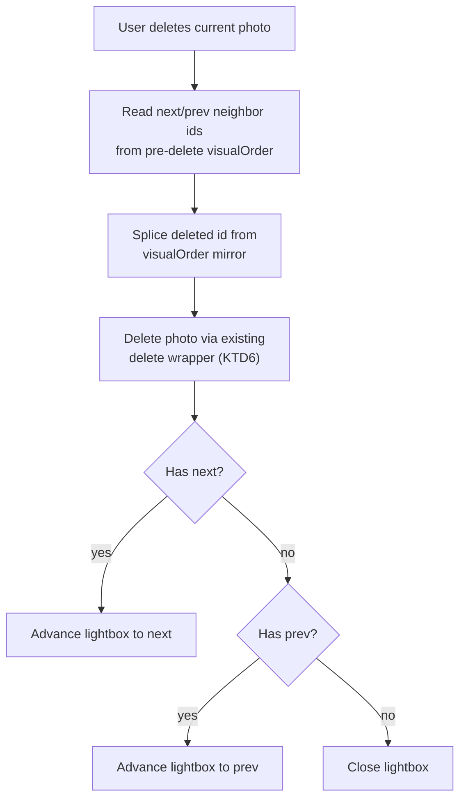

# Lightbox Delete, Navigation, and Timestamp Editing - Plan

**Target repo:** photo-tidy-web

## Goal Capsule

- **Objective:** let the user delete, navigate between, and edit the timestamp of photos from inside the lightbox, without closing it; replace the grid card's delete "X" icon with a trash can, shared with the lightbox's new delete button.
- **Authority hierarchy:** this Planning Contract's Key Technical Decisions govern implementation mechanism; Product Contract Requirements govern product behavior; a unit's Approach never overrides either.
- **Execution profile:** standard `ce-work`/`/goal` execution — three dependency-ordered units.
- **Stop conditions:** a unit's test scenarios fail after a genuine attempt, or an implementation discovery contradicts a KTD's premise — surface as a blocker rather than guessing.
- **Tail ownership:** the implementer runs the Verification Contract gates and satisfies Definition of Done; this plan does not choose a PR/landing strategy — follow repo convention.

---

## Product Contract

### Summary

Add a delete button, left/right navigation (click and keyboard), and inline timestamp editing to the photo lightbox, and replace the grid card's delete "X" icon with a trash-can icon shared with the lightbox. Navigation follows the grid's rendered visual order, not flat chronological order. Deleting the current photo auto-advances to a neighbor rather than closing, unless none remains.

### Problem Frame

The lightbox is currently view-only: no delete, no navigation between photos, no timestamp editing. A user reviewing a batch at full size has to close the lightbox, act in the grid, and reopen it to see the next photo — for every photo they want to clean up or correct. This plan removes that round-trip.

### Requirements

**Lightbox delete**
- R1. The lightbox has a delete button that removes the currently-viewed photo through the app's existing delete path (object-URL release, upload-tracking notification, in-memory and persisted removal, selection pruning).
- R2. Deleting the currently-viewed photo auto-advances the lightbox to a neighboring photo in visual order. The lightbox closes only when no photo remains to show.

**Lightbox navigation**
- R3. The lightbox has left/right controls to move to the previous/next photo without closing; the keyboard's Left/Right arrow keys do the same.
- R4. Navigation order follows the grid's rendered visual order (cluster/day-aware), not the flat chronological photo list.

**Lightbox timestamp editing**
- R5. The lightbox supports inline timestamp editing with the same behavior as the grid card's existing editor: click to edit, commit on blur or Enter, cancel on Escape.
- R6. An in-progress timestamp edit is protected from the lightbox's other keyboard handling: Escape cancels the edit instead of closing the lightbox, and Left/Right arrow keys move within the date/time input instead of navigating photos, for as long as the edit is active.

**Grid icon**
- R7. The grid card's delete icon is a trash can instead of an X. The lightbox's new delete button uses the same icon.

### Scope Boundaries

- Unchanged: the lightbox's zoom-open trigger (magnifying-glass click), the focus trap's Tab-cycling mechanism, delete confirmation behavior (stays zero-confirmation, matching the rest of the app), grid layout/clustering/day-separators, and `photo-tidy-api/`.
- This plan supersedes KTD12 in `docs/plans/2026-08-17-002-feat-photo-card-overlays-day-grouping-plan.md` (`session-settled: user-approved` — "no next/prev navigation... revisit only on explicit future request"). This plan is that request. KTD13 in the same origin plan (zero-confirmation delete) is not superseded — the lightbox's new delete button follows the same zero-confirmation behavior.

---

## Planning Contract

### Key Technical Decisions

- KTD1. **`visualOrder` is mirrored into React state, in addition to the existing `visualOrderRef`**, used only to compute the lightbox's prev/next ids. The ref stays as-is for `handleDragEnd`'s synchronous reads. Reading a ref during render for nav ids can go stale while the lightbox is open with no other re-render trigger (e.g. an async recluster resolving); the ref is deliberately non-reactive for a different reason (avoiding render churn during drag), so a second, reactive copy is added rather than changing the ref's semantics. *(session-settled: user-approved — chosen over deriving nav from the flat `photos` array: user confirmed lightbox navigation should follow `visualOrder` during scoping.)*
- KTD2. **Delete-and-advance computes the neighbor id from the pre-delete visual order, preferring `next` and falling back to `prev` when no `next` exists**, closing the lightbox only when neither exists. The deleted id is also spliced out of the `visualOrder` state mirror synchronously with the delete, rather than waiting for the async recluster round-trip — this closes a window where a nav arrow could otherwise target the just-deleted id before the mirror naturally refreshes. *(session-settled: user-approved — chosen over closing the lightbox on delete: user confirmed auto-advance during scoping.)*
- KTD3. **Deriving `prevId`/`nextId` guards `visualOrder.indexOf(zoomedPhotoId) === -1`** by producing `undefined` for both, instead of letting index arithmetic fall through to `visualOrder[0]` (which would misrepresent "no next" as "next is the first photo").
- KTD4. **The lightbox's keydown handler gains an edit-in-progress guard**: while a timestamp edit is active, Escape cancels the edit (not close-lightbox), and Left/Right arrow keys are suppressed entirely rather than treated as navigation — checked via the lightbox's own edit-mode state.
- KTD5. **Clicking delete or a nav arrow while a timestamp edit is active explicitly commits the edit first**, via a direct commit call in the button handler — not left to native blur-before-click DOM ordering. This makes the click path's behavior a deliberate decision, and keeps it symmetric with the keyboard path's deliberate block-rather-than-commit choice (KTD4).
- KTD6. **Delete reuses `PhotoUploadPage.tsx`'s existing delete wrapper** (object-URL release, upload-tracking notification, removal, selection pruning) — not a raw removal call. This codebase has a documented prior bug where a second delete-capable surface skipped that wrapper and leaked object URLs; the lightbox is a third such surface.
- KTD7. **Focus-restore-on-close only calls `.focus()` when the pre-open element is still connected to the DOM** (`.isConnected`). Navigating or deleting inside the lightbox can detach the originally-focused element (e.g. its grid card was removed) by the time the lightbox closes; calling `.focus()` on a detached node is a silent no-op that leaves focus nowhere.
- KTD8. **The trash-can icon is extracted into a small new shared module** (`components/icons.tsx`) rather than duplicated inline in both the grid card and the lightbox. This one icon is genuinely shared between two components; the zoom and checkmark icons stay single-use and unshared.
- KTD9. **The lightbox's stale "view-only, knows nothing about the batch" doc comment is rewritten** to describe its actual new prop surface, rather than left standing to mislead a future reader.

### High-Level Technical Design

**Delete-and-advance decision:**

---

## Implementation Units

### U1. Shared trash-can icon; swap the grid card's delete icon

**Goal:** extract a reusable `TrashIcon` and use it for the grid card's delete button, replacing the X icon.

**Requirements:** R7

**Dependencies:** none

**Files:**
- `components/icons.tsx` (new)
- `components/PhotoCard.tsx`
- `components/PhotoCard.test.tsx`

**Approach:**
- New `components/icons.tsx` exports `TrashIcon`, matching the existing icon convention in this codebase (`viewBox="0 0 12 12"`, `strokeWidth={2.5}`, `stroke="currentColor"`, `fill="none"`).
- `PhotoCard.tsx`'s delete `CardOverlayButton` renders `<TrashIcon className="w-5 h-5" />` in place of the inline X path. `aria-label="Delete photo"` and all existing `stopPropagation`/`onActivate` wiring are unchanged.

**Test scenarios:**
- The grid card's delete button renders the trash-can icon, not the old X path.
- The delete button's existing behavior (pointerdown/click `stopPropagation`, `onActivate` firing `onDelete`) is unchanged — regression pass over `PhotoCard.test.tsx`'s existing delete-button scenarios.

**Verification:** `npm run test -- components/PhotoCard`, `npm run lint`.

---

### U2. Extend `PhotoLightbox`: delete, navigation, and timestamp editing

**Goal:** give the lightbox the new prop surface and self-contained interaction logic for delete, nav, and inline timestamp editing, including the keyboard-conflict guard.

**Requirements:** R1 (delete affordance), R3 (nav affordance + keyboard), R5, R6, R7 (lightbox delete icon)

**Dependencies:** U1

**Files:**
- `components/PhotoLightbox.tsx`
- `components/PhotoLightbox.test.tsx`

**Approach:**
- New props: `capturedAt: Date | null`, `onDelete: () => void`, `onTimestampChange: (newDate: Date | null) => void`, `onNavigatePrev?: () => void`, `onNavigateNext?: () => void`. Presence of `onNavigatePrev`/`onNavigateNext` gates whether each nav control renders — matches this codebase's existing "optional callback gates the affordance" convention (`PhotoCard`'s `onNameChange`/`onTimestampChange`).
- Port `PhotoCard.tsx`'s timestamp-edit state and helpers (`isEditingTimestamp`, `tsValue`, `toDatetimeLocal`/`parseDatetimeLocalAsUTC`, commit-on-blur/Enter, cancel-on-Escape) into `PhotoLightbox.tsx` directly — same pattern, new home.
- Delete button and nav buttons use `TrashIcon` (delete) and simple chevron/arrow icons (nav) from `components/icons.tsx` or inline, following existing icon conventions.
- Delete and nav button click handlers: if `isEditingTimestamp`, call `commitTimestamp()` first (KTD5), then invoke `onDelete`/`onNavigatePrev`/`onNavigateNext`.
- Extend the existing document-level `keydown` handler: guard Escape and ArrowLeft/ArrowRight behind `isEditingTimestamp` (KTD4) — editing active: Escape cancels the edit, arrows do nothing (native input handles them); not editing: Escape closes as before, ArrowLeft/ArrowRight call `onNavigatePrev`/`onNavigateNext` when defined.
- Focus-restore-on-unmount: guard the existing `.focus()` call with `previouslyFocusedRef.current?.isConnected` (KTD7).
- Rewrite the type-level doc comment describing the component's scope (KTD9) — it currently claims the component "knows nothing else about the photo... and nothing about the rest of the batch," which is no longer true.

**Execution note:** this unit holds the most non-obvious interaction logic (the keyboard guard, commit-before-action). Write the keyboard-conflict and commit-before-action test cases before the straightforward render/click cases, so the guard is proven under the adversarial ordering first.

**Test scenarios:**
- Delete button click calls `onDelete`.
- Nav buttons call `onNavigatePrev`/`onNavigateNext` respectively when clicked; a nav button is absent from the DOM when its corresponding prop is `undefined` (covers both-undefined and one-undefined cases).
- ArrowLeft/ArrowRight keydown call `onNavigatePrev`/`onNavigateNext` when not editing and the corresponding prop is defined; do nothing when the corresponding prop is `undefined`.
- Escape closes the lightbox (calls `onClose`) when not editing.
- Clicking the timestamp enters edit mode; Enter commits via `onTimestampChange` with the parsed date and exits edit mode; Escape while editing cancels the edit (calls neither `onTimestampChange` nor `onClose`) and exits edit mode.
- ArrowLeft/ArrowRight while editing do not call `onNavigatePrev`/`onNavigateNext`.
- Clicking delete or a nav button while an edit is in progress calls `onTimestampChange` (the commit) before calling `onDelete`/`onNavigatePrev`/`onNavigateNext`.
- Focus-restore on unmount calls `.focus()` on the pre-open element when it's still connected to the DOM, and does not throw or attempt to focus a detached element when it isn't.
- Replaces the existing `'renders no next/prev navigation control'` test (which hard-codes the pre-this-plan absence of navigation) with cases asserting nav renders correctly when the callbacks are supplied.

**Verification:** `npm run test -- components/PhotoLightbox`, `npm run lint`.

---

### U3. Wire `PhotoUploadPage`: visual-order state, neighbor derivation, delete-and-advance

**Goal:** connect U2's new lightbox props to real data — the visual-order state mirror, prev/next derivation, and a delete-and-advance handler.

**Requirements:** R1, R2, R3, R4

**Dependencies:** U2

**Files:**
- `components/PhotoUploadPage.tsx`
- `components/PhotoUploadPage.test.tsx`

**Approach:**
- Add `const [visualOrder, setVisualOrder] = useState<string[]>([])`. `handleVisualOrderChange` sets both this state and the existing `visualOrderRef` (unchanged for `handleDragEnd`) (KTD1).
- Derive `currentIndex = zoomedPhotoId ? visualOrder.indexOf(zoomedPhotoId) : -1`; `prevId`/`nextId` are `undefined` when `currentIndex === -1` (KTD3), otherwise `visualOrder[currentIndex - 1]`/`visualOrder[currentIndex + 1]` (each `undefined` at an edge).
- New `handleLightboxDelete`: read `nextId`/`prevId` from the current (pre-delete) `visualOrder`, pick `nextId ?? prevId` as the neighbor to advance to (KTD2), splice the deleted id out of the `visualOrder` state, call the existing delete wrapper (`handleDeletePhoto`, per KTD6) with the current `zoomedPhotoId`, then `setZoomedPhotoId(neighbor ?? null)`.
- Pass to `<PhotoLightbox>`: `capturedAt={zoomedPhoto.capturedAt}`, `onDelete={handleLightboxDelete}`, `onTimestampChange={(d) => updatePhotoTimestamp(zoomedPhoto.id, d)}`, `onNavigatePrev={prevId ? () => setZoomedPhotoId(prevId) : undefined}`, `onNavigateNext={nextId ? () => setZoomedPhotoId(nextId) : undefined}`.

**Execution note:** add the divergent-visual-order-vs-flat-array regression test first (a fixture where `visualOrder` and the flat `photos` array order differ, asserting navigation follows `visualOrder`) — this repo has a documented prior bug from exactly this confusion, and this unit is the same risk shape.

**Test scenarios:**
- Opening the lightbox on a middle photo in a `visualOrder` that diverges from flat chronological order shows nav wired to the correct (`visualOrder`-derived) neighbor ids, not the flat-array neighbors.
- Opening on the first/last photo in `visualOrder` yields only one defined neighbor prop.
- Deleting the current photo with a `next` neighbor advances the lightbox to it.
- Deleting the current (last-in-order) photo with only a `prev` neighbor advances to `prev`.
- Deleting the only remaining photo closes the lightbox (`zoomedPhotoId` becomes `null`).
- Deleting through the lightbox still releases the object URL, calls `notifyPhotoRemoved`, and prunes `selectedIds` — regression coverage confirming the existing wrapper is reused, not bypassed.
- The `visualOrder` state mirror updates whenever `PhotoGrid` reports a new order, staying in sync with the existing ref.

**Verification:** `npm run test -- components/PhotoUploadPage`, `npm run lint`, `npm run build`.

---

## Verification Contract

| Gate | Command | Applies to |
|---|---|---|
| Unit tests | `npm run test` | All units |
| Lint | `npm run lint` | All units |
| Build | `npm run build` | U3 (touches the client component tree) |
| Manual check | Open the lightbox, navigate with clicks and arrow keys, edit a timestamp, delete a photo mid-edit and at the end of a batch, confirm keyboard focus behaves sensibly throughout | After U3, before calling the plan done |

## Definition of Done

- All three units implemented; `npm run test`, `npm run lint`, and `npm run build` pass at the repo root.
- Every test scenario listed under each unit exists and passes, including the rewritten (not merely supplemented) `PhotoLightbox.test.tsx` navigation test.
- No dangling references to the old X delete-icon path remain in `PhotoCard.tsx` (the lightbox's delete button is new, not a port of a prior icon).
- A manual pass (see Verification Contract) has been performed in a real browser at least once, since `datetime-local` keyboard-segment behavior can differ from jsdom's.

---

## Risks & Dependencies

- **`datetime-local` browser behavior.** jsdom's handling of the native date/time control's internal Left/Right-arrow segment navigation may not exactly match real browsers. The manual check in the Verification Contract exists specifically to catch this.
- **Cross-plan decision reversal.** This plan explicitly supersedes a prior session-settled decision (KTD12, see Scope Boundaries) rather than introducing it from a clean slate — flagged so a reviewer doesn't mistake this for an unnoticed scope violation.

## Sources & Research

- `components/PhotoLightbox.tsx`, `components/PhotoCard.tsx`, `components/PhotoGrid.tsx`, `components/PhotoUploadPage.tsx`, `hooks/useClusteredPhotos.ts` — current architecture this plan extends.
- `docs/plans/2026-08-17-002-feat-photo-card-overlays-day-grouping-plan.md` — origin of the lightbox's view-only constraint (R3, Scope Boundaries, KTD12, KTD13) that this plan partially supersedes.
- `docs/solutions/logic-errors/cluster-drag-timestamp-visual-order-divergence.md` — precedent for KTD1/KTD3's visual-order-not-flat-array requirement, including its recommended regression-test shape (assert the result matches visual order and explicitly does not match flat-array resolution).
- `docs/solutions/logic-errors/cluster-view-delete-missing-object-url-release-and-selection-cleanup.md` — precedent for KTD6's single-delete-path requirement; explicitly anticipated a third delete surface being added someday.
