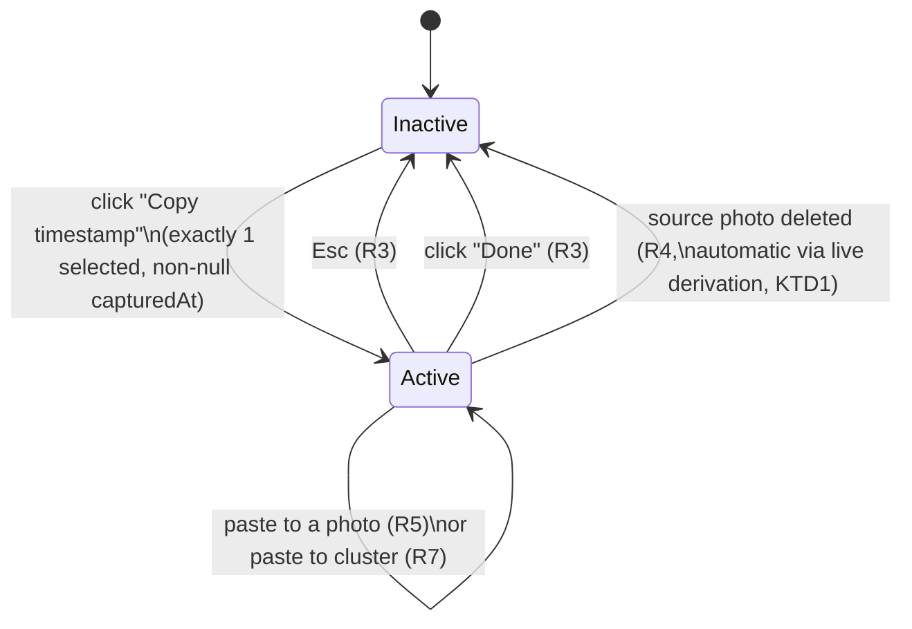

# Copy Timestamp Between Photos - Plan

**Target repo:** photo-tidy-web

## Goal Capsule

- **Objective:** let the user copy one photo's timestamp and paste it onto other photos, individually or to an entire cluster at once, from the grid view only.
- **Authority hierarchy:** this Planning Contract's Key Technical Decisions govern implementation mechanism; Product Contract Requirements govern product behavior; a unit's Approach never overrides either.
- **Execution profile:** standard `ce-work`/`/goal` execution — four dependency-ordered units.
- **Stop conditions:** a unit's test scenarios fail after a genuine attempt, or an implementation discovery contradicts a KTD's premise — surface as a blocker rather than guessing.
- **Tail ownership:** the implementer runs the Verification Contract gates and satisfies Definition of Done; this plan does not choose a PR/landing strategy — follow repo convention.

---

## Product Contract

### Summary

Add a "Copy timestamp" action, available only when exactly one photo is selected in the grid. Activating it enters a copy mode: the source photo is highlighted, and every other photo gets a one-click paste action that sets its timestamp to the copied value, immediately and without confirmation. When the source photo sits inside a cluster, a "paste to entire cluster" shortcut applies the timestamp to every other member of that cluster at once. Copy mode is grid-only — it does not appear in, and is unreachable from, the lightbox.

### Problem Frame

Photos in a cluster usually come from the same moment, but each photo's timestamp was set independently (import time, a prior manual edit, or a drag-reorder slot). Correcting a whole cluster's timestamp today means editing each photo by hand, one at a time. This feature turns that into: pick the one photo with the right timestamp, then click to apply it to the rest — including a one-click shortcut for an entire cluster.

### Requirements

**Copy mode entry and exit**
- R1. A "Copy timestamp" action is visible only when exactly one photo is selected and that photo has a non-null captured timestamp. It does not appear with zero or multiple photos selected, or when the one selected photo has no timestamp to copy.
- R2. Activating it enters copy mode: the source photo is visually highlighted, and its timestamp is shown prominently for the duration of copy mode.
- R3. Esc or a visible "Done" control exits copy mode.
- R4. Copy mode ends automatically if the source photo is deleted while copy mode is active.

**Pasting**
- R5. While copy mode is active, every photo other than the source shows a paste action. Activating it sets that photo's timestamp to the copied value immediately, with no confirmation step.
- R6. The user can paste to any number of other photos without leaving copy mode.
- R7. When the source photo belongs to a cluster, a "paste to entire cluster" action is available on that cluster's container; activating it sets every other member of that cluster to the copied value in one action. This action is not shown for a photo that is not part of a cluster, or on any cluster other than the source's own.

**Scope boundaries**
- R8. Copy mode is available only in the grid view. There is no copy-timestamp entry point in the lightbox, and copy mode is not reachable while the lightbox is open.

### Scope Boundaries

- Unchanged: drag-to-reorder timestamp assignment (`computeDroppedTimestamp`/`reorderPhotos`), manual per-photo timestamp editing (`useTimestampEdit`), lightbox behavior, `BatchEditPanel`'s existing batch rename/set-timestamp behavior, and `photo-tidy-api/`.
- Multi-select stays fully usable during copy mode; copy mode does not lock, hide, or disable any other grid control (selection checkboxes, drag-to-reorder, delete, rename, `BatchEditPanel`).

---

## Planning Contract

### Key Technical Decisions

- KTD1. **Copy-mode state (`copySourceId: string | null`) lives in `components/PhotoUploadPage.tsx` as an independent sibling of `selectedIds` and `zoomedPhotoId`** — not derived from or coupled to the selection. The copied timestamp is derived live each render from `photosById.get(copySourceId)?.capturedAt`, never snapshotted once at copy-mode entry. If the source is deleted mid-session, the derivation returns `undefined` and copy mode ends cleanly on its own (R4) with no separate invalidation path needed. Chosen over capturing the Date once, which would need its own staleness-handling logic — the exact hazard documented in `docs/solutions/logic-errors/stale-shared-ref-read-after-concurrent-invocation-in-async-hooks.md`.
- KTD2. **The "Copy timestamp" button is a new page-level control in `PhotoUploadPage.tsx`, gated on `selectedIds.size === 1`, coexisting with `BatchEditPanel` rather than suppressing or replacing it.** `BatchEditPanel.tsx` itself is untouched — no new props, no new internal state. `BatchEditPanel` already renders and functions correctly at `selectedCount === 1` today with no special-casing; changing that would be an unrequested change to a working feature.
- KTD3. **No other grid interaction is disabled, hidden, or visually quieted while copy mode is active** — multi-select, drag-to-reorder, delete, and rename all stay exactly as usable as outside copy mode. This matches the only existing precedent for a similar in-progress, selection-scoped operation in this codebase (the ZIP-download feature's KTD10, which deliberately leaves other controls unlocked during an async operation), and copy mode is explicitly non-modal — other cards must stay clickable to receive a paste.
- KTD4. **During copy mode, each non-source `PhotoCard`'s existing bottom-left zoom overlay slot is temporarily replaced by the paste button**, reverting to zoom when copy mode ends. All four corners of the card are already visually claimed today (the two `CardOverlayButton` slots — zoom bottom-left, delete bottom-right — plus the selection checkmark and Google-Photos origin badge, neither of which is a `CardOverlayButton` instance), so a new always-present slot isn't available without touching every card's layout. Zoom is not needed mid-copy-mode: copy mode is grid-only, and the lightbox is unreachable while it's active regardless (KTD1 keeps copy-mode state independent of `zoomedPhotoId`).
- KTD5. **A new `setPhotosTimestamp(ids: string[], date: Date)` helper is added to `hooks/usePhotos.ts`**, applying one identical timestamp to every listed id in a single update. Chosen over reusing `batchSetTimestamps` (which staggers each target by `rank * 1000ms` — wrong semantics for a paste, which needs every target set to the exact same value) or looping `updatePhotoTimestamp` per id from the calling component (scatters batch-mutation logic outside the file that already owns the equivalent helpers).
- KTD6. **"Paste to entire cluster" resolves membership from the same `cluster.members` list `PhotoGrid`'s cluster render blocks already use** (from `useClusteredPhotos`) — never re-derived from the flat `photos` array. This directly follows the P0-severity precedent in `docs/solutions/logic-errors/cluster-drag-timestamp-visual-order-divergence.md`, where a second, independently-derived representation of cluster membership/order silently diverged from the authoritative one.
- KTD7. **Copy-mode props thread from `PhotoUploadPage` through `PhotoGrid` to `PhotoCard`**, mirroring how `selectedIds`/`onSelect`/`onDelete`/`onZoom` already flow today. `PhotoGrid` owns the "paste to entire cluster" button (it already has `cluster.members` in scope where the cluster container renders); `PhotoUploadPage` owns copy-mode state and the single-paste/paste-to-cluster mutation calls.

### Sources & Research

- `components/PhotoUploadPage.tsx:96` (`selectedIds`), `:252-267` (`toggleSelect`/`selectAll`/`clearSelection`), `:551-568` (`BatchEditPanel` render gate, `selectedIds.size > 0`, already correct at exactly 1), `:128` (`visualOrder`), `:155` (`photosById`), `:273-275` (`handleBatchSetTimestamp`, staggered — not reusable for paste), `:106` + `:413` + `:647-658` (`zoomedPhotoId`, `inert` wrapper, lightbox rendered outside it — confirms copy-mode state as a sibling of `zoomedPhotoId` makes R8 free).
- `components/BatchEditPanel.tsx:23-37`: prop shape (`selectedCount`, `distinctTimestamps`, `onBatchRename`, `onBatchSetTimestamp`, `onBatchDelete`, `onClearSelection`) — no copy-mode-related prop needed (KTD2).
- `components/PhotoCard.tsx:16-43` (`CardOverlayButton`, `position: 'left'|'right'`, `stopPropagation` on `onPointerDown`/`onClick`), `:149` (selection ring), `:160-172` (origin badge + checkmark corners), `:176-199` (delete/zoom in the two `CardOverlayButton` slots) — confirms all four corners claimed (KTD4). `hooks/useTimestampEdit.ts:31-79` confirmed orthogonal to paste (R untouched by this feature).
- `components/PhotoGrid.tsx:207-267` (`blocks` `useMemo`), `:239-251` (cluster `<section>` container with `cluster.members` already in scope) — the natural, minimal-diff location for the "paste to entire cluster" button (KTD6, KTD7).
- `hooks/usePhotos.ts:116-120` (`updatePhotoTimestamp`, reusable for single paste), `:138-150` (`batchSetTimestamps`, staggered, wrong semantics for paste — motivates KTD5).
- `components/icons.tsx`: existing icon convention (`viewBox="0 0 12 12"`, `stroke="currentColor"`, `strokeWidth={2.5}`, `fill="none"`, sized via `className`); no clipboard/paste icon exists yet.
- `docs/solutions/logic-errors/cluster-drag-timestamp-visual-order-divergence.md`: P0 precedent for cluster-membership/order divergence (KTD6).
- `docs/solutions/best-practices/exif-timestamp-rewriting-for-drag-reorder-persistence-2026-04-05.md`: confirms `updatePhotoTimestamp` is the correct direct-set integration point, and that EXIF bytes are rewritten only at download time — paste needs no EXIF-writing logic of its own.
- `docs/solutions/logic-errors/cluster-view-delete-missing-object-url-release-and-selection-cleanup.md`: general lesson that a second mutation call site can silently skip a first call site's side effects — checked against `updatePhotoTimestamp`/`setPhotosTimestamp`, which are used directly and carry no such wrapper to miss.
- `docs/solutions/best-practices/image-as-selection-target-dnd-kit-pattern-2026-04-05.md`: confirms the `stopPropagation` discipline every new interactive overlay element must follow to coexist with dnd-kit's `PointerSensor`.
- `docs/solutions/logic-errors/zip-download-warning-banner-unmounted-by-photo-count-render-gate.md`: KTD10 precedent motivating KTD3 (leave other controls unlocked during an in-progress, selection-scoped operation).
- `CONCEPTS.md`'s Cluster entry: confirms a single unclustered photo renders as a one-member Cluster with no cluster chrome, so "paste to entire cluster" naturally never appears for it (R7).

---

## High-Level Technical Design

Copy mode is a single piece of state (`copySourceId`) with three independent exit triggers and one paste action that can repeat any number of times without leaving the mode:

`Active` is derived, not stored: `isCopyMode = photosById.get(copySourceId) != null`. This is why the "source deleted" transition needs no explicit handler — it falls out of KTD1's live-derivation choice on the next render.

---

## Implementation Units

### U1. `setPhotosTimestamp` helper and paste/clipboard icons

**Goal:** add the shared timestamp-setting primitive and the new icons the rest of this feature depends on.

**Requirements:** R5, R7; KTD5

**Dependencies:** none

**Files:**
- `hooks/usePhotos.ts`
- `hooks/usePhotos.test.ts`
- `components/icons.tsx`

**Approach:**
- Add `setPhotosTimestamp(ids: string[], date: Date)` to `hooks/usePhotos.ts`, mirroring `batchSetTimestamps`'s structure (one `setPhotos` update, re-sort) but setting every listed id to the identical `date` with no per-photo offset (KTD5).
- Add a clipboard-style "copy" icon and a "paste" icon to `components/icons.tsx`, matching the existing convention (`viewBox="0 0 12 12"`, `stroke="currentColor"`, `strokeWidth={2.5}`, `fill="none"`, sized via `className`).

**Patterns to follow:** `hooks/usePhotos.ts`'s existing `batchSetTimestamps` for structure; `components/icons.tsx`'s `TrashIcon`/`ChevronLeftIcon` for the new icons' shape.

**Test scenarios:**
- `setPhotosTimestamp` sets the identical `date` on every id in the given list.
- Ids not in the list are left unchanged.
- An empty id list is a no-op (no state update, or a same-value update — assert nothing else changes).
- The photo list re-sorts afterward the same way `updatePhotoTimestamp`/`batchSetTimestamps` already do.

**Verification:** `npm run test -- hooks/usePhotos`, `npm run lint`, `npm run build`.

---

### U2. Copy-mode state, entry button, and status banner in `PhotoUploadPage`

**Goal:** add copy-mode state, the "Copy timestamp" entry control, and the always-visible-while-active status banner (highlighted source, copied timestamp, Esc/Done exit).

**Requirements:** R1, R2, R3, R4, R8; KTD1, KTD2

**Dependencies:** U1

**Files:**
- `components/PhotoUploadPage.tsx`
- `components/PhotoUploadPage.test.tsx`

**Approach:**
- Add `copySourceId: string | null` state (`useState`), independent of `selectedIds` (KTD1).
- Derive `copiedEntry = copySourceId ? photosById.get(copySourceId) : null` and `isCopyMode = copiedEntry != null` each render — never snapshot the Date separately (KTD1). This makes R4 automatic: once the source is removed from `photosById`, `isCopyMode` goes false on the next render.
- "Copy timestamp" button: render next to the existing selection-controls row, gated on `selectedIds.size === 1 && photosById.get(Array.from(selectedIds)[0])?.capturedAt != null` (R1). Clicking it sets `copySourceId` to that photo's id.
- Status banner: while `isCopyMode`, render a compact banner (mirroring the existing `isRestoring`/`storageWarning` render pattern already used in this file) showing the copied timestamp and a "Done" button that clears `copySourceId`.
- Esc handling: a document-level keydown listener active only while `isCopyMode`, closing copy mode on `Escape` (R3). Scope it narrowly (only attach while `isCopyMode` is true) so it cannot interfere with any other keyboard handling in the app when inactive.
- Pass `isCopyModeActive`, `copySourceId`, and paste callbacks (`onPaste(id: string)`, `onPasteToCluster(ids: string[])`, both calling `setPhotosTimestamp`/`updatePhotoTimestamp` from U1) down to `PhotoGrid` (KTD7).
- Do not pass any copy-mode props to `PhotoLightbox` — R8 is satisfied by copy-mode state never reaching the lightbox's render tree.

**Patterns to follow:** `usePhotoPersistence`'s `isRestoring`/`storageWarning` render pattern in `components/PhotoUploadPage.tsx` for the status banner; the existing selection-controls row layout for the entry button.

**Test scenarios:**
- "Copy timestamp" button appears when exactly one photo with a non-null `capturedAt` is selected; does not appear at zero or 2+ selected, or when the one selected photo has a null `capturedAt`.
- Clicking it enters copy mode: the banner renders with the source photo's timestamp.
- Changing the selection (selecting a different photo, or clearing selection) while copy mode is active does NOT end copy mode — `copySourceId` is untouched by `selectedIds` changes.
- Pressing Esc while copy mode is active exits it (banner disappears, `isCopyMode` false).
- Clicking "Done" exits copy mode.
- Deleting the source photo while copy mode is active ends copy mode automatically, with no separate cleanup call (Covers R4).
- No copy-mode prop or state reaches `PhotoLightbox` — assert its render props are unaffected when copy mode is active and a different photo is zoomed (Covers R8).
- `BatchEditPanel` still renders and receives its existing props unchanged when exactly one photo is selected, whether or not copy mode is subsequently entered (regression, confirms KTD2 coexistence).

**Verification:** `npm run test -- components/PhotoUploadPage`, `npm run lint`, `npm run build`.

---

### U3. `PhotoCard`: source highlight and paste button

**Goal:** give `PhotoCard` the copy-mode visual/interaction surface — a distinct highlight when it's the source, a paste button in place of zoom on every other card while copy mode is active.

**Requirements:** R2, R5, R6; KTD4

**Dependencies:** U1, U2

**Files:**
- `components/PhotoCard.tsx`
- `components/PhotoCard.test.tsx`

**Approach:**
- New props: `isCopySource?: boolean`, `isCopyModeActive?: boolean`, `onPaste?: () => void`.
- When `isCopySource`, render a distinct highlight (a differently-colored ring, alongside/instead of the existing selection ring) so the source is visually unambiguous even if it's also currently selected (R2).
- When `isCopyModeActive && !isCopySource`, replace the bottom-left `CardOverlayButton` (currently zoom) with a paste button calling `onPaste` (KTD4). When copy mode is inactive, this slot renders zoom exactly as it does today — no behavior change outside copy mode.
- The paste button follows the existing `CardOverlayButton` `stopPropagation` discipline on `onPointerDown`/`onClick` (same as delete/zoom today), so it doesn't trigger a drag-start or a selection toggle.
- Delete (bottom-right) is untouched and stays fully functional during copy mode (Covers R — KTD3, carried from the plan-wide decision, verified at the card level here).

**Patterns to follow:** `CardOverlayButton`'s existing `position="left"`/`position="right"` usage for zoom/delete; the existing selection-ring styling for the new copy-source highlight.

**Test scenarios:**
- A card with `isCopySource` renders the distinct highlight.
- A non-source card with `isCopyModeActive` renders a paste button in the zoom slot instead of the zoom button; clicking it calls `onPaste` with `stopPropagation` (no drag-start, no selection toggle).
- The source card itself does not render a paste button on itself.
- When `isCopyModeActive` is false (or the props are omitted), the card renders zoom in that slot exactly as before — regression check against existing zoom-button tests.
- The delete button remains present and clickable regardless of `isCopyModeActive`/`isCopySource` (Covers KTD3 at the card level).

**Verification:** `npm run test -- components/PhotoCard`, `npm run lint`, `npm run build`.

---

### U4. `PhotoGrid`: thread copy-mode props, add "paste to entire cluster"

**Goal:** pass copy-mode state and callbacks from `PhotoUploadPage` down to every `PhotoCard`, and add the "paste to entire cluster" button to each cluster's container.

**Requirements:** R7; KTD6, KTD7

**Dependencies:** U2, U3

**Files:**
- `components/PhotoGrid.tsx`
- `components/PhotoGrid.test.tsx`

**Approach:**
- New props on `PhotoGrid`: `isCopyModeActive`, `copySourceId`, `onPaste(id: string)`, `onPasteToCluster(ids: string[])` (KTD7).
- For each rendered `PhotoCard`, pass `isCopySource={entry.id === copySourceId}`, `isCopyModeActive`, and `onPaste={() => onPaste(entry.id)}`.
- In the cluster `<section>` block (where `cluster.members` is already in scope), render "Paste to entire cluster" only when `isCopyModeActive && cluster.members.includes(copySourceId)`. On click, call `onPasteToCluster(cluster.members.filter(id => id !== copySourceId))` — membership sourced from `cluster.members`, never re-derived from the flat `photos` array (KTD6).
- Singleton (non-cluster) render blocks never reach this branch, so R7's "not shown for a photo that isn't part of a cluster" is automatic.

**Patterns to follow:** the existing cluster `<section>` container and its `<h2>{cluster.members.length} related photos</h2>` header in `components/PhotoGrid.tsx`; the existing `lib/test-helpers/cluster-render-blocks.ts` fixture builders (`clusteredResult`/`flatResult`) for cluster-shaped tests.

**Test scenarios:**
- The cluster containing the source photo renders "Paste to entire cluster" while copy mode is active; other clusters do not.
- Clicking it calls `onPasteToCluster` with every member id of that cluster except the source, in `cluster.members` order — using a non-array-contiguous cluster fixture (Covers the P0 divergence class from KTD6's cited precedent).
- A cluster member with a null `capturedAt` is still included in the paste-to-cluster id list (it's a target, not a value source).
- A singleton (one-member) block never renders "Paste to entire cluster," regardless of copy-mode state.
- When copy mode is inactive, no cluster renders the button.
- Each `PhotoCard` in the grid receives the correct `isCopySource`/`isCopyModeActive`/`onPaste` props derived from `PhotoGrid`'s own props (integration check that threading is wired correctly, not just that `PhotoCard`'s own logic works in isolation).

**Verification:** `npm run test -- components/PhotoGrid`, `npm run lint`, `npm run build`.

---

## Verification Contract

| Command | Applies to |
|---|---|
| `npm run test -- hooks/usePhotos` | U1 |
| `npm run test -- components/PhotoUploadPage` | U2 |
| `npm run test -- components/PhotoCard` | U3 |
| `npm run test -- components/PhotoGrid` | U4 |
| `npm run lint` | U1, U2, U3, U4 |
| `npm run build` | U1, U2, U3, U4 |
| `npm run test` (full suite) | Before ship — confirms no regression outside the touched files |

## Definition of Done

- All Requirements (R1-R8) are satisfied and traceable to a unit.
- `npm run test`, `npm run lint`, and `npm run build` pass clean.
- Existing `BatchEditPanel`, drag-to-reorder, manual timestamp editing, and lightbox behavior are unchanged (regression coverage in U2/U3 confirms this, not just manual inspection).
- No changes outside `photo-tidy-web/`.
