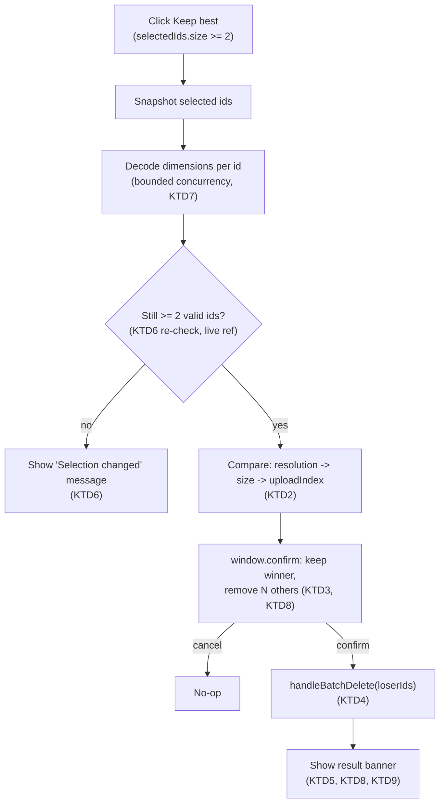

# Keep Best Photo From Selection - Plan

**Target repo:** photo-tidy-web

## Goal Capsule

- **Objective:** let the user pick 2+ photos they consider interchangeable and keep only the highest-resolution one in a single action, using file size and upload order only as tiebreakers — a resolution/size/order signal, not a perceptual-quality judgment.
- **Authority hierarchy:** this Planning Contract's Key Technical Decisions govern implementation mechanism; Product Contract Requirements govern product behavior; a unit's Approach never overrides either.
- **Execution profile:** standard `ce-work`/`/goal` execution — two dependency-ordered units.
- **Stop conditions:** a unit's test scenarios fail after a genuine attempt, or an implementation discovery contradicts a KTD's premise — surface as a blocker rather than guessing.
- **Tail ownership:** the implementer runs the Verification Contract gates and satisfies Definition of Done; this plan does not choose a PR/landing strategy — follow repo convention.

---

## Product Contract

### Summary

Add a "Keep best" action to the selection-controls row. With 2 or more photos selected — anywhere in the grid, in one cluster or spanning several — it compares them by resolution then file size then upload order, confirms the winner and loss count with the user, deletes the rest, and reports what happened.

### Problem Frame

A user who selects several photos they consider duplicates of each other (a burst, a repeat send, several exports of the same shot) has no way to resolve that group to one photo without deleting the others by hand. This app already has algorithmic near-duplicate clustering as a separate concept, but nothing that acts on an arbitrary user-made selection. This feature adds that action, scoped strictly to whatever the user has explicitly selected — it makes no similarity judgment of its own.

### Requirements

**Entry and visibility**
- R1. A "Keep best" control appears in the selection-controls row whenever 2 or more photos are selected, regardless of cluster membership. It does not appear at 0 or 1 selected.
- R2. Keep best is grid-only; there is no entry point in the lightbox.

**Comparison**
- R3. Activating it compares every currently selected photo by pixel resolution (width × height); the highest resolution wins.
- R4. A resolution tie breaks toward the larger file size.
- R5. A resolution-and-size tie breaks toward whichever photo was added to the batch earliest.

**Confirmation and result**
- R6. Before anything is deleted, the user sees a confirmation naming the photo that will be kept and how many other selected photos will be removed.
- R7. On confirmation, every selected photo except the winner is deleted; declining leaves the selection and batch unchanged.
- R8. After deletion, a dismissible message reports the kept photo's filename and resolution, and how many photos were removed.

### Scope Boundaries

- Unchanged: manual selection, manual per-card/per-cluster deletion, `BatchEditPanel`'s existing batch actions, the clustering algorithm itself, and `photo-tidy-api/`.
- No automatic similarity detection of any kind — this feature only ever acts on the user's explicit selection, never infers which photos are "duplicates" of each other.
- No undo. Matches every other delete path in this app today.

---

## Planning Contract

### Key Technical Decisions

- KTD1. **Read a photo's pixel dimensions via `createImageBitmap`, reusing the exact decode-timeout guard already in `lib/generate-thumbnail.ts` (`withTimeout`, `DECODE_TIMEOUT_MS`) rather than writing a third copy of it.** That guard exists because `createImageBitmap` can hang instead of rejecting on a pathological file (`lib/generate-thumbnail.ts:11-15`); reusing it is a straight export, not a new pattern. A photo whose decode fails or times out degrades to `{width: 0, height: 0}` and is never excluded — this reuses only the "never throws, degrades to a sentinel value" half of `generateThumbnail`'s own contract (`lib/generate-thumbnail.ts:54-61`), not that contract's other half, where callers exclude a failed photo from the request entirely; excluding here would violate R3's "every currently selected photo" requirement. Governs R3.
- KTD2. **The comparator is a three-tier cascade: resolution, then file size, then `uploadIndex` (lower — added earlier — wins).** Resolution and file-size-as-tiebreak were the "best quality" rule of a prior, now-removed dedup feature (see Sources & Research); this plan reuses that exact two-tier rule and adds the third tier the user's own spec asks for. `uploadIndex` already exists (`hooks/usePhotos.ts`) as this app's "added earliest" signal — no new field needed. File size is a rough proxy for encoding quality at equal resolution, not a genuine sharpness/composition measure — accepted here because it only ever breaks an exact resolution tie, the same scope the prior feature used it for. Governs R3, R4, R5.
- KTD3. **The action is gated behind a `window.confirm()` naming the winner and loss count, even though this app's only other selection-scoped bulk action (`BatchEditPanel`'s "Delete selected") has none.** The distinguishing factor is who chooses the victims: `BatchEditPanel`'s delete acts only on photos the user individually, deliberately selected for removal, while this feature's losers are chosen by the comparator (KTD2) from a group the user merely asserted were interchangeable — no specific photo is confirmed disposable by the user until this dialog. `window.confirm()` is the one point where the comparator's choice becomes visible and stoppable before it's irreversible. This is reinforced, not solely justified, by a near-identical feature that previously shipped in this codebase with no confirmation at all and was later removed after "it prov[ing] confusing that removed photos weren't visible" (`CONCEPTS.md`'s Cluster entry) — that precedent doesn't fully resolve here, since this dialog names a count rather than every removed filename (R8's result banner is deliberately kept to a summary rather than a full before/after list, to stay proportional to this feature's size), but it establishes that this codebase has already been burned once by a similar no-confirmation auto-resolution. `handleClearAll`'s existing confirm (`components/PhotoUploadPage.tsx:424-425`) is the only local convention to match: same native-confirm mechanism, no new modal component. Governs R6.
- KTD4. **Deletion reuses `handleBatchDelete(ids)` unchanged (`components/PhotoUploadPage.tsx:377-392`), called with every selected id except the winner.** It already does object-URL release, `notifyPhotoRemoved`, `removePhotos`, and precise `selectedIds` pruning for an arbitrary id subset — no new deletion plumbing. Governs R7.
- KTD5. **The result message renders as its own independently-gated dismissible banner** (own `useState<string | null>`, shown whenever it's non-null), never nested inside a `photos.length > 0`-style conditional. A prior feature in this exact file shipped a banner nested inside a data-presence gate and it silently stopped rendering once that gate's condition went false mid-operation (see Sources & Research); this plan follows the fix that established pattern, not the bug. Governs R8.
- KTD6. **Snapshot the selected ids at click time; immediately after the decode phase completes, before comparing, drop any id no longer present in a live-read `photosByIdRef`.** Because the click handler is a single async function, a plain closed-over `photosById` would still reflect its click-time snapshot when read after the decode `await`s resolve, silently defeating the re-validation — this is the same stale-closure hazard `hooks/useGooglePhotosUpload.ts` already solved with its `removedPhotoIdsRef`/`isCurrent()` pattern (see Sources & Research), so this checkpoint reads through an equivalent ref kept current across renders, never the closed-over value. One checkpoint is sufficient: `window.confirm()` blocks synchronously and nothing else in this flow yields to the event loop between comparing and showing it, so a photo can't be deleted out from under the winner/loser choice in that gap — only the decode phase (which spans real async time) is a genuine race window. If fewer than 2 valid ids remain at this checkpoint, stop and show a brief, dismissible message via the same banner mechanism as KTD5 (e.g. "Selection changed — try again") rather than aborting with no trace — a bare no-op is indistinguishable from a hang or a missed click, and this app already treats "never an uncaught rejection or a silent no-op" as a hard rule for an in-flight, selection-scoped async operation (the ZIP-download feature's KTD7 — see Sources & Research). This re-validation is the only guard against the async decode window (selection can change, or a selected photo can be deleted elsewhere, while dimensions are still being read); it deliberately does **not** lock other controls (selection, per-card delete, `BatchEditPanel`) during that window, matching this app's established precedent of leaving unrelated controls live during an in-flight, selection-scoped operation (the ZIP-download feature's snapshot-and-don't-lock decision, and copy mode's identical decision — see Sources & Research). Governs R6, R7.
- KTD7. **Dimension decoding for the selected photos runs with bounded concurrency (a small fixed constant, mirroring `UPLOAD_CONCURRENCY` in `hooks/useGooglePhotosUpload.ts:35`), not unbounded `Promise.all`.** A cross-cluster selection can span most of the loaded batch; bounding concurrency avoids starting dozens of simultaneous image decodes at once. Governs R3.
- KTD8. **When the winning photo's dimensions are `{0, 0}` (its decode failed), the confirmation and result message omit the resolution clause entirely rather than showing "0 × 0."** A literal zero-by-zero reads as a bug, not a measurement. Governs R6, R8.
- KTD9. **The winner's id is left in `selectedIds` after the action, matching `handleBatchDelete`'s existing behavior unmodified** — it prunes only the ids it actually deletes. No new selection-clearing logic is added. Governs R7.
- KTD10. **No cluster-membership derivation of any kind.** `selectedIds` is already a flat, cluster-agnostic `Set<string>` (confirmed: nothing in `toggleSelect`/`selectAll`/`clearSelection` branches on cluster membership), and `photosById` is the same cross-cluster-safe lookup `handleBatchDelete` already uses. This feature reads only the user's explicit selection, so the P0 precedent about never re-deriving cluster membership from the flat `photos` array (see Sources & Research) does not apply — there is no cluster membership being derived here at all. Governs R1.

### Sources & Research

- `lib/generate-thumbnail.ts:11-33` (`DECODE_TIMEOUT_MS`, `withTimeout`) and `:54-61` (`generateThumbnail`'s "never throws" contract) — the decode-timeout guard and graceful-degradation contract KTD1 reuses.
- `docs/plans/2026-08-15-001-feat-similar-photo-grouping-dedup-plan.md` KTD9 — the original "compare pixel count, then file size" rule this plan's comparator extends (KTD2). That plan's whole feature (`lib/perceptual-hash.ts`, `hooks/usePhotoMetrics.ts`) was later deleted in a cross-branch merge (`docs/solutions/workflow-issues/conflict-markers-dont-catch-cross-branch-collateral-damage.md`) — nothing from it is reusable code, only the design decision.
- `CONCEPTS.md`'s Cluster entry — records that the deleted feature's no-confirmation auto-delete "proved confusing that removed photos weren't visible" and was removed for it. Directly motivates KTD3.
- `components/PhotoUploadPage.tsx:416-425` (`handleClearAll`) — the only existing `window.confirm()` precedent and its blast-radius rationale, matched by KTD3.
- `components/PhotoUploadPage.tsx:377-392` (`handleBatchDelete`) — reused unchanged by KTD4.
- `components/PhotoUploadPage.tsx:611-629` (copy-mode banner) and the ZIP-download feature's `docs/solutions/logic-errors/zip-download-warning-banner-unmounted-by-photo-count-render-gate.md` — the independent-gate dismissible-banner pattern (and the bug from nesting it) that KTD5 follows.
- `docs/plans/2026-08-31-001-feat-zip-download-all-plan.md` KTD10, and `docs/plans/2026-09-02-001-feat-copy-timestamp-between-photos-plan.md` KTD3 — the two prior instances of "snapshot at click time, don't lock other controls" this plan's KTD6 follows a third time. That same zip-download plan's KTD7 ("never an uncaught rejection or a silent no-op") is the precedent KTD6's abort-message requirement follows.
- `hooks/useGooglePhotosUpload.ts:35` (`UPLOAD_CONCURRENCY`) and `:37-52` (`uploadWithConcurrency`) — the bounded-concurrency pattern KTD7 mirrors. The same file's `removedPhotoIdsRef`/`isCurrent()` live-read pattern (`hooks/useGooglePhotosUpload.ts:114-132`) is the precedent KTD6's live-ref re-validation follows, to avoid a stale closure during the in-flight decode.
- `docs/solutions/logic-errors/cluster-drag-timestamp-visual-order-divergence.md` — the P0 precedent KTD10 confirms does not apply here.
- `hooks/usePhotos.ts` — current `PhotoEntry` shape (`uploadIndex`, `file`, no width/height field); `removePhotos`/`setPhotosTimestamp` as the established "accept an explicit `ids: string[]` subset" idiom, already fully satisfied by reusing `handleBatchDelete`.
- `components/PhotoUploadPage.tsx:588-609` — the selection-controls row R1's button is added to.
- `components/PhotoGrid.tsx:158` — confirms `selectedIds` carries no cluster-membership branching, grounding KTD10.

---

## High-Level Technical Design

`isComparingBest` is a single boolean covering the whole decode/compare window (disables the button, prevents re-entry, shows a "Comparing…" label); nothing else in the UI locks during it (KTD6).

---

## Implementation Units

### U1. Dimension-reading helper and comparator

**Goal:** add the pure logic — read a photo's pixel dimensions, and pick a winner from a candidate list — with no UI coupling.

**Requirements:** R3, R4, R5; KTD1, KTD2

**Dependencies:** none

**Files:**
- `lib/generate-thumbnail.ts` (modify — export `withTimeout` and `DECODE_TIMEOUT_MS`)
- `lib/photo-quality.ts` (new)
- `lib/photo-quality.test.ts` (new)

**Approach:**
- Export `withTimeout` and `DECODE_TIMEOUT_MS` from `lib/generate-thumbnail.ts` unchanged (no behavior change to `generateThumbnail` itself).
- `lib/photo-quality.ts` exports `getPhotoDimensions(file: File): Promise<{ width: number; height: number }>`: decode via `createImageBitmap(file, { imageOrientation: 'from-image' })` wrapped in the imported `withTimeout`/`DECODE_TIMEOUT_MS`, read `bitmap.width`/`bitmap.height`, close the bitmap. On any decode failure or timeout, resolve `{ width: 0, height: 0 }` — never throw (KTD1).
- Also export `pickBestPhoto(candidates: { id: string; width: number; height: number; size: number; uploadIndex: number }[]): { winnerId: string; loserIds: string[] }`: pure cascade comparator per KTD2. Precondition: called with 2+ candidates (callers enforce this; not a defensive concern of this function).

**Patterns to follow:** `lib/generate-thumbnail.ts`'s existing decode-and-degrade shape for `getPhotoDimensions`; `hooks/usePhotos.ts`'s `compareByCapturedAt` for the cascade-comparator shape.

**Test scenarios:**
- `getPhotoDimensions` returns the bitmap's actual width/height for a normal decodable file (mock `createImageBitmap` via `vi.stubGlobal`, following `lib/generate-thumbnail.test.ts`'s existing mock — same global, same directory, same `withTimeout` guard under test).
- A decode rejection resolves to `{ width: 0, height: 0 }`, not a thrown error.
- A decode that never settles resolves to `{ width: 0, height: 0 }` once `DECODE_TIMEOUT_MS` elapses (fake timers).
- `pickBestPhoto`: higher resolution wins outright.
- `pickBestPhoto`: equal resolution, larger file size wins.
- `pickBestPhoto`: equal resolution and size, lower `uploadIndex` (added earlier) wins.
- `pickBestPhoto`: exactly 2 candidates (the minimum contract) returns the correct single-element `loserIds`.
- `pickBestPhoto`: 4+ candidates with a mix of clear winners and ties resolves to exactly one winner and the rest as losers.

**Verification:** `npm run test -- lib/photo-quality`, `npm run lint`, `npm run build`.

---

### U2. "Keep best" control, confirmation flow, and result banner

**Goal:** wire the button, the snapshot/decode/compare/confirm/delete flow, and the dismissible result message into `PhotoUploadPage`.

**Requirements:** R1, R2, R3, R4, R5, R6, R7, R8; KTD3, KTD4, KTD5, KTD6, KTD7, KTD8, KTD9, KTD10

**Dependencies:** U1

**Files:**
- `components/PhotoUploadPage.tsx`
- `components/PhotoUploadPage.test.tsx`

**Approach:**
- Add `isComparingBest: boolean` and `keepBestResult: string | null` state, plus a `photosByIdRef` kept current every render (`useRef`, synced the same way `hooks/useGooglePhotosUpload.ts`'s `removedPhotoIdsRef` stays current) so the async flow below never reads a stale closure of `photosById`.
- Button in the selection-controls row (`components/PhotoUploadPage.tsx:588-609`), positioned away from the non-destructive selection controls (Select all / Clear selection) given this is an unrecoverable delete; gated on `selectedIds.size >= 2`, disabled while `isComparingBest` (re-entrancy guard), showing a "Comparing…" label next to it while active — mirrors `isGeneratingZip`'s "Zipping {zipDoneCount} of {zipTotal}…" in-progress pattern.
- On click: snapshot `ids = Array.from(selectedIds)`; set `isComparingBest`; decode each id's dimensions via U1's `getPhotoDimensions`, bounded concurrency per KTD7.
- Re-validate `ids` against `photosByIdRef.current` (drop any id no longer present); if fewer than 2 remain, clear `isComparingBest`, set `keepBestResult` to `"Selection changed — try again."`, and stop (KTD6). No second check is needed after this: `window.confirm()` blocks synchronously and nothing between comparing and showing it yields to the event loop.
- Build candidates from `photosByIdRef.current` (dimensions, `file.size`, `uploadIndex`) and call `pickBestPhoto`.
- `window.confirm(...)` with the exact copy `Keep "<filename>" (<width>×<height>)? This will delete <N> other selected photo(s).` — or, when the winner's dimensions are `{0,0}` (KTD8), `Keep "<filename>"? This will delete <N> other selected photo(s).`; on cancel, clear `isComparingBest` and stop.
- On confirm, call `handleBatchDelete(loserIds)`, set `keepBestResult` to `Kept "<filename>" (<width>×<height>). Removed <N> photo(s).` (or, at `{0,0}`, `Kept "<filename>". Removed <N> photo(s).`), clear `isComparingBest`.
- Render the result banner as an independent sibling — own `{keepBestResult && (...)}` gate, dismiss button clears it (KTD5) — positioned near the other transient banners (copy-mode banner, `zipWarning`). The same state and slot carry both the completion message and the KTD6 abort message; the two are mutually exclusive in time, so one field is enough.
- No cancel affordance for an in-flight decode: this app's selections are a manually-curated batch, not a bulk import of thousands, bounded concurrency keeps the window short, and the disabled button with its "Comparing…" label already communicates that something is happening — a cancel control is out of scope for this unit.
- No changes to `PhotoLightbox` or its props (R2 is satisfied structurally: the button and its state never reach that component).

**Patterns to follow:** `handleClearAll`'s `window.confirm()` (`components/PhotoUploadPage.tsx:424-425`) for the confirm call; `isGeneratingZip`'s button-disable pattern for `isComparingBest`; the copy-mode banner (`components/PhotoUploadPage.tsx:611-629`) for the result banner's structure and styling.

**Test scenarios:**
- Button visibility: hidden at 0 and 1 selected, shown at 2+. Covers R1.
- No "Keep best" button or state reaches `PhotoLightbox` (assert its render props are unaffected with the lightbox open and 2+ selected). Covers R2.
- Two selected photos, different resolutions: confirming deletes the lower-resolution one via `handleBatchDelete`, called with exactly its id. Covers R3, R6, R7.
- Equal resolution: the larger-file-size photo is kept. Covers R4.
- Equal resolution and size: the lower-`uploadIndex` (earlier-added) photo is kept. Covers R5.
- Declining the confirm dialog calls neither `handleBatchDelete` nor sets a result message, and the selection is unchanged.
- After confirming, the result banner text names the kept photo's filename, its resolution, and the correct removed count. Covers R8.
- A selection spanning two different clusters (mock `useClusteredPhotos` with a multi-cluster fixture) resolves and deletes correctly — no cluster-aware branching anywhere in the flow. Covers KTD10.
- If one of exactly 2 selected photos is deleted (e.g., via its own per-card delete) while dimensions are still being decoded, the action aborts with no confirm dialog shown and `keepBestResult` reads "Selection changed — try again." — never a bare no-op. Covers KTD6.
- While `isComparingBest` is true, the button is disabled and shows a "Comparing…" label; both clear once the flow reaches the confirm dialog or aborts.
- `window.confirm()` and the result banner render the exact copy from Approach (winner filename, resolution, and loser count).
- When the eventual winner's dimensions decode to `{0, 0}`, the confirm and result text omit the resolution clause (assert the literal "0 x 0" or "0×0" string never appears). Covers KTD8.
- After a completed action, the winner's id is still present in `selectedIds` (e.g., its own sole-selection "Copy timestamp" button, or `BatchEditPanel`, still reflects it as selected). Covers KTD9.
- The result banner is reachable even when this action reduces `photos.length` to 1 (the minimum possible after keeping exactly one survivor) — assert it is not nested inside any `photos.length > 0`-style gate. Covers KTD5.

**Verification:** `npm run test -- components/PhotoUploadPage`, `npm run lint`, `npm run build`.

---

## Verification Contract

| Command | Applies to |
|---|---|
| `npm run test -- lib/photo-quality` | U1 |
| `npm run test -- components/PhotoUploadPage` | U2 |
| `npm run lint` | U1, U2 |
| `npm run build` | U1, U2 |
| `npm run test` (full suite) | Before ship — confirms no regression outside the touched files |

## Definition of Done

- All Requirements (R1-R8) are satisfied and traceable to a unit.
- `npm run test`, `npm run lint`, and `npm run build` pass clean.
- Existing selection, manual deletion, `BatchEditPanel`, and clustering behavior are unchanged — verified by the full `npm run test` suite run (Verification Contract), not just manual inspection.
- No changes outside `photo-tidy-web/`.
