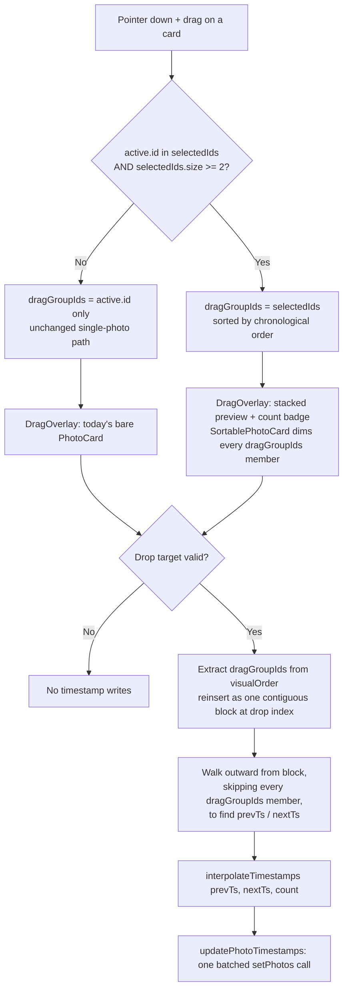

# Multi-Photo Drag-and-Drop Timestamp Reordering - Plan

**Target repo:** photo-tidy-web

## Goal Capsule

- **Objective:** extend the existing single-photo drag-and-drop timestamp reorder so a whole multi-photo selection can be dragged and dropped together, with all dragged photos getting new interpolated timestamps that preserve their current relative order.
- **Authority hierarchy:** this Planning Contract's Key Technical Decisions govern implementation mechanism; Product Contract Requirements govern product behavior; a unit's Approach never overrides either.
- **Execution profile:** standard `ce-work`/`/goal` execution — five dependency-ordered units.
- **Stop conditions:** a unit's test scenarios fail after a genuine attempt, or an implementation discovery contradicts a KTD's premise — surface as a blocker rather than guessing.

---

## Product Contract

### Summary

Dragging any photo that is part of the current multi-selection moves the whole selection together. Dropping between two boundary photos interpolates a new timestamp for every dragged photo, preserving their relative order. The drag preview shows a stacked thumbnail with a count badge for multi-selections. Single-photo drag stays pixel-for-pixel unchanged. Scope is limited to `photo-tidy-web`'s grid/drag code; `lib/exif-write.ts`, clustering, lightbox, delete, keep-best, and `photo-tidy-api/` are untouched.

### Problem Frame

Today, `handleDragEnd` in `components/PhotoUploadPage.tsx` only ever moves one photo: it resolves exactly two neighbors from the drop point and writes one interpolated timestamp. The app already has a multi-select mechanism (`selectedIds`, used by the "Keep best" feature), but drag-and-drop ignores it entirely — a user who wants to re-time a whole batch of photos relative to the rest of the grid must drag them one at a time, repeating the same drop gesture N times.

### Requirements

**Drag activation and grouping**

- R1. Dragging a photo that is part of the current selection (`selectedIds.size >= 2`) moves the whole selection together as one group.
- R2. Dragging a photo that is NOT part of the current selection behaves as today's single-photo drag: only that photo moves, and the existing selection is left untouched. *(session-settled: user-approved — chosen over pulling the existing selection along regardless; confirmed at scoping)*
- R3. Dragging when 0 or 1 photos are selected behaves exactly as single-photo drag does today, unchanged.

**Drop resolution and timestamp interpolation**

- R4. Dropping a dragged group between two boundary (non-dragged) photos assigns each dragged photo a new interpolated timestamp within that boundary gap.
- R5. The dragged group's relative order after the drop matches their current chronological order before the drag, not the order they were selected in. *(session-settled: user-approved — chosen over selection/click order; confirmed at scoping)*
- R6. Boundary neighbors are resolved from the true rendered visual order (`visualOrder`), skipping every dragged id — never the flat chronological `photos` array.
- R7. Interpolation produces distinct in-app timestamps even when the two boundary photos are as close as 1 second apart and 10 or more photos are being dropped.
- R8. No photo outside the dragged group has its timestamp modified by this feature.

**Visual feedback**

- R9. The drag preview for a multi-photo drag shows a stacked-thumbnail visual with a count badge (e.g. "4 photos"); a single-photo drag's preview is unchanged.
- R10. Non-grabbed selected cards indicate visually that they are part of the in-flight group move.

**Scope and non-goals**

- R11. Cross-cluster drags (moving a selection into or out of a cluster) need no special handling — clustering re-forms on its next pass from the updated timestamps.
- R12. This feature does not modify clustering, lightbox, delete, or keep-best behavior, and makes no changes under `photo-tidy-api/`.
- R13. `lib/exif-write.ts` is not modified. Sub-second interpolation (R7) is an in-app ordering guarantee only — the existing whole-second EXIF writer may collapse tightly-packed timestamps back to duplicate seconds on export and re-import. *(session-settled: user-approved — chosen over extending the EXIF writer for full export durability; confirmed after the sub-second-EXIF trade-off was surfaced)*

### Scope Boundaries

- Very large selections (e.g. select-all on a big library) dragged at once: no stated performance ceiling. `visualOrder` is already an array-of-ids operation, so no special handling is added; revisit only if real usage shows a problem.
- Keyboard/touch dnd-kit sensors are out of scope — only `PointerSensor` is wired today, and multi-drag does not add new sensors.
- Whether `selectedIds` clears after a multi-drag drop: it does not (see KTD5) — out of scope to make this configurable.

---

## Planning Contract

### Key Technical Decisions

- KTD1. **Freeze the drag group at drag-start, in chronological order.** `handleDragStart` computes, once: `selectedIds.has(active.id) && selectedIds.size >= 2 ? [...selectedIds sorted by current chronological order] : [active.id]`, and stores it in new state (`dragGroupIds`). Both `DragOverlay` and `handleDragEnd` read `dragGroupIds`, never re-derive membership from `selectedIds` at drop time — so a selection change mid-drag (Esc, deselect) can't retroactively change which photos move. Instantiates R1, R2, R3, R5. *(session-settled: user-approved — chosen over deriving drag membership from `selectedIds` live at drop time)*
- KTD2. **Extract-and-reinsert-as-block for boundary resolution.** Extract every `dragGroupIds` member from `visualOrder`, reinsert them as one contiguous block at the drop index, then walk outward from that block to find the nearest non-group id on each side as `prevTs`/`nextTs`. This generalizes today's single-item `arrayMove` + immediate-neighbor read (`components/PhotoUploadPage.tsx:334-354`) to N items and is the simplest algorithm consistent with "maintaining relative order." Instantiates R4, R6.
- KTD3. **New N-item interpolation helper**, `interpolateTimestamps(prevTs: Date | null, nextTs: Date | null, count: number): Date[]`, added alongside `computeDroppedTimestamp` (`components/PhotoUploadPage.tsx:48-67`). Evenly spaces `count` values inside `(prevTs, nextTs)` when both exist; falls back to the same edge-offset (±1000ms) and unchanged branches as today's single-item logic when one or both bounds are absent. Instantiates R7, R8, R13.
- KTD4. **New batched write path**, `updatePhotoTimestamps(updates: {id: string; date: Date | null}[])` in `hooks/usePhotos.ts`, modeled on `setPhotosTimestamp`'s single-pass shape. Computes every target date against one pre-drop snapshot and issues exactly one `setPhotos` call. A loop calling the existing single-id `updatePhotoTimestamp` N times is rejected: each call re-sorts and renumbers the array, so later dragged photos' neighbor positions would shift mid-loop. Instantiates R4, R8.
- KTD5. **Selection persists after drop.** `selectedIds` is left unchanged by a group drop, matching this codebase's existing convention (e.g. Keep Best leaves the winner's id in `selectedIds`). No clearing logic is added.
- KTD6. **Dim every dragged card, not just the grabbed one.** Extend `SortablePhotoCard.tsx`'s existing `isDragging`-driven 0.4-opacity treatment (line 59) so it applies to every id in `dragGroupIds`, not only `active.id`'s own `useSortable` instance. Instantiates R10.
- KTD7. **Stacked `DragOverlay` for group drags.** When `dragGroupIds.length >= 2`, `DragOverlay` renders a small offset stack of the existing `PhotoCard` image markup plus a count badge, using the same absolutely-positioned-overlay convention already used for the selection checkmark and Google-Photos-origin badge on `PhotoCard.tsx`. A single-item drag renders exactly today's bare `<PhotoCard>` overlay, unchanged. Instantiates R9.
- KTD8. **No special copy-mode handling.** Group-drag and copy-mode (`copySourceId`) stay independent state. The existing pointer-down interception on cards already keeps the two gestures from conflicting; no new guard is added.

### Assumptions

- The implementer places `interpolateTimestamps` in `components/PhotoUploadPage.tsx` next to `computeDroppedTimestamp`, matching this file's existing convention of colocating small pure helpers with their one caller — moving it to `lib/` is an acceptable alternative if `ce-work` finds a cleaner seam, but is not required.

### Sources & Research

- `docs/solutions/logic-errors/cluster-drag-timestamp-visual-order-divergence.md` — the P0 fix establishing that drag-drop must resolve neighbors from `visualOrder`, never `photos.findIndex`. KTD2/KTD6's algorithm and U2's regression tests build directly on this invariant.
- `docs/solutions/best-practices/exif-timestamp-rewriting-for-drag-reorder-persistence-2026-04-05.md` — the existing single-item midpoint/edge-offset algorithm (`computeDroppedTimestamp`) KTD3 generalizes, and the rejected `assignTimestamps()` bulk-reassignment approach KTD3/KTD4 avoid repeating.
- `docs/solutions/logic-errors/keep-best-comparison-stranded-by-unhandled-decode-errors-and-stale-selection-snapshot.md` — this codebase's only other multi-`selectedIds` interaction; informed KTD5's "selection persists" default and confirms today's drag handlers are synchronous (no `await`), so no live-ref re-validation is required for KTD1's freeze.
- `docs/solutions/best-practices/image-as-selection-target-dnd-kit-pattern-2026-04-05.md` — establishes the `PointerSensor` `{ distance: 8 }` activation constraint and the card pointer-down/selection-toggle convention KTD1 and KTD8 build on.

---

## High-Level Technical Design

---

## Implementation Units

### U1. Freeze drag-group membership at drag start

- **Goal:** compute and store the frozen, chronologically-ordered drag group the moment a drag starts.
- **Requirements:** R1, R2, R3, R5 (KTD1)
- **Dependencies:** none
- **Files:**
  - `components/PhotoUploadPage.tsx` (new `dragGroupIds` state, `handleDragStart`)
  - `components/PhotoUploadPage.test.tsx`
- **Approach:**
  1. Add `dragGroupIds: string[]` state alongside `activeId`.
  2. In `handleDragStart`, compute `dragGroupIds` per KTD1, ordering multi-id groups by current chronological order (reuse `compareByCapturedAt` or the equivalent ordering already available from `visualOrder`/`photosById`), not `Set` insertion order.
- **Patterns to follow:** the `comparingAnchorId` freeze-at-trigger-time pattern (`components/PhotoUploadPage.tsx:175, 539`) for "snapshot once at gesture start, don't re-derive later."
- **Test scenarios:**
  - Dragging a selected photo when 3 photos are selected freezes all 3 ids, ordered chronologically (not click order).
  - Dragging while only 1 photo is selected freezes just that one id.
  - Dragging a photo NOT in `selectedIds`, while other photos are selected, freezes just the dragged id; `selectedIds` itself is untouched.
  - Selection changes (deselect, Esc-clear) after the freeze but before drop do not change the already-frozen group.
- **Verification:** new tests in `PhotoUploadPage.test.tsx` assert `dragGroupIds` for each scenario above.

### U2. Generalize drop resolution to N-item groups

- **Goal:** extend `handleDragEnd` to resolve boundary neighbors and reorder `visualOrder` for the whole frozen group.
- **Requirements:** R4, R6, R8 (KTD2)
- **Dependencies:** U1
- **Files:**
  - `components/PhotoUploadPage.tsx` (`handleDragEnd`)
  - `components/PhotoUploadPage.test.tsx`
- **Approach:**
  1. Extract every `dragGroupIds` member from `visualOrder`.
  2. Reinsert them as one contiguous block at the drop index.
  3. Walk outward from the block, skipping every `dragGroupIds` member, to find the nearest non-group id on each side (`prevTs`/`nextTs`).
- **Patterns to follow:** the existing `visualOrder`-based (never flat-array) neighbor resolution invariant from `docs/solutions/logic-errors/cluster-drag-timestamp-visual-order-divergence.md`.
- **Test scenarios:**
  - Dragging 3 contiguous selected photos to a new position resolves the correct prev/next neighbors.
  - A scattered (non-contiguous) selection dropped at one point resolves true boundary neighbors that skip every dragged id, not just the physically-grabbed one.
  - Covers the visual-order-divergence hazard: dragging a group across a non-array-contiguous cluster, or a cluster with a null-timestamp member, resolves neighbors matching `visualOrder` — assert the correct result AND `.not.toHaveBeenCalledWith` the flat-array-based (wrong) resolution, mirroring the existing P0 regression pattern.
  - Single-photo drag (group size 1): resolved neighbors and array mutation are identical to pre-change behavior.
- **Verification:** `PhotoUploadPage.test.tsx` green, including the existing single-drag suite unchanged.

### U3. Multi-timestamp interpolation and batched write

- **Goal:** add the N-timestamp interpolation helper and the batched multi-id write path, wired to U2's resolved boundaries.
- **Requirements:** R4, R7, R8, R13 (KTD3, KTD4)
- **Dependencies:** U2
- **Files:**
  - `components/PhotoUploadPage.tsx` (`interpolateTimestamps` helper, wiring into `handleDragEnd`)
  - `hooks/usePhotos.ts` (`updatePhotoTimestamps`)
  - `components/PhotoUploadPage.test.tsx`, `hooks/usePhotos.test.ts` (or equivalent existing test file for this hook)
- **Approach:**
  1. `interpolateTimestamps(prevTs, nextTs, count)`: even spacing inside `(prevTs, nextTs)` when both exist; ±1000ms edge-offset branch when only one bound exists; unchanged branch when neither exists — same 3-branch shape as `computeDroppedTimestamp`, generalized to `count` outputs.
  2. `updatePhotoTimestamps(updates)`: single pass over the current photos snapshot, one `setPhotos` call, modeled on `setPhotosTimestamp`'s shape — never a loop over the existing single-id `updatePhotoTimestamp`.
- **Test scenarios:**
  - 3 photos between two neighbors with a large gap get evenly spaced, distinct timestamps in their pre-drag relative order.
  - 10 photos between two neighbors exactly 1 second apart still produce 10 distinct in-app `Date` values.
  - Only one neighbor exists (drop at the very start/end of `visualOrder`): the edge-offset branch applies to the whole group, preserving relative order.
  - Neither neighbor has a timestamp: unchanged branch, no writes.
  - `updatePhotoTimestamps` computes all N target dates against one snapshot and issues exactly one `setPhotos` call, not N — verified by a call-count assertion.
  - No photo outside the dragged group has its timestamp changed by the drop.
- **Verification:** new unit tests for `interpolateTimestamps` and `updatePhotoTimestamps` pass; `PhotoUploadPage.test.tsx` integration tests pass.

### U4. Multi-select drag visual feedback

- **Goal:** extend the drag-visual treatment (dimming, `DragOverlay`) to the whole frozen group.
- **Requirements:** R9, R10 (KTD6, KTD7)
- **Dependencies:** U1
- **Files:**
  - `components/SortablePhotoCard.tsx`
  - `components/PhotoUploadPage.tsx` (`DragOverlay` JSX)
  - `components/PhotoUploadPage.test.tsx`
- **Approach:**
  1. Extend the `isDragging`-driven 0.4-opacity dim to every id in `dragGroupIds`, not only `active.id`'s own `useSortable` instance.
  2. Branch `DragOverlay` JSX on `dragGroupIds.length`: `>= 2` renders the stacked-thumbnail + count-badge variant; `<= 1` renders exactly today's bare `PhotoCard`.
- **Patterns to follow:** the existing absolutely-positioned-overlay convention used for the selection checkmark and Google-Photos-origin badge on `PhotoCard.tsx`.
- **Test scenarios:**
  - A group drag of 4 renders a stacked overlay with a "4 photos" badge.
  - Single-photo drag renders exactly today's bare `PhotoCard` overlay (regression check against the existing overlay test).
  - Non-grabbed selected cards show the dimmed treatment during an in-flight group drag.
- **Verification:** overlay-rendering tests pass; the existing single-drag overlay test (`components/PhotoUploadPage.test.tsx:434-450`) is unchanged and still green.

### U5. Cross-cluster and copy-mode regression coverage

- **Goal:** confirm group-drag has no special-casing issues with clustering or copy-mode.
- **Requirements:** R11, R12 (KTD8)
- **Dependencies:** U2, U3
- **Files:**
  - `components/PhotoUploadPage.test.tsx`
- **Approach:** add coverage only; no production code is expected per KTD8.
- **Test scenarios:**
  - Dragging a multi-selection from inside a cluster to outside it resolves correct timestamps with no cluster-specific errors, and does not call into cluster-recompute code from drag logic.
  - Copy-mode active (`copySourceId` set, including when it equals one of the dragged ids) during a group drag: the drag completes normally and copy-mode state is unaffected.
- **Verification:** new tests green; full suite (`npm run test`) still fully passing; `npm run lint` and `npm run build` clean (only the 2 known pre-existing, unrelated lint errors, if still present).

---

## Verification Contract

| Command | Applies to | Gate |
|---|---|---|
| `npm run test` | All units | Full suite passes, including every new test scenario above and all pre-existing tests unchanged |
| `npm run lint` | All units | No new lint errors (2 pre-existing errors — one in `components/PhotoCard.tsx`, one in `hooks/useTimestampEdit.ts` — unrelated to this feature, are expected) |
| `npm run build` | All units | Production build succeeds |

## Definition of Done

- All five units implemented and their test scenarios pass.
- `npm run test`, `npm run lint`, `npm run build` all clean per the Verification Contract above (2 pre-existing lint errors — one in `components/PhotoCard.tsx`, one in `hooks/useTimestampEdit.ts` — are expected).
- The existing single-photo drag test suite passes unchanged — no regression to R2/R3's "stays exactly as it is now" requirement.
- No changes outside `photo-tidy-web/`; `lib/exif-write.ts`, clustering, lightbox, delete, and keep-best code paths are untouched.
- Any dead-end or experimental code from approaches that did not pan out during implementation is removed before declaring done.
