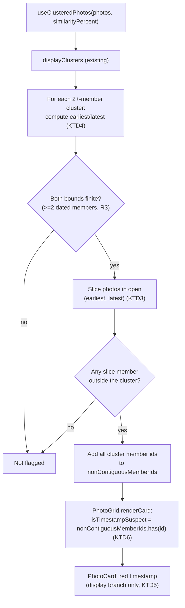

# Highlight Non-Contiguous Cluster Timestamps in Red - Plan

**Target repo:** photo-tidy-web

## Goal Capsule

- **Objective:** give the user a visual signal, on the grid itself, when a similarity cluster's photos are temporally fragmented — some other photo's timestamp falls between the cluster's own earliest and latest member — which usually means one or more of those timestamps are wrong and need fixing.
- **Authority hierarchy:** this Planning Contract's Key Technical Decisions govern implementation mechanism; Product Contract Requirements govern product behavior; a unit's Approach never overrides either.
- **Execution profile:** standard `ce-work`/`/goal` execution — two dependency-ordered units (pure computation, then display wiring).
- **Stop conditions:** a unit's test scenarios fail after a genuine attempt, or an implementation discovery contradicts a KTD's premise — surface as a blocker rather than guessing.
- **Tail ownership:** the implementer runs the Verification Contract gates and satisfies Definition of Done; this plan does not choose a PR/landing strategy — follow repo convention.

---

## Product Contract

### Summary

Add a purely visual signal to the existing similarity-cluster grid: when a cluster's photos are not temporally contiguous — some photo outside the cluster has a timestamp strictly between the cluster's earliest and latest member timestamp — every one of that cluster's timestamp labels renders in red instead of the normal muted color. A contiguous cluster, or an unclustered (singleton) photo, is unaffected.

### Problem Frame

`CONCEPTS.md`'s existing Cluster entry already documents that a cluster renders as one grid block anchored at its earliest member's position, and that "an unrelated photo whose own timestamp falls between two Cluster members still renders after the whole Cluster block, not between them." Today that fact is invisible — nothing on screen tells the user their cluster is temporally fragmented. In practice this usually means the timestamps themselves are wrong (a common cause: WhatsApp re-export resets `DateTimeOriginal` to the forward/download time, not the original capture time), and the user has no cue to go investigate. This feature makes that fragmentation visible directly on the affected cluster's timestamp labels.

### Requirements

**Detection**
- R1. A cluster (2 or more members) is temporally non-contiguous when at least one photo *outside* the cluster has a non-null `capturedAt` strictly between the cluster's own earliest and latest member `capturedAt` (both endpoints excluded — see KTD2 for the boundary-tie decision).
- R2. Members with a null `capturedAt` are excluded from establishing a cluster's earliest/latest bounds, and a null-`capturedAt` outside photo can never be the one that "breaks" contiguity — mirrors `earliestCapturedAtMs`'s existing null-exclusion convention (`hooks/useClusteredPhotos.ts:59-67`).
- R3. A cluster with fewer than 2 members carrying a non-null `capturedAt` has no bounds to evaluate and is never flagged.
- R4. A single-member cluster (an unclustered photo) is never flagged — there is no gap for another photo to fall inside.

**Display**
- R5. When a cluster is flagged, every member's timestamp label — including a member with no `capturedAt` (displayed as "No date") — renders in red instead of the app's normal muted timestamp color, and carries a `title` attribute explaining the flag so the signal is not color-only. The red state persists on hover (an editable card's existing hover color must not silently cancel the flag).
- R6. When a cluster is not flagged (contiguous, or too small to evaluate), its timestamps render exactly as they do today — no visual change.
- R7. The red highlight applies only to the read-only timestamp display; the in-place timestamp-editing input's appearance and behavior are unchanged.

### Scope Boundaries

- Unchanged: the clustering algorithm and API call (`hooks/useClusterApi.ts`), timestamp editing (`useTimestampEdit`, `PhotoCard.tsx`'s edit-mode branch), drag-and-drop reordering, the lightbox, delete, Keep Best, and Copy Mode.
- No change to `renderBlocks`, `visualOrder`, cluster grouping/ordering, or grid layout — this is a read-only, additive display computation layered on top of the existing render pipeline, not a new grouping rule.
- No change to `photo-tidy-api/` or any cross-project contract — detection is computed entirely client-side from data the web app already has.
- No new interactive control (no toggle, no dismiss button, no modal) — the only new user-facing surface is the red color plus its `title` text (R5); nothing else about the grid's interaction model changes.

---

## Planning Contract

### Key Technical Decisions

- KTD1. **Compute a `Set<string>` of every id belonging to a temporally non-contiguous cluster inside `useClusteredPhotos` itself, as a new `useMemo` alongside the existing `renderBlocks`/`visualOrder` computations, and add it to `UseClusteredPhotosResult` as `nonContiguousMemberIds: Set<string>`.** This hook already builds `photosById` (`hooks/useClusteredPhotos.ts:135`) and the chronologically-ordered `displayClusters` (`hooks/useClusteredPhotos.ts:188-197`) that detection needs, and is the single place both `PhotoGrid.tsx` and any future consumer read cluster shape from — adding the computation here, rather than in `PhotoGrid.tsx`, keeps "what does this cluster look like" logic in one file, matching how `renderBlocks`/`visualOrder` are already centralized there. A `Set` (not a per-cluster boolean map) is returned because the only thing a consuming card needs is "is my own id in the flagged set" — an O(1) membership check, matching how `renderCard` already derives `isSoleSelected`/`showKeepBest` as plain per-card booleans from a set/selection it holds (`components/PhotoGrid.tsx:180-181`) rather than building a separate per-cluster lookup table. Governs R1, R2, R3, R4.
- KTD2. **Boundary ties are exclusive: an outside photo whose `capturedAt` exactly equals the cluster's own earliest or latest member timestamp does NOT break contiguity — only a timestamp strictly between the two (open interval) does.** Confirmed with the user during scoping. A tie at the exact boundary is more likely a duplicate/simultaneous capture than evidence of fragmentation, and the user's own example only described a strictly-between case. Governs R1.
- KTD3. **Detection walks the already-globally-sorted `photos` array (chronological, null-`capturedAt` last — `hooks/usePhotos.ts`'s `sortPhotos`/`compareByCapturedAt`) rather than comparing every cluster against every other photo pairwise.** Because `photos` is already sorted ascending by `capturedAt` with nulls at the tail, every photo whose timestamp falls in a cluster's open `(earliest, latest)` interval forms one contiguous slice of that array. For each 2+-member cluster with a valid (non-`Infinity`) earliest and a computed latest: find that slice (binary search or a linear scan bounded by the slice itself, not the whole array) and check whether every entry in it is already a member of the cluster — the first non-member found flags the cluster and its whole member set is added to `nonContiguousMemberIds`; no non-member found means contiguous. This is a direct reuse of the same "photos are canonically ordered by `capturedAt`" invariant `earliestCapturedAtMs` and `visualOrder` already depend on (see `docs/solutions/logic-errors/cluster-drag-timestamp-visual-order-divergence.md`), not a new ordering assumption. Governs R1, R2, R3.
- KTD4. **A cluster's "latest member timestamp" is computed the same way `earliestCapturedAtMs` computes earliest (`hooks/useClusteredPhotos.ts:59-67`) but taking `Math.max` instead of `Math.min`, falling back to `-Infinity` when every member is null.** Only clusters where both the earliest is finite and the latest is finite (i.e., at least 2 members have a real timestamp — could be the same 2 that set both bounds, or more) have a real interval to check; a cluster failing that condition is skipped entirely (R3), never flagged. Written as its own small exported helper (`latestCapturedAtMs`) mirroring `earliestCapturedAtMs`'s exact shape and doc-comment style, not inlined, so it's independently testable and discoverable the same way. Governs R1, R3.
- KTD5. **The red highlight applies only to `PhotoCard.tsx`'s existing read-only timestamp `
` (the `else` branch of the `isEditingTimestamp` ternary, `components/PhotoCard.tsx:394-402`), never to the `isEditingTimestamp` branch's `<input>` (`components/PhotoCard.tsx:380-393`).** This is a structural consequence of the ternary already separating "editing" from "display" — the fix only ever touches the display branch's `className`, so `useTimestampEdit`'s state machine, the input's own styling, and every editing interaction (click-to-edit, commit, cancel) are untouched code, satisfying R7 by construction rather than by a runtime condition. The suspect state's color is `text-red-600 dark:text-red-400`, and its hover treatment (when `onTimestampChange` is present) is a red-family hover shade (e.g. `hover:text-red-700 dark:hover:text-red-300`) applied instead of — not alongside — the existing `hover:text-zinc-700 dark:hover:text-zinc-300`, so hovering to edit a flagged timestamp never silently reverts it to the unflagged color (a real gap caught in doc review: the base/hover pair must branch together on `isTimestampSuspect`, not have hover applied unconditionally after the base color). This red is deliberately distinct from `PhotoCard.tsx`'s existing `rose-600`/`rose-400` (delete) and `red-700` (Keep Best trigger) uses — same hue family (still reads as "needs attention"), different shade, so it doesn't visually collide with either existing meaning. Governs R5, R6, R7.
- KTD6. **The new prop threads through exactly the path `PhotoGrid.tsx`'s `renderCard` already establishes for `isSoleSelected`/`showKeepBest`: `useClusteredPhotos` → `renderCard` → `SortablePhotoCard.tsx` → `PhotoCard.tsx`.** `renderCard` (`components/PhotoGrid.tsx:175-248`) already derives per-card booleans this same way (`isSoleSelected`, `showKeepBest` at lines 180-181) from values available in its closure; `nonContiguousMemberIds.has(id)` is one more line in that same block, named `isTimestampSuspect`, added to both the `SortablePhotoCard`/`PhotoCard` JSX blocks (mirroring `isSoleSelected`'s appearance at lines 197 and 216) and the `useCallback` dependency array (`components/PhotoGrid.tsx:230-247`), exactly like every existing per-card boolean there. `SortablePhotoCard.tsx`'s `Props` (`:6-32`) and pass-through (`:65-82`) get the same one-line addition `isSoleSelected`/`showKeepBest` already show. No new prop-threading pattern is introduced. *(Earlier drafts of this KTD cited an `isInDragGroup`/`dragGroupIdSet` precedent from an in-flight "multi-photo-drag" feature — doc review confirmed that code does not exist on this plan's branch (`develop`) and the citation was corrected to the real, currently-present `isSoleSelected`/`showKeepBest` pattern above.)* Governs R5, R6.
- KTD7. **A member with a null `capturedAt` (displayed as "No date") inside a flagged cluster still renders in red.** R2/KTD4 exclude a null-`capturedAt` photo only from *establishing* a cluster's bounds and from being the *outside* photo that breaks contiguity — once a cluster is flagged by its dated members, every member (dated or not) is part of the same fragmented group, and a null-dated member is itself a data-quality gap worth surfacing, not a reason to special-case it out of the highlight. Keeps `nonContiguousMemberIds`'s "all members or none" shape (KTD1) simple — no second exclusion rule layered on top for display. Governs R5.
- KTD8. **The `title` attribute on a flagged timestamp reads exactly `"Part of a temporally fragmented cluster — another photo's timestamp falls between this cluster's earliest and latest, which usually means a timestamp is wrong"`, present only when `isTimestampSuspect` is true (omitted otherwise, matching the unflagged `
`'s existing lack of a `title`).** Doc review flagged that a color-only signal is invisible to a colorblind user and completely absent for a screen-reader user; a native `title` costs one JSX attribute (no new component, no tooltip library, no dismiss affordance) while giving every access mode at least some textual signal, which is why the Scope Boundaries' original "no tooltip copy" line was narrowed rather than kept as a hard boundary. Governs R5.
- KTD9. **`CONCEPTS.md`'s Cluster entry gets a short addition (not a new heading) describing this behavior**, since it already documents the exact underlying fact (non-array-contiguous clusters) this feature makes visible — the vocabulary belongs beside that existing explanation, not as a separate concept. Not a KTD with an R — a documentation completeness decision, not a behavior decision.

### Sources & Research

- `CONCEPTS.md`'s Cluster entry — already documents the exact phenomenon ("an unrelated photo whose own timestamp falls between two Cluster members still renders after the whole Cluster block, not between them") this feature surfaces visually; the plan's Problem Frame and KTD7 both point back to it.
- `hooks/useClusteredPhotos.ts:16-19` (`Cluster`), `:34-36` (`clusterKey`), `:59-67` (`earliestCapturedAtMs`), `:84-86` (`sortMembersChronologically`), `:95` (`ClusterRenderBlock`), `:97-119` (`UseClusteredPhotosResult`), `:134-235` (`useClusteredPhotos` body: `photosById` at `:135`, `rawClusters` at `:161-178`, `displayClusters` at `:188-197`, `renderBlocks` at `:199-211`, `visualOrder` at `:222-232`, return at `:234`) — the exact data model and null-exclusion/`Infinity`-fallback convention KTD1/KTD3/KTD4 generalize.
- `hooks/usePhotos.ts` — `sortPhotos`/`compareByCapturedAt`'s null-last, ties-by-`uploadIndex` global ordering, the invariant KTD3's slice-based detection depends on.
- `components/PhotoCard.tsx:380-402` — the `isEditingTimestamp` ternary; lines 394-402 are the exact display branch KTD5 targets, lines 380-393 the editing branch it must not touch. `:143-144` (`dateLabel` derivation), `:125-142` (props destructuring) show where the new prop joins the existing list. `:1-4` for the `formatDate` import location, matched by the new `title` string (KTD8) living alongside it, not in a separate file.
- `components/PhotoGrid.tsx:180-181` (`isSoleSelected`/`showKeepBest`, the plain per-card-boolean convention KTD1/KTD6 follow — confirmed real and current, unlike an earlier draft's now-corrected citation to a nonexistent `isInDragGroup`/`dragGroupIdSet` pattern), `:175-248` (`renderCard`, its per-card boolean derivations at `:180-181`, their JSX use at `:197`/`:216`, and its `useCallback` dependency array at `:230-247` — the exact pattern KTD6 extends), `:150-170`-equivalent `Props`/destructuring block (currently `:66-148`, destructuring at `:150-169`), where a new `nonContiguousMemberIds` prop joins the existing list, and `useClusteredPhotos`'s result destructuring at `:162-165` (currently `renderBlocks, photosById, visualOrder, availability, isLoading`).
- `components/SortablePhotoCard.tsx:6-32` (`Props`, showing `isSoleSelected`/`showKeepBest`'s plain-boolean style, no doc comment needed) and its pass-through at `:65-82` — the exact precedent KTD6's new prop's pass-through mirrors.
- `hooks/useClusteredPhotos.test.ts:47-60` — the existing `'re-sorts an API cluster whose members arrive out of chronological order'` test contributes its `makeEntry`/`apiResult`/`mockUseClusterApi` helpers, which U1's new tests reuse directly. It does **not** already contain a non-contiguous fixture (all three of its photos are members of the *same* cluster) — the A/B/C-with-B-excluded shape (A/C clustered at t=1/t=3, B unclustered at t=2) matching the user's own example and `CONCEPTS.md`'s is new test data U1 introduces, built with those same helpers. *(An earlier draft of this bullet claimed the fixture shape itself was reused, which doc review found incorrect against the actual test file — corrected above.)*
- `docs/solutions/logic-errors/cluster-drag-timestamp-visual-order-divergence.md` — establishes both the non-array-contiguous-cluster scenario as a real, previously-load-bearing edge case in this codebase, and the "photos is canonically sorted, resolve positional questions against that sort" reasoning KTD3 reuses (there, for visual order; here, for detection).

---

## High-Level Technical Design

---

## Implementation Units

### U1. Non-contiguous-cluster detection

**Goal:** add the pure computation — given the current photo set and clusters, which member ids belong to a temporally non-contiguous cluster — with no UI coupling.

**Requirements:** R1, R2, R3, R4; KTD1, KTD2, KTD3, KTD4

**Dependencies:** none

**Files:**
- `hooks/useClusteredPhotos.ts` (modify)
- `hooks/useClusteredPhotos.test.ts` (modify)

**Approach:**
- Add `latestCapturedAtMs(cluster, photosById): number`, mirroring `earliestCapturedAtMs` (`hooks/useClusteredPhotos.ts:59-67`) exactly but with `Math.max` and a `-Infinity` fallback. Export it alongside `earliestCapturedAtMs` (KTD4).
- Inside `useClusteredPhotos`, add a new `useMemo` (after `displayClusters`, alongside `renderBlocks`) that:
  - Builds `sortedDated = photos.filter(p => p.capturedAt !== null)` once — already in ascending order since `photos` itself is globally sorted with nulls last (no re-sort needed).
  - For each cluster in `displayClusters` with `members.length >= 2`: compute `earliest = earliestCapturedAtMs(cluster, photosById)` and `latest = latestCapturedAtMs(cluster, photosById)`. Skip (not flagged) unless both are finite (R3).
  - Find the slice of `sortedDated` whose `capturedAt` is strictly greater than `earliest` and strictly less than `latest` (open interval, KTD2) — a linear scan bounded to that slice, or a binary search for the lower bound, either is acceptable; do not scan the full `photos` array per cluster.
  - If any entry in that slice has an `id` not in `cluster.members`, add every id in `cluster.members` to the result `Set<string>` (R1).
  - Return the accumulated `Set<string>` as `nonContiguousMemberIds`.
  - Add `nonContiguousMemberIds` to `UseClusteredPhotosResult` (`hooks/useClusteredPhotos.ts:97-119`) and the hook's final return (`:234`).
- A single-member cluster is structurally skipped by the `members.length >= 2` guard (R4) — never even reaches the bounds check.

**Patterns to follow:** `earliestCapturedAtMs`'s exact null-exclusion/`Infinity`-fallback shape and doc-comment style (`hooks/useClusteredPhotos.ts:38-67`) for `latestCapturedAtMs`; the existing `displayClusters`/`renderBlocks` `useMemo` placement and dependency style (`:188-211`) for the new memo.

**Test scenarios** (extend `hooks/useClusteredPhotos.test.ts`, reusing its `makeEntry`/`apiResult`/`mockUseClusterApi` helpers):
- The exact CONCEPTS.md/user-example shape: A (t=10:00) and C (t=14:30) clustered, B (t=12:00) not in any cluster — `nonContiguousMemberIds` contains A's and C's ids, not B's. Covers R1.
- A contiguous cluster (e.g., A t=10:00 and B t=10:02 clustered, with every other photo's timestamp outside `[10:00, 10:02]`) — `nonContiguousMemberIds` is empty. Covers R6 (implicitly; asserted at this layer as "not flagged").
- A cluster with a null-`capturedAt` member plus one dated member (1 dated member total) — never flagged, regardless of what other photos exist, because it has no valid bounds. Covers R2, R3.
- A cluster where the "breaking" outside photo itself has a null `capturedAt` — never flagged by that photo (it can't be evaluated against the interval). Covers R2.
- Boundary tie: an outside photo's `capturedAt` exactly equals the cluster's earliest or latest member timestamp — not flagged (exclusive bounds). Covers KTD2.
- A single-member cluster (unclustered photo) — never appears in `nonContiguousMemberIds` even when other clusters/photos exist around it. Covers R4.
- Multiple clusters in the same batch: one flagged, one not — assert both outcomes independently in one fixture (no cross-cluster leakage).

**Verification:** `npm run test -- hooks/useClusteredPhotos`, `npm run lint`, `npm run build`.

---

### U2. Red timestamp display

**Goal:** thread U1's `nonContiguousMemberIds` through to each card and apply the red highlight to the read-only timestamp label only.

**Requirements:** R5, R6, R7; KTD5, KTD6, KTD7, KTD8

**Dependencies:** U1

**Files:**
- `components/PhotoGrid.tsx` (modify)
- `components/SortablePhotoCard.tsx` (modify)
- `components/PhotoCard.tsx` (modify)
- `components/PhotoCard.test.tsx` (modify)
- `components/PhotoGrid.test.tsx` (modify)

**Approach:**
- `PhotoGrid.tsx`: destructure `nonContiguousMemberIds` from `useClusteredPhotos`'s result (currently `:162-165`, alongside `renderBlocks, photosById, visualOrder, availability, isLoading`); inside `renderCard` (currently `:175-248`), add `const isTimestampSuspect = nonContiguousMemberIds.has(id)` alongside the existing `isSoleSelected`/`showKeepBest` derivations (currently `:180-181`); pass `isTimestampSuspect` to both the `SortablePhotoCard` and plain-`PhotoCard` JSX branches (alongside `isSoleSelected={isSoleSelected}` at `:197`/`:216`); add `nonContiguousMemberIds` to the `useCallback` dependency array (currently `:230-247`) — it's already a stable `useMemo` result from the hook, so this doesn't cause extra re-renders beyond a genuine cluster-shape change. (Re-verify these line numbers against the file at implementation time — U1's own edits shift them.)
- `SortablePhotoCard.tsx`: add `isTimestampSuspect?: boolean` to `Props` (mirroring `isSoleSelected`/`showKeepBest`'s plain style, currently `:6-32`), destructure it, pass through unchanged to the inner `PhotoCard` (mirroring the existing pass-through, currently `:65-82`).
- `PhotoCard.tsx`: add `isTimestampSuspect?: boolean` to `Props` (after `onKeepBest`, `:122-123`) and its destructuring (`:125-142`). In the display-only branch (`:394-402`), branch the `
`'s `className` on `isTimestampSuspect` (KTD5, KTD7 — a null-`capturedAt` member's "No date" label gets the same treatment, no extra condition needed): when true, `text-red-600 dark:text-red-400` as the base plus (only when `onTimestampChange` is set) `cursor-text hover:text-red-700 dark:hover:text-red-300`; when false, today's `text-zinc-500 dark:text-zinc-400` plus (only when `onTimestampChange` is set) `cursor-text hover:text-zinc-700 dark:hover:text-zinc-300` — i.e. base-plus-hover is one branched pair, not a suspect-conditional base with the existing hover class appended unconditionally (doc review: appending the old hover class unconditionally would silently cancel the red flag on mouseover, KTD5). Add `title={isTimestampSuspect ? "Part of a temporally fragmented cluster — another photo's timestamp falls between this cluster's earliest and latest, which usually means a timestamp is wrong" : (existing title, unchanged)}` (KTD8) — the existing `title={onTimestampChange ? 'Click to edit date' : undefined}` stays as the non-suspect case; when both are true (an editable, flagged card), KTD8's string takes precedence since it is the more specific signal. Do not touch the `isEditingTimestamp` branch (`:380-393`) at all (KTD5).

**Patterns to follow:** `isSoleSelected`/`showKeepBest`'s existing threading (`components/PhotoGrid.tsx:180-181,197,216,230-247`; `components/SortablePhotoCard.tsx:27,29,47,49,77,79`) for the new prop's plumbing.

**Test scenarios:**
- `PhotoCard.test.tsx`: with `isTimestampSuspect=true`, the rendered timestamp element carries the red-color class/style and the KTD8 `title` text; with it `false` or omitted, it carries the normal muted color and the unflagged `title` (or none). Covers R5, R6.
- `PhotoCard.test.tsx`: with `isTimestampSuspect=true` AND the card in edit mode (timestamp input focused/rendered), the `<input>` element itself carries none of the red styling or the suspect `title` — only the display `
` does when not editing. Covers R7.
- `PhotoCard.test.tsx`: with `isTimestampSuspect=true` and `onTimestampChange` provided (editable card), simulating `:hover` (or asserting the class list directly) shows the red-family hover class, never the plain zinc hover class that would cancel the flag. Covers KTD5's hover-preservation fix.
- `PhotoCard.test.tsx`: a card with `capturedAt: null` (rendering "No date") and `isTimestampSuspect=true` still gets the red class and title — the null-date label is not special-cased out of the highlight. Covers KTD7.
- `PhotoGrid.test.tsx`: given a fixture where `useClusteredPhotos` (mocked, following this file's existing mocking convention) reports a non-contiguous cluster, the rendered cards for that cluster's members show the suspect styling and the rendered card for the non-member photo between them does not. Covers R5, R6, KTD6's threading.

**Verification:** `npm run test -- components/PhotoCard components/PhotoGrid`, `npm run lint`, `npm run build`.

---

## Verification Contract

| Command | Applies to |
|---|---|
| `npm run test -- hooks/useClusteredPhotos` | U1 |
| `npm run test -- components/PhotoCard components/PhotoGrid` | U2 |
| `npm run lint` | U1, U2 |
| `npm run build` | U1, U2 |
| `npm run test` (full suite) | Before ship — confirms no regression outside the touched files |

## Definition of Done

- All Requirements (R1-R7) are satisfied and traceable to a unit.
- `npm run test`, `npm run lint`, and `npm run build` pass clean.
- Clustering, timestamp editing, drag-and-drop, lightbox, delete, Keep Best, and Copy Mode behavior are unchanged — verified by the full `npm run test` suite run (Verification Contract), not just manual inspection.
- `CONCEPTS.md`'s Cluster entry is updated per KTD9.
- No changes outside `photo-tidy-web/`.
