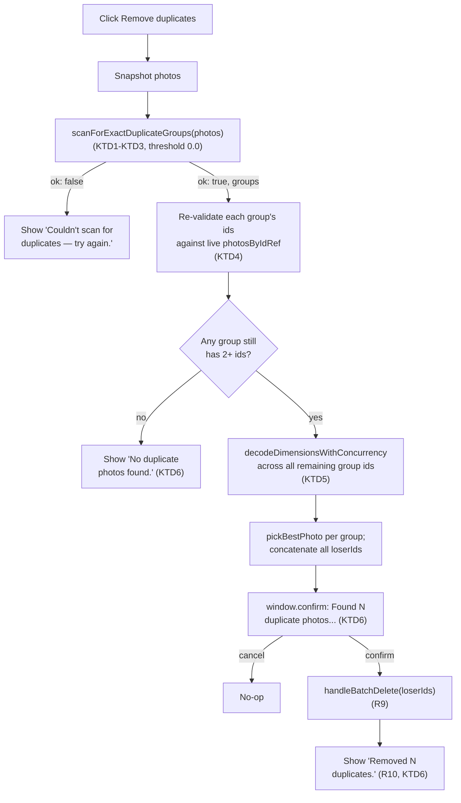

# Auto-Deduplicate Identical Photos With One Click - Plan

**Target repo:** photo-tidy-web

## Goal Capsule

- **Objective:** a single always-visible button that scans the whole loaded batch for exact-duplicate photos (no selection, no clustering slider involved), and — after the user confirms a count — deletes every duplicate except the best copy of each.
- **Authority hierarchy:** this Planning Contract's Key Technical Decisions govern implementation mechanism; Product Contract Requirements govern product behavior; a unit's Approach never overrides either.
- **Execution profile:** standard `ce-work`/`/goal` execution — two dependency-ordered units (the reusable scan primitive, then the button/flow wired into `PhotoUploadPage`).
- **Stop conditions:** a unit's test scenarios fail after a genuine attempt, or an implementation discovery contradicts a KTD's premise — surface as a blocker rather than guessing.
- **Tail ownership:** the implementer runs the Verification Contract gates and satisfies Definition of Done; this plan does not choose a PR/landing strategy — follow repo convention.

---

## Product Contract

### Summary

Add a "Remove duplicates" button, always visible alongside "Clear all"/"Download all" whenever photos are loaded — independent of the similarity slider's position and of the current selection. Clicking it scans the whole batch for exact-duplicate photos via `photo-tidy-api`'s clustering endpoint at its strictest threshold, shows a confirmation naming how many duplicates were found, and on confirm deletes every duplicate except the highest-quality copy of each group.

### Problem Frame

The app already has two ways to resolve duplicate/near-duplicate photos: the similarity-cluster grid (manual review, any threshold) and "Keep Best" (manual selection, any 2+ photos). Both require the user to first select or review something. Neither offers a single action that says "just get rid of the exact duplicates for me" across the whole batch with no setup. This feature adds that action — deliberately scoped to *only* true exact duplicates (no fuzzy threshold), so it's safe to run with minimal review: the confirmation dialog is the safety net, not a substitute for the user checking anything beforehand.

This app previously shipped an auto-resolve-identical-photos feature with **no** confirmation at all; it was removed because "it prov[ed] confusing that removed photos weren't visible" (`CONCEPTS.md`'s Cluster entry, which explicitly anticipates "Smart auto-suggestions may return once grouping itself is trustworthy"). This feature is that return, closing the gap that removal actually named — the missing confirmation gate — with the same count-level visibility this app's other bulk-delete actions ("Keep Best," "Clear all") already use, not a full per-photo before/after list. It does not attempt a stronger visibility guarantee than those existing actions already provide.

### Requirements

**Entry and visibility**
- R1. A "Remove duplicates" button is visible whenever `photos.length > 0`, regardless of the similarity slider's position, the current selection, or whether any cluster is currently rendered. It also stays visible for the remainder of its own scan/decode window or while its own result banner is showing, even if `photos.length` drops to 0 in the meantime (e.g. every remaining photo is deleted by some other action while the scan is still in flight) — mirroring this app's existing convention for its ZIP-download action, which stays visible on the same "in flight or result pending" basis.
- R2. The button requires no selection and is unaffected by `selectedIds` in any way — it operates on every currently loaded photo.

**Detection**
- R3. Clicking the button scans the entire currently loaded batch for exact duplicates, using `photo-tidy-api`'s existing clustering mechanism at its strictest (`threshold: 0.0`) setting — the same mechanism and threshold value `CONCEPTS.md`'s "0% = only exact duplicates" already describes, not a new detection method.
- R4. Only groups of 2 or more exact-duplicate photos count; a photo with no exact duplicate is left untouched.
- R5. No fuzzy/near-duplicate matching — a photo is only ever grouped with another when the API reports them at threshold `0.0` (session-settled: user-directed — strict exact-match only, no tolerance for re-encoded near-identical copies, chosen over a small non-zero tolerance specifically because this feature auto-deletes on confirm rather than requiring per-photo review, and a false grouping here is exactly the class of mistake the prior no-confirmation auto-resolve feature was removed for). Accepted residual risk from this decision: `threshold: 0.0` is the API's stated strictest setting, not a documented pixel-exact or cryptographic guarantee (CLIP embeddings are a semantic-similarity measure) — a theoretical false-positive grouping of two genuinely distinct-but-visually-near-identical photos (e.g. back-to-back shots of an unchanged static scene) can't be ruled out from this plan alone. This tradeoff was already weighed against the alternative (a small non-zero tolerance, which raises that same risk further while also catching more legitimate re-encoded duplicates) and rejected in favor of the strictest available setting; re-litigating it would require empirical evidence this plan cannot gather, not a design change.

**Selection and confirmation**
- R6. For each duplicate group, the photo with the highest pixel resolution (width × height) is kept; a resolution tie breaks toward the larger file size, and a remaining tie breaks toward whichever copy was added to the batch earliest — the same three-tier comparator "Keep Best" already uses.
- R7. Before deleting anything, the user sees a confirmation naming the total number of duplicate photos that will be removed across every group combined, and must confirm before any deletion happens.
- R8. Declining the confirmation leaves every photo untouched.
- R9. On confirmation, every duplicate group's losers are deleted in one action; the winner of each group is kept.
- R10. After deletion, a dismissible message reports how many duplicates were removed.

### Scope Boundaries

- Unchanged: the "Keep Best" button and its selection-scoped behavior, the similarity-cluster slider and grid, manual per-card/per-cluster deletion, `BatchEditPanel`'s existing batch actions, and `photo-tidy-api/`.
- No new detection mechanism — this feature calls the existing `POST /api/cluster` endpoint exactly as the live slider does, just at a fixed strict threshold and as a one-shot request instead of a live debounced one.
- No preview of which specific photos will be removed before confirming — the confirmation names a count only, matching this app's existing "Keep Best" and "Clear all" confirmation conventions (naming a count/scope, not every filename).
- No undo. Matches every other delete path in this app today.
- No special handling for `photo-tidy-api`'s documented 500-photos-per-request cap (`photo-tidy-api/README.md`) — a batch over that size fails this scan the same generic way the live similarity slider already fails at that size today; this is an inherited constraint of the reused mechanism (KTD1), not a gap this feature introduces, and is out of scope to special-case here.

---

## Planning Contract

### Key Technical Decisions

- KTD1. **Detection reuses `photo-tidy-api`'s existing `POST /api/cluster` endpoint at a fixed `threshold: 0.0`, via a new one-shot function — not the live `useClusterApi` hook, and not a new client-side hashing mechanism.** Confirmed during scoping: neither of the two mechanisms named in the original request (perceptual hash, identical file content) exists anywhere in this codebase — `lib/perceptual-hash.ts` was deleted when clustering moved server-side (`docs/plans/2026-08-26-001-feat-integrate-cluster-api-plan.md`), and there is no file-content hash anywhere. The API's own threshold range is `[0.0, 0.5]` (`photo-tidy-api/README.md`) with `0.0` as the strictest, in-range value — matching `CONCEPTS.md`'s existing "0% = only exact duplicates" description. `useClusterApi.ts`'s live hook cannot be reused directly: it short-circuits before firing any request whenever `similarityPercent <= 0` (`hooks/useClusterApi.ts:249`), so "0%" is a describable API concept the app never actually computes at rest — this feature makes its own explicit one-shot request instead. Governs R3, R5.
- KTD2. **Export `postCluster` from `hooks/useClusterApi.ts` (currently module-private, `:112-149`) unchanged, and build the new one-shot scan on top of it — do not duplicate its request-building or reimplement `useClusterApi`'s live-hook machinery (debounce, generation-token race-safety, health-gate state) for this one-shot use.** `postCluster(photos, excludeIds, thumbnailsByFile, threshold)` already takes a plain `threshold` parameter and has no dependency on the hook's own state, so exporting it (a one-word change, zero behavior change, `hooks/useClusterApi.test.ts` stays green with no edits) is strictly additive reuse — not a refactor of tested, subtle code. Governs R3.
- KTD3. **New pure async function `scanForExactDuplicateGroups(photos: PhotoEntry[]): Promise<{ ok: true; groups: string[][] } | { ok: false }>` lives in a new file, `lib/duplicate-scan.ts`** — mirroring `lib/photo-quality.ts`'s existing "pure logic, no UI coupling" convention (that file's own opening doc comment) rather than inlining this into `PhotoUploadPage.tsx` the way `decodeDimensionsWithConcurrency` is: unlike that helper, this one needs its own dedicated test file exercising the network/retry contract, and giving it a home under `lib/` alongside `photo-quality.ts` keeps `PhotoUploadPage.tsx` from re-growing request-building logic it already deliberately avoids (`decodeDimensionsWithConcurrency` is pure-local dimension decoding with no network call). Internally: generate a thumbnail per photo via `generateThumbnail` (`lib/generate-thumbnail.ts`), in fixed-size concurrency-bounded batches reusing `lib/chunk-array.ts`'s `chunkArray` — the exact same shape `decodeDimensionsWithConcurrency` (`components/PhotoUploadPage.tsx:82-101`) already uses for this feature's own later dimension-decode step, and for the same reason KTD5 keeps that step bounded: unlike `useClusterApi.ts`'s live hook (`:289`), which only ever regenerates a *cache-miss* subset of thumbnails on an incremental, debounced tick, this is a one-shot, uncached, whole-batch call fired fresh on every click — an unbounded `Promise.all` here would start decoding every currently loaded photo's full-resolution file simultaneously, a materially larger and more repeatable burst than the live hook's own incremental case it would otherwise appear to mirror. Build `thumbnailsByFile`/`excludeIds` from any thumbnail failures (mirrors R16 in `hooks/useClusterApi.ts`'s own doc comment — a `null` thumbnail excludes that photo from the request, it never throws); call the now-exported `postCluster(photos, excludeIds, thumbnailsByFile, 0.0)`; on a single-photo-rejection `400` (`result.rejectedId !== null`), add that id to `excludeIds` and retry once (mirrors the exact retry-once shape at `hooks/useClusterApi.ts:320-337`); return `{ ok: true, groups }` where `groups` is every returned cluster's `photoIds` with 2+ members (single-photo clusters are not duplicate groups, R4); any other failure (`postCluster` returning `!ok` with no single-photo rejection to retry, or `postCluster` itself throwing — a network error, not `generateThumbnail`, which never throws per its own contract above) returns `{ ok: false }`. Governs R3, R4, R5.
- KTD4. **The button's click handler (`handleRemoveDuplicates`, in `PhotoUploadPage.tsx`) mirrors `handleKeepBest`'s exact shape** (`components/PhotoUploadPage.tsx:533-594`): snapshot `photos` at click time, run the async scan, re-validate against a live ref before confirming, gate deletion behind `window.confirm`, delete via the existing unmodified `handleBatchDelete`, report a result via an independently-gated banner, wrap the whole flow in try/finally so a thrown rejection can't strand the in-flight flag. The re-validation step is generalized from Keep Best's single-selection check to per-group: after the scan resolves, filter every group's ids against a live `photosByIdRef.current` (`components/PhotoUploadPage.tsx:227-228`, already exists), dropping any id no longer present, then drop any group whose filtered size falls under 2 — a photo deleted by some other action during the scan's async window (per-card delete, "Clear all", etc.) can't be a duplicate-group member anymore. No selection-changed re-check is needed (unlike Keep Best) because this feature has no selection input to invalidate. Governs R6, R7, R8, R9.
- KTD5. **Dimension decoding for winner/loser selection reuses `decodeDimensionsWithConcurrency` (`components/PhotoUploadPage.tsx:82-101`) and `pickBestPhoto` (`lib/photo-quality.ts`) completely unchanged**, called once across the flattened set of every remaining valid group's member ids (not once per group) — both are already generic over an arbitrary `ids: string[]`, with no dependency on `selectedIds` or any other Keep-Best-specific state. `pickBestPhoto` is then called once per group on that group's own candidate subset, and every group's `loserIds` are concatenated into one flat list before the confirmation/deletion step. Governs R6.
- KTD6. **The confirmation and result copy follow the user's literal spec, with the same singular/plural handling "Keep Best" already uses for its own count-driven result text** (`Removed ${loserIds.length} photo(s).`, `components/PhotoUploadPage.tsx:586`) rather than the spec's illustrative copy applied verbatim at every count (which would read "Found 1 duplicate photos" at the very common single-group case): `` `Found ${totalDuplicateCount} duplicate photo(s) to remove. Continue?` `` and, on completion, `` `Removed ${totalDuplicateCount} duplicate(s).` `` — no per-photo filename list, matching this app's existing "Keep Best"/"Clear all" confirmation convention of naming a count/scope rather than enumerating every affected item (R7's Scope Boundary). When the scan (after re-validation) finds zero actionable duplicate groups — either none existed, or every found group was invalidated by a concurrent delete — no confirmation dialog appears; the result banner instead reads `No duplicate photos found.` so the click is never a silent no-op. Governs R7, R8, R10.
- KTD7. **New independent state, not reuse of `isComparingBest`/`keepBestResult`.** `isScanningDuplicates: boolean` and `duplicateScanResult: string | null` are their own `useState`s, mirroring Keep Best's own reasoning for why *its* banner state is independent from `zipWarning`'s (`components/PhotoUploadPage.tsx:161-166`'s doc comment) — two unrelated actions sharing one flag/banner would let one action's in-flight state or message clobber the other's. `duplicateScanResult`'s banner is rendered as its own independently-gated sibling block (never nested inside a `photos.length > 0`-style conditional), matching `keepBestResult`'s own established fix for exactly that bug class. Governs R10.
- KTD8. **Button placement: the existing bottom whole-batch action row** (`components/PhotoUploadPage.tsx:873-895`, currently "Clear all"/"Download all"), positioned before "Clear all", using that same bordered-secondary button style (not "Download all"'s dark primary style, which stays reserved for the batch's main positive action) — this row is already exactly "whole-batch actions needing no selection," the same category this feature belongs to. The row's own outer mount condition (currently `photos.length > 0 || isGeneratingZip || zipWarning`, per its own "kept mounted whenever a ZIP build is in flight or a warning is pending" comment) extends to `|| isScanningDuplicates || duplicateScanResult`, so this feature's button and banner get the same "stays mounted through its own in-flight/result window even if `photos.length` hits 0 in the meantime" guarantee the ZIP flow already has (R1) — without this, a concurrent per-card delete during the scan could unmount the row mid-flight, hiding the in-progress button along with it. Disabled while `isRestoring` (matching the row's other two buttons) or while `isScanningDuplicates` (re-entrancy guard, mirroring `isComparingBest`'s role for the Keep Best button), showing a "Scanning for duplicates…" label in place of the button text while active — mirrors `isComparingBest`'s "Comparing…" convention rather than `isGeneratingZip`'s numeric-progress convention, since this flow has no meaningful per-item counter to show (two network round-trips, not a per-photo loop). Governs R1, R2.

### Sources & Research

- `CONCEPTS.md`'s Cluster entry — "0% = only exact duplicates" (the detection semantics this plan reuses, KTD1) and the removed-auto-resolve-feature history ("proved confusing that removed photos weren't visible... Smart auto-suggestions may return once grouping itself is trustworthy") that directly motivates this feature's confirmation-gated design (R7/R8) and this plan's Problem Frame.
- `docs/plans/2026-08-26-001-feat-integrate-cluster-api-plan.md` — confirms `lib/perceptual-hash.ts`/`lib/photo-clustering.ts` were deleted entirely when clustering moved to `photo-tidy-api`; grounds KTD1's correction of the original request's stated (nonexistent) mechanisms.
- `docs/plans/2026-09-04-001-feat-keep-best-photo-selection-plan.md` — the sibling feature this plan mirrors throughout: its KTD2 (resolution-then-size comparator, reused verbatim by R6/KTD5), KTD6 (independent banner-gate convention, reused by KTD7), KTD7 (bounded-concurrency dimension decode, reused unchanged by KTD5), and KTD3's confirmation-dialog rationale (R7/KTD6).
- `photo-tidy-api/README.md:44-57` — the `POST /api/cluster` request/response contract and `threshold: float in [0.0, 0.5]` range confirming `0.0` is a valid, in-range, strictest-setting value (KTD1).
- `hooks/useClusterApi.ts:112-149` (`postCluster`, to be exported per KTD2), `:90-96` (`extractRejectedPhotoId`, reused internally by the now-exported `postCluster`), `:249` (the `similarityPercent <= 0` bail-out that makes the live hook unusable for this feature, KTD1), `:281-290` (the cache-scoped `pending`-files-only thumbnail generation this feature's own uncached, whole-batch case deliberately does NOT mirror unbounded, per KTD3), `:320-337` (the exact per-photo-rejection retry-once shape KTD3 mirrors).
- `lib/chunk-array.ts` — `chunkArray`, the batching primitive `decodeDimensionsWithConcurrency` already uses and KTD3's bounded thumbnail generation reuses identically.
- `lib/generate-thumbnail.ts` — `generateThumbnail`'s "never throws, degrades to `null`" contract, reused unchanged by KTD3.
- `lib/photo-quality.ts` — `getPhotoDimensions`/`pickBestPhoto`, reused unchanged by KTD5/R6.
- `components/PhotoUploadPage.tsx:82-101` (`decodeDimensionsWithConcurrency`, reused unchanged by KTD5), `:161-168` (Keep Best's independent-banner-state doc comment, mirrored by KTD7), `:227-228` (`photosByIdRef`, reused by KTD4), `:458-473` (`handleBatchDelete`, reused unchanged by R9), `:533-594` (`handleKeepBest`, the exact shape KTD4 mirrors), `:873-895` (the bottom action-button row KTD8 extends).
- `hooks/usePhotos.ts` — `PhotoEntry` shape (`:7`), `removePhotos` (`:166`, reached only via the unmodified `handleBatchDelete`).

---

## High-Level Technical Design

`isScanningDuplicates` covers the whole scan/decode/compare window (disables the button, shows "Scanning for duplicates…"); nothing else in the UI locks during it, matching Keep Best's precedent.

---

## Implementation Units

### U1. Exact-duplicate scan primitive

**Goal:** add the pure, network-calling scan function and export the one existing piece it reuses — no UI coupling.

**Requirements:** R3, R4, R5; KTD1, KTD2, KTD3

**Dependencies:** none

**Files:**
- `hooks/useClusterApi.ts` (modify — export `postCluster`)
- `lib/duplicate-scan.ts` (new)
- `lib/duplicate-scan.test.ts` (new)

**Approach:**
- In `hooks/useClusterApi.ts`, add `export` to `postCluster`'s existing declaration (currently `:112`). No other change to this file.
- `lib/duplicate-scan.ts` exports `scanForExactDuplicateGroups(photos: PhotoEntry[]): Promise<{ ok: true; groups: string[][] } | { ok: false }>`:
  - Generate a thumbnail per photo via `generateThumbnail(photo.file)`, in fixed-size concurrency-bounded batches via `chunkArray` (`lib/chunk-array.ts`) — the same bounded shape `decodeDimensionsWithConcurrency` (`components/PhotoUploadPage.tsx:82-101`) already uses, not the unbounded `Promise.all` `useClusterApi.ts:281-290` uses for its own much-smaller, cache-scoped incremental case.
  - Build `thumbnailsByFile: Map<File, string | null>` from the results; build `excludeIds: Set<string>` from every photo whose thumbnail came back `null`.
  - Call `postCluster(photos, excludeIds, thumbnailsByFile, 0.0)`.
  - If the result is a single-photo-rejection failure (`!result.ok && result.rejectedId !== null`), add that id to `excludeIds` and call `postCluster` once more with the same arguments otherwise unchanged (mirrors `useClusterApi.ts:320-337`'s retry-once shape exactly, but as a single retry here — no generation-token concept needed since this is a one-shot call with no concurrent supersession to guard against).
  - On any other failure (`!result.ok` with `rejectedId === null`, or `postCluster` itself throwing — a network error) return `{ ok: false }`. `generateThumbnail` never throws (it degrades to `null` per its own contract), so it is never a source of a thrown error here — only `postCluster`/`fetch` can be.
  - On success, return `{ ok: true, groups: result.clusters.filter((c) => c.photoIds.length >= 2).map((c) => c.photoIds) }` (R4 — single-photo clusters are dropped here, not left for the caller to filter).

**Patterns to follow:** `hooks/useClusterApi.ts`'s own `run()` inner function (`:278-352`) for the thumbnail-generation-then-postCluster-then-retry-once shape being mirrored, minus its debounce/generation-token/state-setting concerns, which don't apply to a one-shot call; `decodeDimensionsWithConcurrency` (`components/PhotoUploadPage.tsx:82-101`) for the bounded-batching shape via `chunkArray`; `lib/photo-quality.ts`'s file-level doc comment style ("Pure ... logic, no UI coupling") for this new file's own opening comment.

**Test scenarios** (new `lib/duplicate-scan.test.ts`, mocking `generateThumbnail` and `postCluster`/`fetch` the same way `hooks/useClusterApi.test.ts` already does):
- All photos decode thumbnails successfully and the API returns one 2-member cluster plus one 1-member cluster: resolves `{ ok: true, groups: [[idA, idB]] }` — the 1-member cluster is excluded. Covers R3, R4.
- The API returns two 2+-member clusters: both appear in `groups`. Covers R3.
- More photos than the batching constant: thumbnail generation runs in bounded-size chunks, not one unbounded `Promise.all` — assert the request/mock-call shape reflects batching, mirroring how `decodeDimensionsWithConcurrency`'s own concurrency is verified.
- The API returns zero clusters with 2+ members: resolves `{ ok: true, groups: [] }` (not a failure — "scanned successfully, found nothing" is a valid, distinct outcome from a scan failure).
- A photo's thumbnail generation fails (`generateThumbnail` resolves `null`): that photo's id is excluded from the request sent to `postCluster` (assert the excludeIds/request shape), matching R16's existing exclusion convention.
- `postCluster` returns a single-photo-rejection failure: `scanForExactDuplicateGroups` retries exactly once with that id added to `excludeIds`, and the retry's success result is returned.
- `postCluster` returns a non-single-photo-rejection failure (or the retry also fails): resolves `{ ok: false }`.
- `postCluster` throws (a network error): resolves `{ ok: false }`, never an uncaught rejection. (`generateThumbnail` is not a throw source to test here — it never throws, per its own documented contract.)
- Confirm the request is built with `threshold: 0.0` in every case (assert the exact call). Covers R5.

**Verification:** `npm run test -- lib/duplicate-scan hooks/useClusterApi`, `npm run lint`, `npm run build`.

---

### U2. "Remove duplicates" button, confirmation flow, and result banner

**Goal:** wire the button, the snapshot/scan/re-validate/decode/compare/confirm/delete flow, and the dismissible result message into `PhotoUploadPage`.

**Requirements:** R1, R2, R6, R7, R8, R9, R10; KTD4, KTD5, KTD6, KTD7, KTD8

**Dependencies:** U1

**Files:**
- `components/PhotoUploadPage.tsx`
- `components/PhotoUploadPage.test.tsx`

**Approach:**
- Add `isScanningDuplicates: boolean` and `duplicateScanResult: string | null` state (KTD7), independent of the existing Keep Best state.
- Widen the bottom action row's own outer mount condition (currently `photos.length > 0 || isGeneratingZip || zipWarning`) to also include `|| isScanningDuplicates || duplicateScanResult` (KTD8) — so the row, and this feature's button/label with it, survives a `photos.length` drop to 0 during its own in-flight or result-pending window.
- Button in that row, before "Clear all", same bordered-secondary style, its own render additionally gated on `photos.length > 0 || isScanningDuplicates || duplicateScanResult` (R1) — distinct from, but consistent with, the row's own widened outer gate above; disabled while `isRestoring || isScanningDuplicates`; label swaps to "Scanning for duplicates…" while `isScanningDuplicates` is true (KTD8).
- On click (`handleRemoveDuplicates`): snapshot `const snapshotPhotos = photos`; set `isScanningDuplicates(true)`.
- `try`: call `await scanForExactDuplicateGroups(snapshotPhotos)`.
  - On `{ ok: false }`: `setDuplicateScanResult("Couldn't scan for duplicates — try again.")`, return.
  - On `{ ok: true, groups }`: re-validate each group against `photosByIdRef.current` — filter each group's ids to those still present, then drop any group whose filtered length is under 2 (KTD4). If zero groups remain, `setDuplicateScanResult('No duplicate photos found.')` and return (KTD6).
  - Flatten the remaining valid groups' ids into one list; call the existing `decodeDimensionsWithConcurrency` once across that flattened list (KTD5).
  - For each remaining valid group, build `PhotoQualityCandidate[]` from `photosByIdRef.current` + the decoded dimensions map, call `pickBestPhoto`, and concatenate every group's `loserIds` into one flat `allLoserIds` array.
  - `window.confirm(`Found ${allLoserIds.length} duplicate photo(s) to remove. Continue?`)` (KTD6); if declined, return with no state change (R8).
  - On confirm: `handleBatchDelete(allLoserIds)` (R9, reused unchanged); `setDuplicateScanResult(`Removed ${allLoserIds.length} duplicate(s).`)` (R10).
- `finally`: `setIsScanningDuplicates(false)`.
- `catch` (wrapping the whole body, matching `handleKeepBest`'s shape): log and `setDuplicateScanResult("Couldn't scan for duplicates — try again.")`.
- Render `duplicateScanResult`'s banner as its own independent sibling block (own `{duplicateScanResult && (...)}` gate, dismiss button clears it) — not nested inside `photos.length > 0` (KTD7), positioned near `keepBestResult`'s own banner.

**Patterns to follow:** `handleKeepBest` (`components/PhotoUploadPage.tsx:533-594`) for the whole async flow's shape; `keepBestResult`'s banner JSX (`:917-927`) for the new banner's structure and styling; the bottom action row's existing buttons (`:880-893`) for the new button's styling and disabled-state convention; that same row's existing outer-gate comment ("Kept mounted whenever a ZIP build is in flight or a warning is pending, even if `photos` has just dropped to zero") for the widened-gate rationale above; `Removed ${loserIds.length} photo(s).` (`:586`) for the `(s)`-suffix pluralization convention.

**Test scenarios** (mirroring `PhotoUploadPage — Keep best`'s existing describe block conventions; mock `@/lib/duplicate-scan`'s `scanForExactDuplicateGroups` directly, the same way that file already mocks `@/lib/photo-quality`'s `getPhotoDimensions`):
- Button visibility: present whenever `photos.length > 0`, absent at 0 with no scan in flight and no result pending, and unaffected by `selectedIds` (present with 0, 1, or many selected). Covers R1, R2.
- A successful scan finding one 2-member duplicate group: confirming deletes the lower-quality photo via `handleBatchDelete`, called with exactly its id; the result banner reads "Removed 1 duplicate(s)." Covers R3 (through the mock), R6, R7, R9, R10.
- The button and its "Scanning for duplicates…" label remain visible and rendered even if every photo is deleted (via per-card delete) while a scan is still in flight — the row does not unmount out from under the in-progress action. Covers R1, KTD8.
- Two independent duplicate groups found in the same scan: confirming deletes both groups' losers in one `handleBatchDelete` call; the confirmation and result text both reflect the combined total count, not per-group counts. Covers R7, R9, R10.
- Declining the confirm dialog calls `handleBatchDelete` with nothing, and no result message is set. Covers R8.
- A scan resolving `{ ok: true, groups: [] }` (or all groups invalidated by re-validation): no confirm dialog appears; the result banner reads "No duplicate photos found." Covers KTD6.
- A scan resolving `{ ok: false }`: the result banner reads "Couldn't scan for duplicates — try again." with no confirm dialog and no deletion.
- If a photo in a found duplicate group is deleted (via its own per-card delete) while the scan/decode is still in flight: that group is dropped if it falls under 2 remaining ids, or shrinks to just its remaining ids if still 2+, before the confirm dialog is shown — never a stale reference to an already-deleted photo. Covers KTD4.
- While `isScanningDuplicates` is true, the button is disabled and shows "Scanning for duplicates…"; both clear once the flow reaches the confirm dialog or resolves to any terminal message.
- After a completed action, the "Keep Best" button and `keepBestResult` banner are unaffected — reflect whatever their own independent state says, not this action's outcome. Covers KTD7.

**Verification:** `npm run test -- components/PhotoUploadPage`, `npm run lint`, `npm run build`.

---

## Verification Contract

| Command | Applies to |
|---|---|
| `npm run test -- lib/duplicate-scan hooks/useClusterApi` | U1 |
| `npm run test -- components/PhotoUploadPage` | U2 |
| `npm run lint` | U1, U2 |
| `npm run build` | U1, U2 |
| `npm run test` (full suite) | Before ship — confirms no regression outside the touched files |

## Definition of Done

- All Requirements (R1-R10) are satisfied and traceable to a unit.
- `npm run test`, `npm run lint`, and `npm run build` pass clean.
- The similarity slider/grid, Keep Best, manual deletion, and `BatchEditPanel`'s existing actions are unchanged — verified by the full `npm run test` suite run (Verification Contract), not just manual inspection.
- No changes outside `photo-tidy-web/`.
